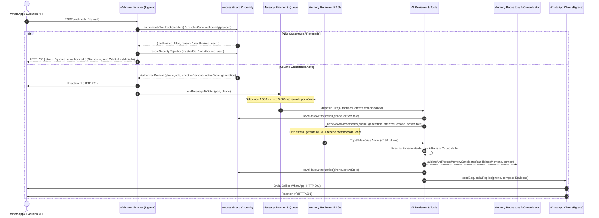

# Design Técnico — Memória Estruturada, RAG Seguro e Isolamento Rigoroso (Revisado)

## 1. Arquitetura e Fluxo de Dados

O processamento segue uma esteira determinística de segurança em múltiplas barreiras com checagem do escopo efetivo:



---

## 2. Contratos e Interfaces TypeScript (Sem `any`)

### 2.1. Identidade e Acesso Segregado (`src/hydra-sync/types/access_contract.ts`)

```typescript
export type UserRole = 'socio' | 'gerente' | 'operador';

export interface AuthorizedUser {
  phone: string; // E.164 canônico: '5511996242812'
  name: string;
  role: UserRole;
  allowedStores: string[]; // ['*'] para rede completa, ou ['MPJorgeBeretta']
  isActive: boolean;
  canSimulatePersona: boolean; // Permissão exclusiva para /socio e /{loja}
  createdAt: string; // ISO 8601
  updatedAt: string;
}

export interface PhoneIdentityMapping {
  remoteJid: string; // Ex: '271077481652389@lid' ou '5511996242812@s.whatsapp.net'
  phoneCanonical: string; // '5511996242812'
  identityType: 'PN' | 'LID';
  pushName?: string;
  verifiedAt: string;
}

export interface AuthorizedContext {
  phone: string;
  remoteJid: string;
  user: AuthorizedUser;
  effectivePersona: 'socio' | 'gerente';
  activeStoreSlug: string | null; // null para sócio/rede
  activeStoreName: string | null;
  memoryGeneration: number;
  scopeVersion: string;
  messageId: string;
  batchId?: string;
}

export interface SecurityRejectionLog {
  remoteJidMasked: string;
  phoneMasked?: string;
  reason: 'unauthorized_user' | 'unresolved_identity' | 'revoked_user' | 'invalid_webhook_token';
  endpoint: 'webhook_ingress' | 'queue_consumer' | 'tool_execution' | 'message_egress';
  timestamp: string;
}
```

### 2.2. Memória Estruturada e Escopo Efetivo (`src/hydra-sync/types/memory_contract.ts`)

```typescript
export type MemoryType = 'explicit_preference' | 'correction' | 'derived_interest';
export type MemoryScopeType = 'perfil_global' | 'rede' | 'loja';
export type MemoryStatus = 'candidate' | 'active' | 'superseded' | 'expired' | 'invalidated';

export interface MemoryRecord {
  memoryId: string;
  phone: string;
  generationId: number;
  scopeType: MemoryScopeType; // 'perfil_global' para apresentação; 'rede' para sócio; 'loja' para gerente
  lojaSlug: string | null; // Loja vinculada ou null para rede/perfil_global
  memoryType: MemoryType;
  topicKey: string; // Chave semântica (ex: 'cmv_display_unit', 'alias_retidos')
  contentNormalized: string; // Conteúdo normalizado da preferência/regra
  evidenceText: string; // Citação do turno do usuário
  sourceTurnIds: string[]; // IDs de mensagens/turnos de origem para deduplicação idempotente
  status: MemoryStatus;
  confidence: number; // 0.0 a 1.0
  occurrenceCount: number; // Frequência de confirmações
  distinctDays: string[]; // Datas distintas no fuso America/Sao_Paulo (ex: ['2026-09-28', '2026-09-30'])
  supersededBy?: string; // ID da memória sucessora se status === 'superseded'
  createdAt: string; // ISO 8601
  confirmedAt: string; // Data da última confirmação
  expiresAt?: string; // Data de expiração por TTL
}

export interface MemoryCandidate {
  memoryType: MemoryType;
  scopeType: MemoryScopeType;
  lojaSlug?: string;
  topicKey: string;
  contentNormalized: string;
  evidenceText: string;
  confidence?: number;
}

export interface MemoryRetrievalFilter {
  phone: string;
  generationId: number;
  effectivePersona: 'socio' | 'gerente';
  activeLojaSlug?: string | null;
  topicKey?: string; // Para getMemoriesByTopic
  maxItems?: number; // Padrão: 3
}

export interface MemoryRetrievalResult {
  memories: MemoryRecord[];
  formattedContext: string; // Bloco formatado para o prompt (<150 tokens)
  source: 'structured_direct' | 'hybrid_vector' | 'fallback_empty';
  latencyMs: number;
}
```

### 2.3. Retorno do Revisor Crítico de IA (Piggyback de Memória)

```typescript
export interface CriticalReviewerOutput {
  decisao: 'APROVAR' | 'AJUSTAR' | 'CONSULTAR' | 'ESCLARECER';
  motivo: string;
  resposta?: string;
  ferramenta?: string;
  parametros?: Record<string, string | number | boolean>;
  candidatosMemoria?: MemoryCandidate[]; // Zero chamadas extras ao LLM!
}
```

---

## 3. Regras de Isolamento de Escopo Efetivo

O filtro de recuperação de memória e execução de ferramentas obedece rigorosamente ao **perfil de trabalho efetivo** no turno atual:

### 3.1. Perfil Efetivo de Gerente (`effectivePersona === 'gerente'`)
* O usuário está operando como gerente de uma loja autorizada (`activeStoreSlug = 'MPJorgeBeretta'`).
* **Memórias de Rede são Bloqueadas:** Uma preferência ou anotação criada sob escopo de rede (`scope_type = 'rede'`) **NUNCA** pode ser retornada ao gerente, mesmo que o usuário real seja um sócio em teste.
* **Critério de Elegibilidade SQL para Gerente:**
  ```sql
  WHERE phone = :phone
    AND generation_id = :generationId
    AND status = 'active'
    AND (
      (scope_type = 'loja' AND loja_slug = :activeStoreSlug)
      OR scope_type = 'perfil_global'
    )
    AND (expires_at IS NULL OR expires_at > datetime('now'))
  ```
* **Preferências Pessoais Globais (`perfil_global`):** Aplicam-se apenas a configurações puras de apresentação desprovidas de dados de negócio (ex: "preferência por listas com marcadores", "evitar abreviações técnicas").

### 3.2. Perfil Efetivo de Sócio (`effectivePersona === 'socio'`)
* O usuário está operando com visão da rede completa (`allowedStores` contém `'*'`).
* **Critério de Elegibilidade SQL para Sócio:**
  ```sql
  WHERE phone = :phone
    AND generation_id = :generationId
    AND status = 'active'
    AND (scope_type = 'rede' OR scope_type = 'perfil_global')
    AND (expires_at IS NULL OR expires_at > datetime('now'))
  ```

---

## 4. Validação Determinística Anti-Alucinação Factual

Para evitar que a memória seja corrompida com números voláteis transitórios sem bloquear preferências legítimas:

1. **Classificação de Fato Operacional Volátil (PROIBIDO na Memória):**
   - Strings que contêm valores numéricos associados a fatos transitórios de uma OS específica, faturamento de um dia ou CMV de um mês (ex: *"faturamento hoje foi de R$ 84.613,61"*, *"saldo devedor da OS 1128 é R$ 3.833,74"*, *"veículo Sandero placa EGM6B79 está aguardando peça"*).
   - O validador rejeita sentenças que associam valores monetários concretos a identificadores transitórios de entidades (`os_id`, `placa`, `data_referencia`).
2. **Classificação de Preferência ou Regra de Negócio (PERMITIDO na Memória):**
   - Declarações de formato, ordem ou glossário (ex: *"mostrar CMV em percentual com duas casas decimais"*, *"prefiro faturamento antes de OSs"*, *"quando eu disser retidos, considerar pátio acima de 5 dias"*).
   - Termos contendo palavras como "faturamento", símbolos de "%" e números cardinais são **aceitos** quando atuam como qualificadores de formatação, limites de filtros ou regras de vocabulário.
3. **Critério de Promoção de Inferências:**
   - Confiança informada pelo modelo $\ge 0.8$, sozinha, **NÃO promove** inferência a preferência confirmada.
   - Inferências derivadas de consultas repetidas permanecem categorizadas estritamente como `derived_interest`.
   - Apenas declarações explícitas do operador no turno são registradas como `explicit_preference` ou `correction`.

---

## 5. Motor de Consolidação sem LLM

A consolidação opera com lógica determinística em TypeScript:

1. **Agrupamento Pela Chave Quíntupla Completa:**
   $$\text{Agrupamento} = (\text{phone}, \text{generation\_id}, \text{scope\_type}, \text{loja\_slug}, \text{topic\_key})$$
   Garante que o mesmo tópico em lojas diferentes (ex: Jorge Beretta vs Kennedy) ou em gerações diferentes nunca se misturem.
2. **Deduplicação Estável por Turnos de Origem:**
   - Cada memória mantém `source_turn_ids: string[]`.
   - Ao processar uma evidência, se `turnId` já constar na lista, a ocorrência não é incrementada.
3. **Consolidação Diária e Semanal via Watermarks (America/Sao_Paulo):**
   - Janela baseada em watermark (`last_processed_timestamp` na tabela `hydra_memory_consolidation_checkpoints`), cobrindo o dia integral sem cortes arbitrários de final de noite.
   - Consolidação semanal: exige $\ge 2$ dias distintos na semana (`distinctDays.length >= 2`) para qualificar um `derived_interest` como estável. Interesses com apenas 1 dia sofrem decaimento de confiança (`confidence *= 0.5`) e expiram em 14 dias se não confirmados.
4. **Proteção Contra Jobs Atrasados pós-Reset:**
   - Antes de persistir qualquer consolidação, o job revalida no banco se a `generation_id` do registro ainda é igual ao `memory_generation` ativo do perfil em `hydra_user_profiles`. Se o usuário efetuou `/reset` enquanto o job executava, a consolidação dessa geração é descartada silenciosamente.

---

## 6. Preservação de Cadência Operacional na Migração

1. **Debounce de Mensagens:** Mantido exatamente em **1.500 ms de silêncio** e **teto máximo de 5.000 ms** (calibração aprovada da Missão 2).
2. **TTL de Contexto de Conversa:** Mantido em **120 minutos** (conforme `turn_context_repository.ts`).
3. **Modo Compatível de Autenticação Webhook:**
   - Se `EVOLUTION_WEBHOOK_SECRET` estiver configurado, exige validação do header.
   - Se não estiver configurado, aceita a requisição e emite log operacional de compatibilidade, garantindo que o bot continue respondendo sem interrupções durante o processo de migração.
4. **Idempotência de Seeds de Usuários:**
   ```sql
   INSERT INTO hydra_authorized_users (phone, name, role, allowed_stores, is_active, can_simulate_persona)
   VALUES (?, ?, ?, ?, 1, ?)
   ON CONFLICT(phone) DO NOTHING;
   ```
   Garante que reexecuções de migrations nunca reativem operadores que foram desativados (`is_active = 0`).

---

## 7. Divisão de Frentes e Propriedade de Arquivos

```
┌────────────────────────────────────────────────────────────────────────┐
│                        AGENTE PRINCIPAL (Orquestrador)                 │
│  - specs/hydra-memory-rag-isolation/*                                  │
│  - src/hydra-sync/agent_dispatcher.ts (PROPRIETÁRIO ÚNICO)             │
│  - src/hydra-sync/types/access_contract.ts                             │
│  - src/hydra-sync/types/memory_contract.ts                             │
└──────────────────┬─────────────────┬─────────────────┬─────────────────┘
                   │                 │                 │
                   ▼                 ▼                 ▼
         ┌──────────────────┐ ┌──────────────┐ ┌──────────────┐
         │     AGENTE 1     │ │   AGENTE 2   │ │   AGENTE 3   │
         │ Acesso & Sessão  │ │   Memória &  │ │ Recuperação, │
         │                  │ │ Consolidação │ │  Briefing &  │
         │                  │ │   sem LLM    │ │   Harness    │
         └──────────────────┘ └──────────────┘ └──────────────┘
```

* **Agente Principal:** Ponto único de edição de `agent_dispatcher.ts`. Conecta a recuperação RAG antes da revisão e a persistência de candidatos de memória após a revisão.
* **Agente 1:** Proprietário de `identity_access_guard.ts`, `command_interceptor.ts`, `turn_context_repository.ts`, `webhook-listener.js` e `test_harness_access_session.ts`.
* **Agente 2:** Proprietário de `memory_repository.ts`, `memory_consolidator.ts`, `semantic_prompt.ts` e `test_harness_memory_consolidation.ts`. Exporta `validateAndPersistMemoryCandidates` para uso pelo Principal.
* **Agente 3:** Proprietário de `memory_retriever.ts`, `ai_briefing.ts` e `test_harness_unified.ts`.
