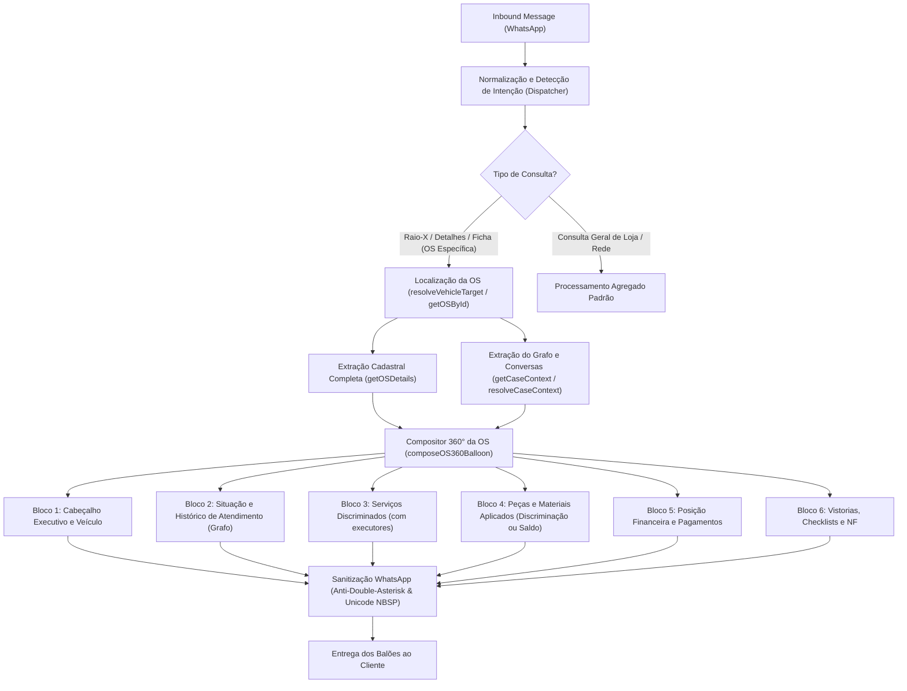

# Design: Arquitetura de Detalhamento 360° da OS e Resolução Completa

Spec ID: `hydra-os-360-full-details`  
Data: 08/10/2026  
Status: Design Técnico  

---

## 1. Fluxo de Execução do Raio-X / Detalhes da OS



---

## 2. Módulos e Alterações Técnicas

### 2.1. `src/hydra-sync/agent_dispatcher.ts`
- **Tolerância a Typos e Expressões Sinônimas:**
  ```typescript
  const isDeepDiveOS = /\b(raio[\s-]*x|taio[\s-]*x|raiox|detalhe|detalhes|ficha|tudo|completo|situacao|situação|o que t[aá] acontecendo|o que est[aá] acontecendo)\b/i.test(norm);
  ```
- **Montagem do Bloco de Peças:**
  ```typescript
  if (osDetail.pecas && osDetail.pecas.length > 0) {
    const pecasLines = osDetail.pecas.map(p => 
      `- ${p.descricao}: ${p.qtd || 1}x *${moneyFmt(p.valorTotal)}*${p.codigo ? ` (${p.codigo})` : ''}`
    ).join('\n');
    blocks.push(`----------------------------------------\n> *Peças e Materiais Aplicados*\n${pecasLines}`);
  } else if (osDetail.valorTotal > (osDetail.totalServicos || 0)) {
    const saldoPecas = osDetail.valorTotal - (osDetail.totalServicos || 0);
    blocks.push(`----------------------------------------\n> *Peças e Materiais Aplicados*\n- Componentes/Reparo de Bancada: *${moneyFmt(saldoPecas)}*`);
  }
  ```
- **Montagem do Bloco de Atendimento e Grafo (`caseCtx`):**
  Integrar compulsoriamente os fatos documentados do `caseCtx`:
  ```typescript
  if (caseCtx) {
    const atLines: string[] = [];
    if (caseCtx.documentedDelayReason) {
      atLines.push(`- *Motivo Operacional:* ${caseCtx.documentedDelayReason}`);
    }
    if (caseCtx.nextPromisedStep) {
      atLines.push(`- *Próximo Passo Prometido:* ${caseCtx.nextPromisedStep}`);
    }
    if (caseCtx.lastObservationDate) {
      atLines.push(`- *Última Interação:* ${caseCtx.lastObservationDate}`);
    }
    if (atLines.length === 0) {
      atLines.push(`- *Histórico:* Sem motivo de atraso registrado nas análises técnicas desta OS.`);
    }
    blocks.push(`----------------------------------------\n> *Situação e Atendimento*\n${atLines.join('\n')}`);
  }
  ```

### 2.2. `src/hydra-sync/hybrid_os_coordinator.ts`
- Atualizar `formatVehicleSituation`:
  - Se `caseContext` estiver disponível mesmo em `VEHICLE_SITUATION`, incluir linha síntese da situação operacional.
  - Exibir indicação de composição financeira se houver discrepância entre serviços e valor total.

### 2.3. `src/hydra-sync/db_repository.ts`
- Garantir que `OSDetailComplete` retorne os campos agregados `totalServicos` e `totalPecas` calculados deterministicamente a partir de `servicos` e `pecas`.

---

## 3. Exemplo Concreto da Resposta Esperada (Caso OS #1916)

```text
> *OS #1916 — HB20 1,6 16V (PET7D45)*
- *Loja:* ReiDoModulo
- *Status:* *ABERTO* (Em Aberto)
- *Permanência:* 2 dia(s) no pátio
- *Cliente:* ERIC FERREIRA DE BARROS
- *Valor Total:* *R$ 1.600,00* (Saldo: *R$ 1.600,00*)

----------------------------------------
> *Situação e Atendimento*
- *Motivo Operacional:* Reparo avançado de bancada em módulo de injeção sem sinal financeiro registrado.
- *Histórico:* Aguardando confirmação financeira antes da liberação do módulo reparado.

----------------------------------------
> *Serviços Discriminados*
- REPROGRAMAÇAO MODULO: *R$ 130,00* (RAPHAEL)

----------------------------------------
> *Peças e Materiais Aplicados*
- Reparo Eletrônico / Bancada de Módulo: *R$ 1.470,00*

----------------------------------------
> *Formas de Pagamento*
- Total: *R$ 1.600,00* (Pago: *R$ 0,00*, Saldo: *R$ 1.600,00*)
- Modalidade de pagamento não formalizada; 100% pendente de quitação.

----------------------------------------
> *Vistorias e Documentos*
- *Checklist de Entrada:* ⚠️ Pendente
- *Checklist do Mecânico:* ⚠️ Pendente
- *Nota Fiscal:* Não emitida para esta OS.
```
