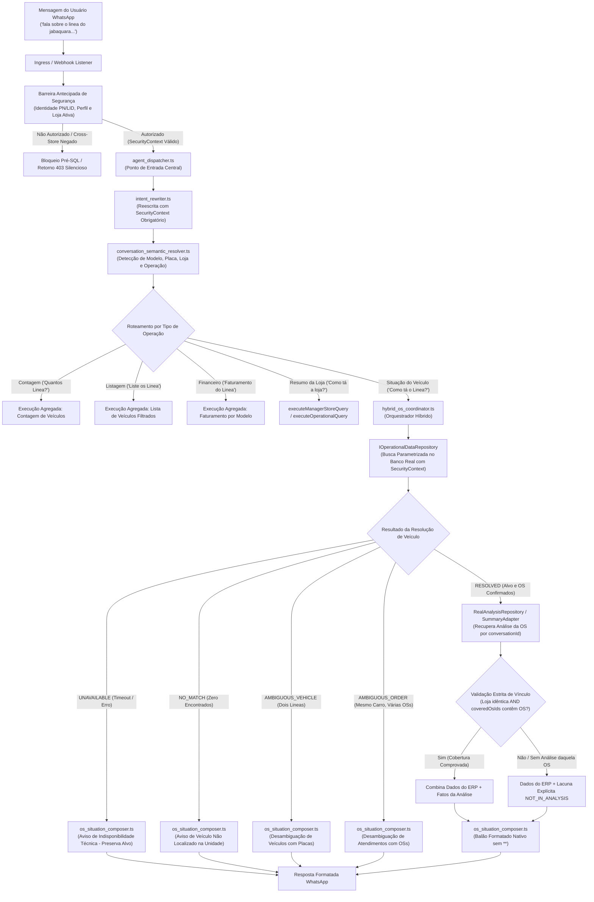

# Documento de Design Técnico: Hydra — Auditoria e Correção do Incidente Linea/Jabaquara

**ID da Spec:** `hydra-os-conversation-context`  
**Data:** 05/10/2026  
**Status:** ESPECIFICAÇÃO DE DESIGN TÉCNICO (VERSÃO 2.1 REVISADA)  

---

## 1. Arquitetura e Fluxo de Dados Ponta a Ponta



---

## 2. Reconciliação dos Contratos de Entrada e Saída

### 2.1 Contexto de Segurança Obrigatório e Tipado
O `SecurityContext` é **mandatório** em todas as operações de busca, reescrita e orquestração. Não há fallback silencioso para `socio` quando o contexto estiver ausente: se ausente, lança `SecurityAccessDeniedError`.

```typescript
export interface SecurityContext {
  readonly persona: 'gerente' | 'socio' | 'admin' | 'atendente';
  readonly authorizedLojaSlug?: string;
  readonly authorizedPhones?: readonly string[];
  readonly memoryGenerationId?: number;
}

export interface UnifiedRewriteContext {
  readonly securityScope: SecurityContext; // OBRIGATÓRIO — NUNCA OPCIONAL
  readonly batch?: MessageBatchPayload;
  readonly parts?: readonly InboundPart[];
  readonly mediaEvidence?: readonly MediaEvidence[];
  readonly previousState?: TurnState | null;
}
```

### 2.2 Entidades Dissociadas: Veículo vs Atendimento (OS)
Separar a identidade do veículo das ordens de serviço correspondentes:

```typescript
/**
 * Identidade do Veículo (o carro físico)
 */
export interface CandidateVehicle {
  readonly vehiclePlate: string;
  readonly vehicleModel: string;
  readonly customerName?: string;
  readonly customerPhone?: string;
  readonly lojaSlug: string;
  readonly activeOrdersCount: number;
  readonly latestOsId?: number;
}

/**
 * Atendimento Específico (a Ordem de Serviço)
 */
export interface CandidateOrder {
  readonly osId: number;
  readonly lojaSlug: string;
  readonly vehiclePlate: string;
  readonly vehicleModel: string;
  readonly customerName: string;
  readonly customerPhone: string;
  readonly status: string;
  readonly totalValue: number;
  readonly paidValue: number;
  readonly pendingServices: readonly string[];
  readonly openedAt: string;
  readonly updatedAt: string;
  readonly closedAt?: string;
  readonly isAberta: boolean;
}

/**
 * União discriminada completa de resultados de resolução de veículo
 */
export type VehicleResolutionResult =
  | {
      readonly type: 'RESOLVED';
      readonly vehicle: CandidateVehicle;
      readonly order: CandidateOrder;
      readonly relatedOrdersCount: number;
    }
  | {
      readonly type: 'AMBIGUOUS_VEHICLE';
      readonly vehicles: readonly CandidateVehicle[];
      readonly totalFound: number;
      readonly cursor?: string;
    }
  | {
      readonly type: 'AMBIGUOUS_ORDER';
      readonly vehicle: CandidateVehicle;
      readonly orders: readonly CandidateOrder[];
      readonly totalFound: number;
    }
  | {
      readonly type: 'NO_MATCH';
      readonly requestedModel: string;
      readonly lojaSlug?: string;
      readonly checkedScope: string;
    }
  | {
      readonly type: 'UNAVAILABLE';
      readonly errorType: 'TIMEOUT' | 'DATABASE_ERROR' | 'PARTIAL_DATA';
      readonly message: string;
      readonly requestedModel: string;
    };
```

### 2.3 Repositório de Dados Operacionais Reais
```typescript
export interface IOperationalDataRepository {
  /**
   * Busca veículos pelo modelo no escopo autorizado pela segurança.
   * Paginação e contagem seguras (sem limitar a rows[0]).
   */
  searchVehiclesByModel(
    model: string,
    securityScope: SecurityContext,
    lojaSlugFilter?: string,
    pagination?: { readonly limit?: number; readonly offset?: number }
  ): Promise<VehicleResolutionResult>;

  /**
   * Retorna ordens de serviço associadas a uma placa específica no escopo autorizado.
   */
  getOrdersForVehicle(
    plate: string,
    securityScope: SecurityContext
  ): Promise<readonly CandidateOrder[]>;

  /**
   * Busca OS diretamente pelo identificador numérico com validação de escopo.
   */
  getOSById(
    osId: number,
    securityScope: SecurityContext
  ): Promise<CandidateOrder | null>;
}
```

---

## 3. Detalhamento dos Componentes e Dono Único

### 3.1 `conversation_semantic_resolver.ts` & `intent_rewriter.ts` (Executor 1)
- **Dono Exclusivo:** Executor 1 (`de5452f5-ae9d-4de2-af64-0b12f075f5ea`).
- **Resolução de Modelo vs Operação:**
  - Extrai menção a modelo de veículo a partir do catálogo real e aliases (`linea`, `onix`, `civic`, `corolla`, etc.).
  - Classifica a operação pedida:
    - `VEHICLE_SITUATION`: *"fala sobre o linea"*, *"como tá o linea"*, *"qq ta acontecendo com o carro linea"*.
    - `COUNT_VEHICLES`: *"quantos Linea temos no Jabaquara?"*.
    - `LIST_VEHICLES`: *"liste os Linea abertos"*.
    - `FINANCIAL_BY_MODEL`: *"faturamento das OS de Linea"*.
- **Detector de Reparação Conversacional:**
  - Expressões como *"não foi isso"*, *"não perguntei isso"*, *"quero entender o carro"* identificam quebra de continuidade e desarmam a herança de raio-X agregado anterior.
- **Unificação de `rewriteIntent`:**
  - Exige `UnifiedRewriteContext` contendo `securityScope: SecurityContext`.

### 3.2 `real_analysis_repository.ts` & `OperationalDataRepository` (Executor 2)
- **Dono Exclusivo:** Executor 2 (`7b9923e9-f4d2-46ff-8a6b-ea932132e04d`).
- **Mapeamento Real da Dimensão `veiculo_modelo`:**
  - No SQLite operacional, a busca parametrizada executa:
    ```sql
    SELECT os_id, loja_slug, veiculo, placa, cliente_nome, cliente_telefone, status, total_os, valor_pago, data_abertura, data_fechamento
    FROM ordens_servico
    WHERE (veiculo LIKE ? OR veiculo LIKE ?)
      AND (? IS NULL OR loja_slug = ?)
    ORDER BY is_aberta DESC, data_abertura DESC
    LIMIT ? OFFSET ?;
    ```
- **Validação Estrita de Vínculo (F04 Revisitado):**
  - O `conversationId` recupera a análise persistida.
  - O vínculo só é promovido a fato se:
    1. `analysis.lojaSlug.toLowerCase() === order.lojaSlug.toLowerCase()`
    2. `analysis.coveredOsIds.includes(order.osId)`
    3. `analysis.isValid === true`
  - Se `analysis.coveredOsIds` não contiver `order.osId`, registra `ConversationGap` do tipo `NOT_IN_ANALYSIS` e entrega apenas os dados cadastrais do ERP. Fatos da conversa NÃO são atribuídos à OS sem evidência comprovada.

### 3.3 `hybrid_os_coordinator.ts` & `agent_dispatcher.ts` (Executor 3)
- **Dono Exclusivo:** Executor 3 (`5dffcfaf-5e84-438e-81f0-88558655f4c0`).
- **Barreira Antecipada no Dispatcher:**
  - Antes de qualquer processamento, valida se `activeProfile.persona === 'gerente'` e se a loja requisitada no texto difere da loja autorizada. Se divergir, bloqueia na raiz com aviso claro de restrição de escopo.
- **Roteamento Determinístico:**
  - Se a intenção canônica for `VEHICLE_SITUATION` ou contiver `vehicleModel`/`placa`/`osId`, despacha para `HybridOSCoordinator.inspectVehicle()` ou `inspectOS()`.
  - **Bloqueio de Fallback Agregado:** Se a busca retornar `NO_MATCH` ou `UNAVAILABLE`, formata a mensagem correspondente via `os_situation_composer.ts`. Fica **terminantemente proibido** transicionar para `executeManagerStoreQuery` ou raio-X de faturamento.
- **Cache Multi-Fatorial com Segregação por Placa:**
  - Chave de relatório:
    `hydra:os_ctx:v2.1:${lojaSlug}:${osId}:${vehiclePlate}:${persona}:${generationId}:${analysisVersion}:${erpUpdatedAt}`
  - Duas placas diferentes de Linea (ex: `ABC1234` e `XYZ9876`) residem em chaves independentes e nunca colidem em cache.

---

## 4. Tratamento de Erros e Respostas WhatsApp (Executor 1)

O `os_situation_composer.ts` deve tratar com redações distintas:
1. **Resultado Vazio Comprovado (`NO_MATCH`):**
   ```text
   Não encontrei uma ordem de serviço correspondente para o veículo Linea na unidade Jabaquara nos dados consultados.
   
   Por favor, verifique se a unidade ou a grafia do modelo estão corretas, ou informe a placa do carro.
   ```
2. **Falha Técnica / Timeout (`UNAVAILABLE`):**
   ```text
   Não foi possível consultar os dados da oficina neste momento (tempo limite de resposta excedido).
   
   O pedido referente ao veículo Linea foi preservado. Por favor, tente novamente em alguns instantes.
   ```
3. **Ambiguidade de Veículos (`AMBIGUOUS_VEHICLE`):**
   ```text
   Encontrei mais de um veículo Linea com ordens na unidade Jabaquara:
   • Linea (Placa ABC1234) — OS 501 (Em Execução)
   • Linea (Placa BRA9988) — OS 521 (Aguardando Peça)
   
   Por favor, informe a placa do veículo desejado para consultar a situação.
   ```
4. **Ambiguidade de Atendimentos (`AMBIGUOUS_ORDER`):**
   ```text
   O veículo Linea (Placa ABC1234) possui mais de uma ordem de serviço registrada:
   • OS 501 (aberta em 01/10/2026) — Em Execução
   • OS 420 (encerrada em 15/08/2026) — Finalizada
   
   Deseja consultar o atendimento atual (OS 501) ou o histórico anterior?
   ```
