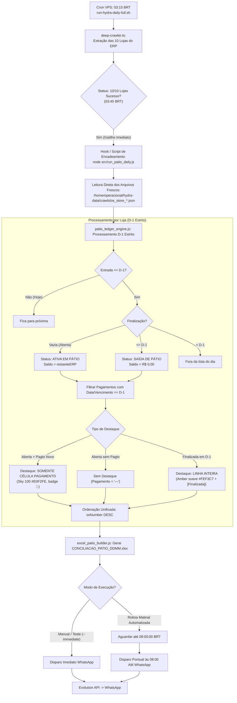

# Design Técnico: Reestruturação do Motor de Carros em Pátio & OS (Ingestão pós-Crawler da VPS)

**Spec ID:** `hydra-patio-engine-reconstruction`  
**Data:** 08/10/2026  
**Status:** PROPOSTA ATUALIZADA / AGUARDANDO APROVAÇÃO (SDD Hard Stop)  

---

## 1. Arquitetura de Acionamento e Ingestão pós-Crawler



---

## 2. Detecção e Handshake pós-Crawler

No arquivo `run-hydra-daily-full.sh` na VPS (ou monitoramento via `run_patio_daily.js`):
1. **Verificação de Integridade dos Crawls:**
   * Inspeciona os 10 arquivos `os_store_*.json` em `/home/operacional/hydra-data/crawls/`.
   * Verifica se `ultima_atualizacao` corresponde à execução da data corrente.
2. **Encadeamento Imediato:**
   * Assim que o crawler finaliza, aciona a conciliação sem intervalo de espera.
   * Planilha gerada em `/home/operacional/hydra/output/relatorios/CONCILIACAO_PATIO_DDMM.xlsx` (ou local em `projects/hydra-rede/output/relatorios/`).

---

## 3. Interfaces TypeScript & Tipagem Estrita

```typescript
export type PatioHighlightType = 'NONE' | 'NEW_PAYMENT' | 'YARD_EXIT';

export interface PatioPaymentItem {
  forma: string;
  valor: number;
  vencimentoBR: string;
  parcela?: string;
}

export interface NormalizedPatioOS {
  osNumber: number;
  lojaSlug: string;
  lojaNomeDisplay: string;
  dataEntradaBR: string; // DD/MM/YYYY
  dataFinalizacaoBR: string | null; // DD/MM/YYYY ou null se aberta
  isAberta: boolean; // true se dataFinalizacao vazia
  saldoPendente: number; // Saldo residual atualizado informado pelo ERP
  totalOSOriginal: number; // Valor original total da OS
  cliente: string;
  placa: string;
  veiculo: string;
  pagamentosD1: PatioPaymentItem[];
  totalPagoD1: number;
  textoPagamentosD1: string; // Ex: "Pix: R$ 385,00" ou "—"
  highlightType: PatioHighlightType;
}

export interface StorePatioBlock {
  lojaSlug: string;
  displayName: string;
  totalAtivas: number; // Veículos em pátio ativo
  totalFinalizadasOntem: number; // Saídas de ontem
  saldoSubtotal: number; // Soma da coluna Valor
  recebidoOntemSubtotal: number; // Soma dos pagamentos D-1
  formasRecebidas: Record<string, number>;
  ordens: NormalizedPatioOS[]; // Ordenação unificada por osNumber DESC
}
```

---

## 4. Módulos Afetados

1. **`src/patio_hydra_bot_adapter.js`:**
   * Suporte à leitura local transparente na VPS (`/home/operacional/hydra-data/crawls`) ou via cache sincronizado local em desenvolvimento (`data/bot-crawls/`).
   * Validação de timestamp para confirmar que os dados pertencem ao crawl mais recente.
2. **`src/patio_ledger_engine.js`:**
   * Refatoração para a elegibilidade D-1 estrita.
   * Filtro rigoroso de pagamentos de D-1.
   * Atribuição de `highlightType: 'NONE' | 'NEW_PAYMENT' | 'YARD_EXIT'`.
   * Ordenação estrita `osNumber DESC` unificada.
3. **`src/excel_patio_builder.js`:**
   * Aplicação do destaque de célula única na coluna `E` para `NEW_PAYMENT`.
   * Aplicação do destaque de linha inteira para `YARD_EXIT`.
   * Estilo padrão limpo para `NONE`.
4. **`src/run_patio_daily.js`:**
   * Opção `--check-fresh-crawl` para assegurar que os arquivos foram gerados no dia.
   * Encadeamento com disparo às 08:00 AM (ou `--immediate`).
