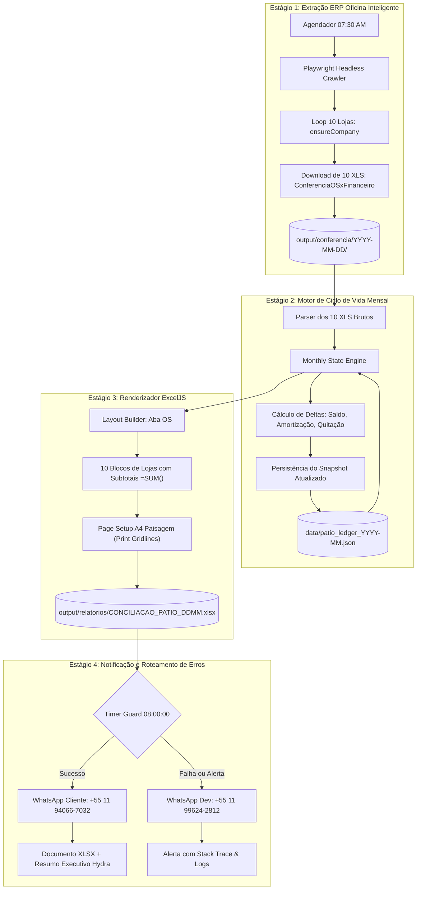
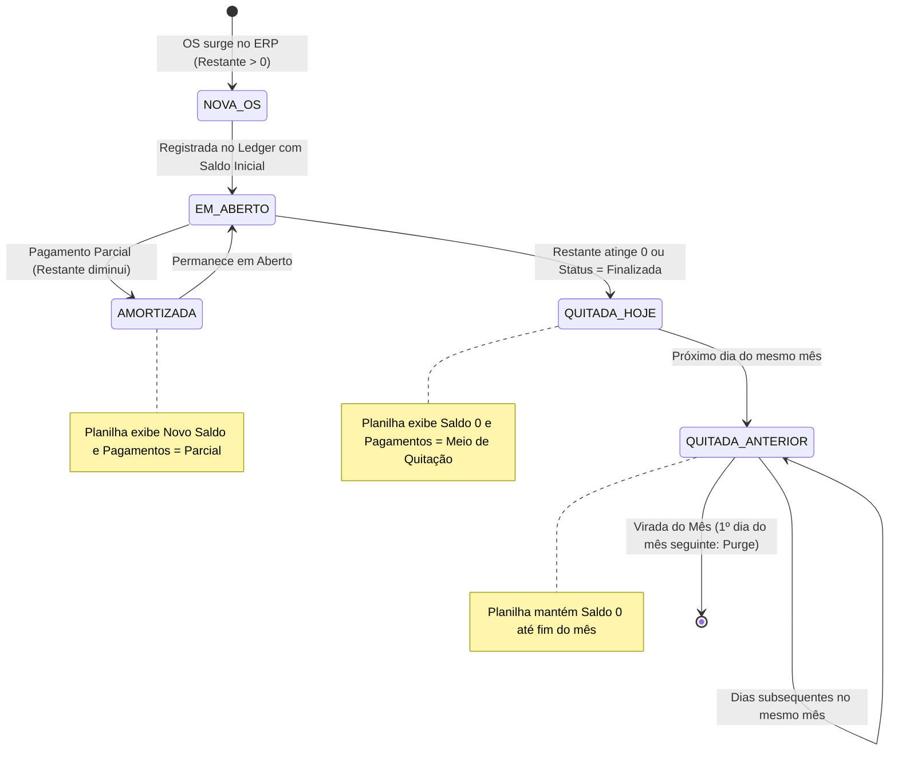

# Design — Relatório Diário de Carros em Pátio por Loja & Ciclo de Quitação de OS

**Spec:** `hydra-patio-os-reconciliation`  
**Data:** 06/10/2026  
**Repositório:** `agy` / `hydra-bot`  
**Estado:** Design Técnico Formalizado (Aguardando `/vibe-apply hydra-patio-os-reconciliation`)

---

## 1. Visão Geral da Arquitetura

O sistema implementa uma esteira de dados determinística em 4 estágios desacoplados:
1. **Extrator (Crawler / File Ingestor):** Coleta os 10 arquivos `[ID]_ConferenciaOSxFinanceiro.xls` do ERP Oficina Inteligente.
2. **Motor de Estado Mensal (Monthly Reconciliation Ledger):** Mantém o estado acumulado das OSs do mês civil, calculando deltas diários de saldo e pagamentos.
3. **Renderizador de Planilha (ExcelJS Builder):** Constrói a aba `OS` estritamente idêntica à referência `CONCILIAÇÃO 2608.xlsx`, com fórmulas e setup A4.
4. **Despachante WhatsApp (Evolution API Dispatcher):** Notifica a diretoria às 08:00 AM com a planilha e resumo executivo Hydra, com roteamento de falhas para o dev.



---

## 2. Contratos de Dados e Tipos TypeScript

```typescript
/**
 * Registro individual extraído do arquivo bruto ConferenciaOSxFinanceiro.xls
 */
export interface OSRawRecord {
  osNumber: number;
  dataAbertura: string; // "DD/MM/YYYY" ou número serial Excel
  cliente: string;
  placa: string;
  regraNegociacao: string;
  statusERP: 'Aberta' | 'Finalizada' | string;
  finalizadaEm?: string;
  faturamentoEm?: string;
  valorTotal: number;
  totalPagoERP: number;
  restanteERP: number; // Saldo devedor restante
  totalFinanceiro: number;
  formasPagamentoERP: string; // Ex: "Credito: 220.00; " ou "PIX 2000"
}

/**
 * Estado persistente de uma OS dentro do ciclo mensal
 */
export interface OSLedgerEntry {
  osNumber: number;
  lojaSlug: string;
  lojaNomeDisplay: string;
  dataAbertura: string;
  cliente: string;
  placa: string;
  valorTotalOriginal: number;
  
  // Saldos e histórico de pagamento
  saldoAnterior: number;
  saldoAtual: number;
  historicoAmortizacoes: {
    data: string; // "YYYY-MM-DD"
    valorAmortizado: number;
    formaPagamento: string;
  }[];
  
  // Exibição na planilha do dia
  valorExibicaoPlanilha: number; // Saldo restante atualizado ou 0 se quitada
  pagamentosExibicaoPlanilha: string; // Novo lançamento do dia ou forma de fechamento
  
  // Ciclo de vida
  statusCiclo: 'EM_ABERTO' | 'QUITADA_HOJE' | 'QUITADA_ANTERIOR';
  dataFechamento?: string; // Data em que atingiu saldo 0
  mesReferencia: string; // "YYYY-MM"
  ativoNoMes: boolean;
}

/**
 * Estrutura do Ledger Mensal persistido em disco
 */
export interface MonthlyLedgerState {
  mesReferencia: string; // "YYYY-MM"
  dataUltimaAtualizacao: string; // "YYYY-MM-DDTHH:mm:ss"
  lojas: Record<string, {
    lojaSlug: string;
    lojaNomeDisplay: string;
    ordens: Record<number, OSLedgerEntry>;
  }>;
}

/**
 * Metadados para montagem da aba OS no Excel
 */
export interface StoreExcelBlock {
  storeName: string;
  lojaSlug: string;
  startRow: number;
  endRow: number;
  subtotalRow: number;
  subtotalFormula: string; // ex: "=SUM(D6:D9)"
  items: {
    os: number;
    data: string | number;
    valor: number;
    pagamento: string;
    obs?: string;
  }[];
}
```

---

## 3. Máquina de Estados: Ciclo de Vida da OS no Mês

A lógica de transição ocorre no processamento diário ao comparar o snapshot do ERP com o arquivo `data/patio_ledger_<YYYY-MM>.json`:



### Regras de Transição Detalhadas:
1. **Nova Ordem Detectada no ERP:**
   - Adiciona ao Ledger da loja correspondente com `statusCiclo = 'EM_ABERTO'`.
   - `valorExibicaoPlanilha = restanteERP`.
   - `pagamentosExibicaoPlanilha = formasPagamentoERP`.
2. **Ordem Existente com Amortização Parcial:**
   - Detecta `restanteERP < saldoAnterior` e `restanteERP > 0`.
   - Delta pago = `saldoAnterior - restanteERP`.
   - Registra no histórico de amortizações.
   - `valorExibicaoPlanilha = restanteERP`.
   - `pagamentosExibicaoPlanilha = extrairNovoPagamento(formasPagamentoERP, saldoAnterior, restanteERP)`.
3. **Ordem Liquidada no Dia:**
   - Detecta `restanteERP == 0` (ou status `Finalizada`) e `saldoAnterior > 0`.
   - `statusCiclo = 'QUITADA_HOJE'`.
   - `dataFechamento = dataAtual`.
   - `valorExibicaoPlanilha = 0`.
   - `pagamentosExibicaoPlanilha = formasPagamentoERP` (destacando a quitação).
4. **Ordem Já Liquidada em Dias Anteriores:**
   - Permanece no Ledger com `statusCiclo = 'QUITADA_ANTERIOR'`.
   - `valorExibicaoPlanilha = 0`.
   - `pagamentosExibicaoPlanilha = ""` (ou anotação de fechamento).
   - Não entra na soma dos valores devidos em aberto da loja, mas permanece visível na listagem.
5. **Virada de Mês (Rollover Contábil):**
   - Ao virar o mês (ex: 31 de agosto -> 01 de setembro):
   - O arquivo `patio_ledger_2026-08.json` é arquivado.
   - O novo arquivo `patio_ledger_2026-09.json` é iniciado importando **apenas as OSs que continuavam com `saldoAtual > 0`**.
   - As OSs com `saldoAtual == 0` do mês anterior são purgadas da visualização do novo mês.

---

## 4. Renderizador ExcelJS: Aba `OS` Idêntica ao Modelo

O renderizador gera o arquivo Excel com as propriedades idênticas a `CONCILIAÇÃO 2608.xlsx`:

### Estrutura de Células:
- **Linha 1:** Coluna B (`B1`): `"Ordem de Serviço"`, Fonte: Segoe UI / Arial 11pt Negrito.
- **Linha 2:** Coluna B (`B2`): Data serial Excel ou string `"DD/MM/YYYY"` da data de referência.
- **Linha 3:** Linha em branco separadora.
- **Blocos de Lojas (10 unidades na ordem canônica):**
  - **Cabeçalho da Loja:** Coluna B com nome da loja (ex: `Planalto `, `Piraporinha`, `Mauá`, etc.).
  - **Cabeçalho de Colunas:**
    - `B`: `"OS:"`
    - `C`: `"Data:"`
    - `D`: `"Valor:"`
    - `E`: `"PAGAMENTOS "`
  - **Linhas de Dados:**
    - `B`: Número da OS (ex: `18458`, formato numérico, centralizado).
    - `C`: Data da OS (formato data `DD/MM/YYYY` ou serial Excel com numberFormat `dd/mm/yyyy`).
    - `D`: Saldo a pagar (formato moeda `R$ #,##0.00`). Se for 0, exibe `0,00`.
    - `E`: Texto de pagamentos (ex: `"Credito: 220.00; "`, `"Debito: 190.00; "`, `"PIX 2000"`).
  - **Linha de Subtotal da Loja:**
    - `D`: Fórmula dinâmica `=SUM(D[linhaInicio]:D[linhaFim])`.
    - Formatação: Negrito, numberFormat `"R$ #,##0.00"`, borda superior simples e borda inferior dupla.
  - **Linha Separadora:** Linha em branco entre lojas.

### Page Setup para Impressão A4 Paisagem:
```javascript
worksheet.pageSetup = {
  orientation: 'landscape',
  paperSize: 9, // A4
  fitToPage: true,
  fitToWidth: 1,
  fitToHeight: 0, // Automático verticalmente
  showGridLines: true,
  margins: {
    left: 0.4,
    right: 0.4,
    top: 0.5,
    bottom: 0.5,
    header: 0.3,
    footer: 0.3
  }
};
```

---

## 5. Notificação WhatsApp (Formato Hydra) & Roteamento de Erros

### Canal Principal (Diretoria): `+55 11 94066-7032` (Às 08:00 AM)
Disparo de documento anexado (`CONCILIACAO_PATIO_<DDMM>.xlsx`) com mensagem formatada no padrão Hydra:

```
🚗 *RELATÓRIO DIÁRIO — PÁTIO DE VEÍCULOS & OS*
📅 *Referência:* 06/10/2026 | *Disparo Oficial:* 08:00 AM

📊 *CONSOLIDADO DA REDE (10 LOJAS)*
• Total de OSs com Saldo em Aberto: 42 ordens
• Valor Total em Aberto no Pátio: R$ 68.438,20
• OSs Quitadas/Baixadas no Ciclo: 14 ordens

🏢 *PÁTIO POR UNIDADE:*
1. *Planalto:* 4 OSs | R$ 23.127,70 (0 quitadas no ciclo)
2. *Piraporinha:* 3 OSs | R$ 5.459,10 (2 quitadas hoje)
3. *Mauá:* 6 OSs | R$ 10.861,44 (2 quitadas no ciclo)
4. *Kennedy:* 3 OSs | R$ 4.785,24 (1 quitada no ciclo)
5. *Rudge Ramos:* 6 OSs | R$ 13.172,10 (1 quitada no ciclo)
6. *Santo André:* 3 OSs | R$ 2.982,40 (2 quitadas no ciclo)
7. *Rei do Módulo:* 5 OSs | R$ 10.240,00 (4 quitadas no ciclo)
8. *Jorge Beretta:* 3 OSs | R$ 2.477,19 (2 quitadas no ciclo)
9. *Dom Pedro I:* 1 OS | R$ 1.810,00 (2 quitadas no ciclo)
10. *Jabaquara:* 2 OSs | R$ 2.609,90 (4 quitadas no ciclo)

📎 _Planilha detalhada de conferência em anexo com aba OS completa._
```

### Canal de Contingência (Desenvolvedor): `+55 11 99624-2812`
Em caso de exceção no crawler, erro de login no ERP ou falha de timeout:
```
🚨 *[ALERTA DE CONTINGÊNCIA — HYDRA PÁTIO]*
*Data:* 06/10/2026 07:42:15
*Status:* FALHA NA EXTRAÇÃO MATINAL

*Diagnóstico:*
Falha na troca de loja ou download do XLS (Loja: Rei do Módulo).
Erro: Timeout 30000ms esperando evento de download.

*Ação Tomada:*
O envio para a diretoria (+55 11 94066-7032) foi SUSPENSO para prevenir o envio de dados parciais.
Logs completos salvos em: logs/patio_error_20261006.log.
```

---

## 6. Agendamento Operacional

- **Horário de Acionamento do Crawler:** `07:30 AM` (permite até 3 tentativas de retry por loja sem risco de atraso).
- **Geração da Planilha e Validação:** `07:45 AM` a `07:50 AM`.
- **Timer Guard de Disparo:** Aguarda `08:00:00 AM` exatos antes de postar na Evolution API.
- **Agendador:** Windows Task Scheduler via `.bat` silencioso (`run_patio_reconciliation.bat`).
