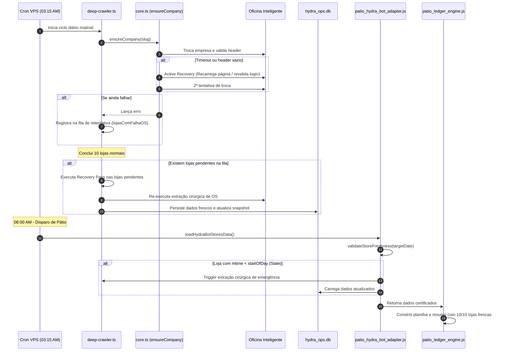

# Design Técnico: Blindagem de Resiliência do Crawler & Validação de Frescor de Pátio

**Spec ID:** `hydra-patio-piraporinha-stale-fix`  
**Data:** 09/10/2026  
**Status:** PROPOSTA DE ARQUITETURA

---

## 1. Fluxo de Execução com Auto-Healing & Validação de Frescor



---

## 2. Contratos & Interfaces TypeScript

### 2.1 Interface de Validação de Frescor (`store_freshness_contract.ts`)

```typescript
export interface StoreFreshnessCheck {
  storeSlug: string;
  filePath: string;
  lastModifiedMs: number;
  lastModifiedISO: string;
  isFresh: boolean;
  ageHours: number;
  reason?: 'file_missing' | 'stale_date' | 'empty_file' | 'fresh';
}

export interface NetworkFreshnessReport {
  executionDateBR: string;
  totalStores: number;
  freshStores: number;
  staleStores: string[];
  missingStores: string[];
  allCertified: boolean;
  checks: Record<string, StoreFreshnessCheck>;
}
```

### 2.2 Assinatura e Comportamento do Active Recovery em `core.ts`

```typescript
export interface EnsureCompanyOptions {
  maxAttempts?: number;
  headerTimeoutMs?: number;
  forceReloadOnRetry?: boolean;
}

/**
 * Garante a seleção da empresa com recuperação ativa contra travamentos ASP.NET
 */
export async function ensureCompany(
  page: Page,
  slugEmpresa: string,
  options?: EnsureCompanyOptions
): Promise<void>;
```

---

## 3. Módulos a Modificar

1. **`src/workers/oficina-agent/playwright/actions/core.ts`**:
   - Refatorar `ensureCompany`:
     - Implementar checagem de URL antes de ler `#lblSiglaEmpresa`.
     - Em caso de falha na tentativa $N$, verificar se a página foi deslogada; se sim, re-autenticar.
     - Se ainda estiver na aplicação, executar `page.reload({ waitUntil: 'load' })` para resetar o pipeline ASP.NET.

2. **`src/hydra-sync/deep-crawler.ts`**:
   - Implementar `recoveryQueue: string[]` para armazenar lojas com Circuit Breaker ativado.
   - Antes da consolidação final e geração do PDF de Metas, executar segunda passada cirúrgica para lojas da fila.
   - Retornar código de saída diferente de 0 caso alguma loja permaneça pendente após a recuperação, impedindo que tarefas encadeadas assumam sucesso cego.

3. **`projects/hydra-rede/src/patio_hydra_bot_adapter.js`**:
   - Implementar `validateStoresFreshness(sourceDir, referenceDateBR)`.
   - Se um arquivo de loja tiver mais de 12 horas ou data anterior a D-1/D, disparar erro determinístico e tentar recarga se local/VPS.

4. **Sincronização Operacional VPS**:
   - Executar extração atualizada para Piraporinha.
   - Regenerar a planilha do dia 09/10 com os dados oficiais batendo com `CONCILIAÇÃO 0910.xlsx`.
