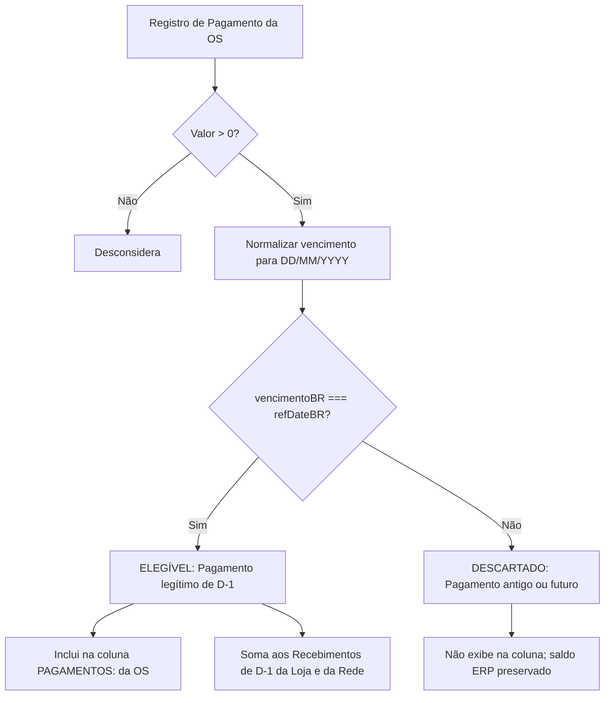

# Design Técnico: Pagamentos Estritos D-1 & Card de Saldo Consolidado

**Spec ID:** `hydra-patio-strict-payments-and-grand-total`  
**Data:** 08/10/2026  

---

## 1. Fluxo de Dados e Algoritmo de Pagamento



### Assinatura da Função:
```javascript
/**
 * Validação estrita: O pagamento pertence a D-1 se e somente se seu vencimento
 * registrado no ERP coincidir exatamente com a data de referência D-1.
 * 
 * @param {object} payment { valor, vencimento, forma, parcela }
 * @param {string} refDateBR Formato DD/MM/YYYY
 * @returns {boolean}
 */
function isPaymentOnReferenceDay(payment, refDateBR) {
  const val = Number(payment.valor) || 0;
  if (val <= 0) return false;

  const vencimentoBR = normalizeToBRDate(payment.vencimento);
  return vencimentoBR === refDateBR;
}
```

---

## 2. Layout da Planilha Excel (Aba "OS")

### A. Bloco Superior de KPIs Executivos (Linhas 4 a 5):
| Células | Título | Conteúdo / Estilo |
|---|---|---|
| `B4:C5` | **VEÍCULOS EM PÁTIO ATIVO** | Contagem total de OSs abertas (ex: `29 ordens`), fundo `#F1F5F9`, borda `#94A3B8` |
| `D4:D5` | **SALDO TOTAL DO PÁTIO** | Valor total pendente real (ex: `R$ 39.889,65`), fundo ouro/âmbar `#FEF3C7`, borda `#F59E0B`, texto `#78350F` bold tamanho 12 |
| `E4:E5` | **RECEBIMENTOS ONTEM (D-1)** | Total arrecadado no dia (ex: `R$ 16.451,06`), fundo azul suave `#E0F2FE`, borda `#7DD3FC`, texto `#0369A1` bold tamanho 12 |

### B. Linha de Fechamento Geral (Grand Total) no Rodapé da Aba "OS":
- Localizada imediatamente após a 10ª loja (Jabaquara):
  - `B{currentRow}:C{currentRow}` (Mescladas): `TOTAL CONSOLIDADO REDE (PÁTIO ATIVO):`
    - Fonte: Segoe UI, tamanho 10.5 bold, cor `#78350F`.
    - Fundo: `#FEF3C7` (Âmbar 100).
    - Alinhamento: Direita.
  - `D{currentRow}`:
    - Fórmula Excel: `=D{sub_1}+D{sub_2}+...+D{sub_10}`.
    - Formato de Número: `R$ #,##0.00`.
    - Fonte: Segoe UI, tamanho 11 bold, cor `#78350F`.
    - Borda: Dupla inferior contábil.
  - `E{currentRow}`:
    - Texto descritivo consolidado: `29 OSs no pátio ativo | 19 saídas de ontem | R$ 16.451,06 recebidos ontem`.
    - Fonte: Segoe UI, tamanho 9 italic, cor `#78350F`.

---

## 3. Módulos Afetados

1. **`src/patio_ledger_engine.js`:**
   - Remoção da heurística `docUpdBR === refDateBR` em `isPaymentOnReferenceDay`.
   - Limpeza da assinatura e chamadas para remover parâmetro morto `docUpdBR`.

2. **`src/excel_patio_builder.js`:**
   - Inserção do Card KPI Executivo de Topo (linhas 4-5) na Aba "OS".
   - Ajuste do offset inicial das lojas para linha 7.
   - Acúmulo dos índices das linhas de subtotal de cada loja (`storeSubtotalRows`).
   - Renderização da linha final de Grand Total da Rede com fórmula `=SUM(...)`.

3. **`src/whatsapp_patio_dispatcher.js`:**
   - Resumo executivo refletirá os recebimentos reais limpos (PIX e Débito de D-1).

4. **VPS Linux (`/home/operacional/hydra-rede/`):**
   - Sincronização dos módulos atualizados via SCP.
