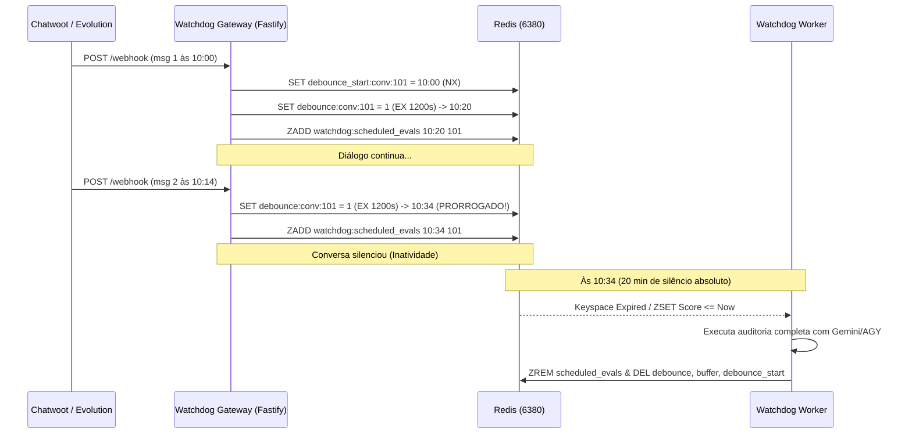

# Design Técnico: Watchdog Sliding Idle Debounce

## Arquitetura de Estado no Redis

### Chaves e Estruturas
1. `buffer:conv:${convId}` (LIST):
   - Armazena os payloads das mensagens recebidas.
   - TTL estendido: `MAX_ACCUMULATION_SECONDS + 600` (ex: 2h 10m).
2. `debounce:conv:${convId}` (STRING):
   - Chave efêmera que monitora a inatividade.
   - A cada mensagem recebida: `SET debounce:conv:${convId} 1 EX remainingTtl`.
   - Dispara notificação `__keyevent@0__:expired` quando a inatividade é atingida.
3. `debounce_start:conv:${convId}` (STRING):
   - Guarda o timestamp epoch em segundos do início do lote atual.
   - Criado com `SET ... NX EX MAX_ACCUMULATION_SECONDS + 600`.
   - Limite teto: `nextScheduledAt = min(now + IDLE_GAP, start + MAX_ACCUMULATION)`.
4. `watchdog:scheduled_evals` (ZSET):
   - Índice ordenado por score (`scheduledAt`).
   - A cada mensagem recebida: `ZADD watchdog:scheduled_evals nextScheduledAt convId`.
   - Reconciliador varre a cada 30s: `ZRANGEBYSCORE watchdog:scheduled_evals -inf now`.

## Fluxo de Processamento

