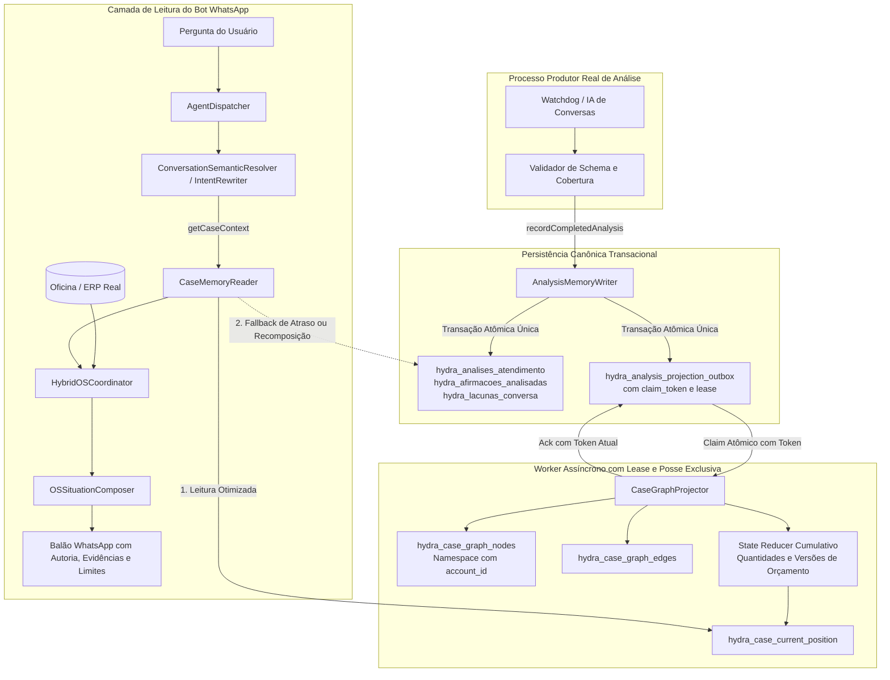

# Desenho Técnico: Hydra — Histórico de Análises e Grafo de Atendimentos

**ID da Spec:** `hydra-case-history-graph`  
**Data:** 05/10/2026  
**Status:** ESPECIFICAÇÃO TÉCNICA E CONTRATOS DE DADOS (VERSÃO 2.1 — REVISADA COM AJUSTES A1–A4)  

---

## 1. Fluxo de Dados e Arquitetura

O sistema implementa desacoplamento estrito entre a análise das conversas pelo produtor, a gravação histórica canônica transacional, a projeção assíncrona do grafo e a leitura para o bot:



---

## 2. Esquema Físico do Banco de Dados e Procedimento de Migração Seguro (A1 e A2)

### 2.1. Controle de Migração e Protocolo de Foreign Keys

Para eliminar os erros comprovados (`no such table` em banco vazio e `no such column: revision_id` em banco legado) e respeitar a especificação do SQLite quanto ao desativamento de chaves estrangeiras:

1. **Protocolo de Foreign Keys (A2):**
   - O estado inicial de `foreign_keys` é inspecionado antes de qualquer transação: `const fkInitial = db.pragma('foreign_keys', { simple: true });`
   - O comando `PRAGMA foreign_keys = OFF;` é executado **estritamente fora** de qualquer transação.
   - A transação de migração roda sob `BEGIN IMMEDIATE;`.
   - Antes de commitar, a integridade de todas as referências é verificada via `PRAGMA foreign_key_check;`. Se houver erros, aborta-se com `ROLLBACK;`.
   - No bloco `finally`, restaura-se obrigatoriamente `db.pragma('foreign_keys = ' + fkInitial);` **fora** da transação.
2. **Três Caminhos de Migração Inspecionados (A1):**
   - O Executor 2 inspeciona as tabelas via `sqlite_schema` e colunas via `PRAGMA table_info`:
     - **Caminho 1 (Banco Vazio):** Cria diretamente todas as tabelas na versão 1 sem executar SELECT sobre tabelas inexistentes.
     - **Caminho 2 (Legado Conhecido):** Mapeia explicitamente apenas as colunas existentes de `hydra_analises_atendimento`, `hydra_afirmacoes_analisadas` e `hydra_lacunas_conversa`. Preserva e converte as chaves de pai e filhos de `analysis_id` para `revision_id = 'legacy:' || analysis_id`. Valida que `count(antiga) === count(nova)`. Proibido `INSERT OR IGNORE` silencioso.
     - **Caminho 3 (Já Migrado):** Se `hydra_schema_migrations` já contiver a versão 1, a rotina é um no-op idempotente.

#### Algoritmo Estruturado de Migração do Executor 2:

```typescript
export function runCaseHistoryGraphMigration(db: Database.Database): void {
  const fkInitial = db.pragma('foreign_keys', { simple: true }) as number;
  
  try {
    // 1. Desligar foreign keys FORA da transação
    db.pragma('foreign_keys = OFF');

    // 2. Inspecionar existência de tabelas no schema
    const tables = db.prepare("SELECT name FROM sqlite_schema WHERE type='table'").all() as { name: string }[];
    const tableNames = new Set(tables.map(t => t.name));

    // Garantir tabela de controle de migrações
    db.exec(`
      CREATE TABLE IF NOT EXISTS hydra_schema_migrations (
        version INTEGER PRIMARY KEY,
        applied_at TEXT DEFAULT CURRENT_TIMESTAMP,
        description TEXT NOT NULL
      );
    `);

    const currentVersionRow = db.prepare("SELECT MAX(version) as ver FROM hydra_schema_migrations").get() as { ver: number | null };
    const currentVersion = currentVersionRow?.ver ?? 0;

    if (currentVersion >= 1) {
      return; // Caminho 3: Já migrado com sucesso (no-op)
    }

    if (!tableNames.has('hydra_analises_atendimento')) {
      // Caminho 1: Banco Vazio - Criação direta sem dependência de dados legados
      db.exec('BEGIN IMMEDIATE;');
      createFreshVersion1Schema(db);
      db.prepare("INSERT INTO hydra_schema_migrations (version, description) VALUES (1, 'fresh_v1_install')").run();
      const fkCheck = db.pragma('foreign_key_check') as unknown[];
      if (fkCheck.length > 0) throw new Error('Foreign key check failed on fresh install');
      db.exec('COMMIT;');
      return;
    }

    // Caminho 2: Legado Conhecido - Migração de tabelas existentes
    const cols = db.prepare("PRAGMA table_info(hydra_analises_atendimento)").all() as { name: string }[];
    const colNames = new Set(cols.map(c => c.name));

    if (colNames.has('revision_id')) {
      // Já possui a coluna nova
      db.exec('BEGIN IMMEDIATE;');
      db.prepare("INSERT OR IGNORE INTO hydra_schema_migrations (version, description) VALUES (1, 'already_has_revision_id')").run();
      db.exec('COMMIT;');
      return;
    }

    // Iniciar transação de reconstrução do legado
    db.exec('BEGIN IMMEDIATE;');

    // 2.1 Criar tabelas temporárias _new
    createVersion1NewTables(db);

    // 2.2 Migrar Pai: hydra_analises_atendimento
    const totalOldAnalyses = (db.prepare("SELECT COUNT(*) as c FROM hydra_analises_atendimento").get() as { c: number }).c;
    db.exec(`
      INSERT INTO hydra_analises_atendimento_new (
        revision_id, analysis_id, source_id, account_id, conversation_id, loja_slug,
        covered_os_ids, source_type, analyzed_until_message_id, analyzed_until_timestamp,
        occurred_at, analyzed_at, recorded_at, analysis_run_id, schema_version,
        analyzer_version, operational_summary, conduct_alert, is_valid
      )
      SELECT 
        'legacy:' || analysis_id,
        analysis_id,
        'legacy_source',
        'legacy_account',
        conversation_id,
        loja_slug,
        covered_os_ids,
        source_type,
        analyzed_until_message_id,
        analyzed_until_timestamp,
        generated_at,
        generated_at,
        created_at,
        'run_legacy',
        '1.0',
        '1.0',
        NULL,
        NULL,
        is_valid
      FROM hydra_analises_atendimento;
    `);
    const totalNewAnalyses = (db.prepare("SELECT COUNT(*) as c FROM hydra_analises_atendimento_new").get() as { c: number }).c;
    if (totalOldAnalyses !== totalNewAnalyses) {
      throw new Error(`Migration row count mismatch on analyses: expected ${totalOldAnalyses}, got ${totalNewAnalyses}`);
    }

    // 2.3 Migrar Filhas: hydra_afirmacoes_analisadas
    if (tableNames.has('hydra_afirmacoes_analisadas')) {
      const totalOldStatements = (db.prepare("SELECT COUNT(*) as c FROM hydra_afirmacoes_analisadas").get() as { c: number }).c;
      db.exec(`
        INSERT INTO hydra_afirmacoes_analisadas_new (
          revision_id, statement_id, fact_id, analysis_id, target_os_id, subject_type,
          polarity, author_role, author_name, message_id, event_timestamp, raw_excerpt,
          confirmation_level, service_scope, budget_version, monetary_cents, delay_cause_reported
        )
        SELECT 
          'legacy:' || analysis_id,
          statement_id,
          'fact_' || statement_id,
          analysis_id,
          target_os_id,
          subject_type,
          polarity,
          author_role,
          author_name,
          message_id,
          event_timestamp,
          raw_excerpt,
          confirmation_level,
          service_scope,
          budget_version,
          CAST(ROUND(monetary_value * 100) AS INTEGER),
          NULL
        FROM hydra_afirmacoes_analisadas;
      `);
      const totalNewStatements = (db.prepare("SELECT COUNT(*) as c FROM hydra_afirmacoes_analisadas_new").get() as { c: number }).c;
      if (totalOldStatements !== totalNewStatements) {
        throw new Error(`Migration row count mismatch on statements: expected ${totalOldStatements}, got ${totalNewStatements}`);
      }
    }

    // 2.4 Migrar Filhas: hydra_lacunas_conversa
    if (tableNames.has('hydra_lacunas_conversa')) {
      const totalOldGaps = (db.prepare("SELECT COUNT(*) as c FROM hydra_lacunas_conversa").get() as { c: number }).c;
      db.exec(`
        INSERT INTO hydra_lacunas_conversa_new (
          gap_id, revision_id, analysis_id, conversation_id, gap_type, message_id, event_timestamp, description
        )
        SELECT 
          gap_id,
          'legacy:' || analysis_id,
          analysis_id,
          conversation_id,
          gap_type,
          message_id,
          event_timestamp,
          description
        FROM hydra_lacunas_conversa;
      `);
      const totalNewGaps = (db.prepare("SELECT COUNT(*) as c FROM hydra_lacunas_conversa_new").get() as { c: number }).c;
      if (totalOldGaps !== totalNewGaps) {
        throw new Error(`Migration row count mismatch on gaps: expected ${totalOldGaps}, got ${totalNewGaps}`);
      }
    }

    // 2.5 Substituir tabelas antigas pelas novas
    db.exec(`
      DROP TABLE IF EXISTS hydra_lacunas_conversa;
      DROP TABLE IF EXISTS hydra_afirmacoes_analisadas;
      DROP TABLE IF EXISTS hydra_analises_atendimento;

      ALTER TABLE hydra_analises_atendimento_new RENAME TO hydra_analises_atendimento;
      ALTER TABLE hydra_afirmacoes_analisadas_new RENAME TO hydra_afirmacoes_analisadas;
      ALTER TABLE hydra_lacunas_conversa_new RENAME TO hydra_lacunas_conversa;
    `);

    // 2.6 Criar índices definitivos
    createVersion1Indexes(db);

    // 2.7 Criar tabelas auxiliares de outbox, grafo e posição atual
    createAuxiliaryVersion1Tables(db);

    // 2.8 Validar integridade referencial antes do commit
    const fkErrors = db.pragma('foreign_key_check') as unknown[];
    if (fkErrors.length > 0) {
      throw new Error('Integrity check failed: invalid foreign keys after legacy migration');
    }

    db.prepare("INSERT INTO hydra_schema_migrations (version, description) VALUES (1, 'legacy_rebuild_complete')").run();
    db.exec('COMMIT;');
  } catch (err) {
    if (db.inTransaction) {
      db.exec('ROLLBACK;');
    }
    throw err;
  } finally {
    // 3. Restaurar o estado original de foreign keys FORA da transação
    db.pragma(`foreign_keys = ${fkInitial}`);
  }
}
```

---

### 2.2. Esquema DDL Final da Versão 1

```sql
-- Análises Canônicas
CREATE TABLE IF NOT EXISTS hydra_analises_atendimento (
  revision_id TEXT PRIMARY KEY,
  analysis_id TEXT NOT NULL,
  source_id TEXT NOT NULL,
  account_id TEXT NOT NULL,
  conversation_id INTEGER NOT NULL,
  loja_slug TEXT NOT NULL,
  covered_os_ids TEXT,
  source_type TEXT NOT NULL CHECK(source_type IN ('OPERATIONAL_SYNTHESIS', 'WATCHDOG_EVAL', 'DAILY_DISPATCH')),
  analyzed_until_message_id INTEGER,
  analyzed_until_timestamp TEXT NOT NULL,
  occurred_at TEXT,
  analyzed_at TEXT NOT NULL,
  recorded_at TEXT DEFAULT CURRENT_TIMESTAMP,
  analysis_run_id TEXT NOT NULL,
  schema_version TEXT NOT NULL,
  analyzer_version TEXT NOT NULL,
  operational_summary TEXT,
  conduct_alert TEXT,
  candidate_contacts_json TEXT,
  candidate_vehicles_json TEXT,
  candidate_orders_json TEXT,
  is_valid INTEGER NOT NULL DEFAULT 1
);

-- Afirmações Operacionais Estruturadas
CREATE TABLE IF NOT EXISTS hydra_afirmacoes_analisadas (
  revision_id TEXT NOT NULL,
  statement_id TEXT NOT NULL,
  fact_id TEXT NOT NULL,
  analysis_id TEXT NOT NULL,
  target_os_id INTEGER,
  subject_type TEXT NOT NULL,
  polarity TEXT NOT NULL CHECK(polarity IN ('AFFIRMATIVE', 'NEGATIVE', 'CONDITIONAL')),
  author_role TEXT NOT NULL CHECK(author_role IN ('CLIENT', 'ATTENDANT', 'SYSTEM', 'UNKNOWN')),
  author_name TEXT NOT NULL,
  message_id INTEGER,
  event_timestamp TEXT NOT NULL,
  raw_excerpt TEXT NOT NULL,
  confirmation_level TEXT NOT NULL,
  service_scope TEXT,
  budget_version TEXT,
  monetary_cents INTEGER,
  delay_cause_reported TEXT,
  part_name TEXT,
  part_code TEXT,
  part_quantity_requested INTEGER,
  part_quantity_arrived INTEGER,
  order_ref TEXT,
  supersedes_fact_id TEXT,
  PRIMARY KEY (revision_id, statement_id),
  FOREIGN KEY (revision_id) REFERENCES hydra_analises_atendimento(revision_id) ON DELETE CASCADE
);

-- Lacunas de Conversa
CREATE TABLE IF NOT EXISTS hydra_lacunas_conversa (
  gap_id TEXT PRIMARY KEY,
  revision_id TEXT NOT NULL,
  analysis_id TEXT NOT NULL,
  conversation_id INTEGER NOT NULL,
  gap_type TEXT NOT NULL,
  message_id INTEGER,
  event_timestamp TEXT NOT NULL,
  description TEXT NOT NULL,
  FOREIGN KEY (revision_id) REFERENCES hydra_analises_atendimento(revision_id) ON DELETE CASCADE
);

-- Outbox com Claim Token, Limite de Tentativas e Lease (A3)
CREATE TABLE IF NOT EXISTS hydra_analysis_projection_outbox (
  job_id TEXT PRIMARY KEY,
  revision_id TEXT NOT NULL,
  analysis_id TEXT NOT NULL,
  loja_slug TEXT NOT NULL,
  status TEXT NOT NULL CHECK(status IN ('PENDING', 'PROCESSING', 'COMPLETED', 'FAILED')),
  worker_id TEXT,
  claim_token TEXT,
  claimed_at TEXT,
  lease_expires_at TEXT,
  attempts INTEGER NOT NULL DEFAULT 0,
  max_attempts INTEGER NOT NULL DEFAULT 5,
  next_attempt_at TEXT,
  error_message TEXT,
  created_at TEXT DEFAULT CURRENT_TIMESTAMP,
  processed_at TEXT,
  FOREIGN KEY (revision_id) REFERENCES hydra_analises_atendimento(revision_id) ON DELETE CASCADE
);

-- Grafo Relacional com Namespace Global contendo account_id (A4.3)
CREATE TABLE IF NOT EXISTS hydra_case_graph_nodes (
  node_id TEXT PRIMARY KEY, -- ${entity_type}:${source_id}:${account_id}:${loja_slug}:${entity_local_id}
  entity_type TEXT NOT NULL CHECK(entity_type IN ('LOJA', 'CONTATO', 'CONVERSA', 'VEICULO', 'ORDEM_SERVICO', 'ANALISE', 'FATO', 'EVIDENCIA')),
  label TEXT NOT NULL,
  account_id TEXT NOT NULL,
  loja_slug TEXT NOT NULL,
  attributes_json TEXT NOT NULL,
  valid_from TEXT,
  valid_to TEXT,
  created_at TEXT DEFAULT CURRENT_TIMESTAMP
);

CREATE TABLE IF NOT EXISTS hydra_case_graph_edges (
  edge_id TEXT PRIMARY KEY, -- ${from_node_id}->${relation_type}->${to_node_id}
  from_node_id TEXT NOT NULL,
  to_node_id TEXT NOT NULL,
  relation_type TEXT NOT NULL CHECK(relation_type IN (
    'PARTICIPATES_IN', 'COVERS_SEGMENT', 'REFERS_TO_VEHICLE', 'TREATS_ORDER',
    'CONTAINS_STATEMENT', 'SUPPORTED_BY_EVIDENCE', 'SUPERSEDES_STATEMENT'
  )),
  status TEXT NOT NULL CHECK(status IN ('ACTIVE', 'INVALIDATED', 'DISPUTED')) DEFAULT 'ACTIVE',
  version INTEGER NOT NULL DEFAULT 1,
  link_method TEXT NOT NULL,
  confidence TEXT NOT NULL,
  loja_slug TEXT NOT NULL,
  evidence_ref TEXT NOT NULL,
  valid_from TEXT,
  valid_to TEXT,
  properties_json TEXT,
  created_at TEXT DEFAULT CURRENT_TIMESTAMP,
  FOREIGN KEY (from_node_id) REFERENCES hydra_case_graph_nodes(node_id) ON DELETE CASCADE,
  FOREIGN KEY (to_node_id) REFERENCES hydra_case_graph_nodes(node_id) ON DELETE CASCADE
);

-- Posição Atual Compacta Derivada por State Reducer
CREATE TABLE IF NOT EXISTS hydra_case_current_position (
  source_id TEXT NOT NULL,
  account_id TEXT NOT NULL,
  loja_slug TEXT NOT NULL,
  os_id INTEGER NOT NULL,
  vehicle_plate TEXT NOT NULL,
  vehicle_model TEXT NOT NULL,
  customer_phone TEXT NOT NULL,
  customer_name TEXT NOT NULL,
  current_erp_status TEXT NOT NULL,
  erp_snapshot_timestamp TEXT NOT NULL,
  current_approval_status TEXT NOT NULL,
  approved_budget_version TEXT,
  pending_budget_version TEXT,
  reported_delay_cause TEXT,
  reported_delay_author TEXT,
  reported_delay_role TEXT,
  reported_delay_at TEXT,
  reported_delay_raw TEXT,
  part_dependencies_json TEXT NOT NULL DEFAULT '[]',
  commitments_summary TEXT,
  active_gaps_json TEXT NOT NULL DEFAULT '[]',
  last_covered_message_id INTEGER,
  last_covered_timestamp TEXT NOT NULL,
  applied_revisions_json TEXT NOT NULL DEFAULT '{}', -- Mapa de fontes para revisões aplicadas
  projection_version INTEGER NOT NULL DEFAULT 1,
  updated_at TEXT DEFAULT CURRENT_TIMESTAMP,
  PRIMARY KEY (source_id, loja_slug, os_id)
);
```

---

## 3. Protocolo do Worker com Claim Token e Limite de Tentativas (A3)

1. **Seleção e Claim Atômico com Limite Rigoroso:**
   ```sql
   -- Passo 1: Selecionar job pendente ou expirado dentro do limite
   SELECT job_id, attempts FROM hydra_analysis_projection_outbox
   WHERE (status = 'PENDING' OR (status = 'PROCESSING' AND lease_expires_at < datetime('now')))
     AND attempts < max_attempts
     AND (next_attempt_at IS NULL OR next_attempt_at <= datetime('now'))
   ORDER BY created_at ASC
   LIMIT 1;

   -- Passo 2: Claim atômico com geração de novo claim_token
   UPDATE hydra_analysis_projection_outbox
   SET status = 'PROCESSING',
       worker_id = :workerId,
       claim_token = :claimToken, -- randomUUID()
       claimed_at = datetime('now'),
       lease_expires_at = datetime('now', '+60 seconds'),
       attempts = attempts + 1
   WHERE job_id = :selectedJobId
     AND (status = 'PENDING' OR (status = 'PROCESSING' AND lease_expires_at < datetime('now')))
     AND attempts < max_attempts;
   ```
2. **Proteção Contra Sobrescrita por Perda de Posse:**
   - Todo processamento grava nós, arestas e posição sob transação.
   - O Ack de finalização verifica obrigatoriamente:
     ```sql
     UPDATE hydra_analysis_projection_outbox
     SET status = 'COMPLETED', processed_at = datetime('now')
     WHERE job_id = :jobId AND claim_token = :claimToken;
     ```
   - Se `changes === 0`, significa que o worker excedeu os 60s de lease e outro worker assumiu o job com um novo token. O worker antigo rejeita a publicação e não corrompe o estado.
3. **Esgotamento e Estado Terminal Visível:**
   - Jobs que atingem `attempts >= max_attempts` são imediatamente marcados como `status = 'FAILED'`, cessando qualquer tentativa automática.

---

## 4. Algoritmo do State Reducer com Quantidades de Peças e Versões de Orçamento (A4.1 e A4.2)

1. **Chegada Parcial de Peças:**
   - Se a OS possui pendência de `partName: 'Amortecedor dianteiro'`, `partCode: 'AMT100'`, `quantityRequested: 2`, e chega um fato `PART_ARRIVAL` com `partCode: 'AMT100'` e `quantityArrived: 1`:
     - O State Reducer calcula o saldo: `quantityPending = 2 - 1 = 1`.
     - O amortecedor **continua ativo** na lista `activePartDependencies` com `quantityPending: 1`.
     - Somente quando `quantityArrived >= quantityRequested` a pendência é completamente encerrada.
2. **Separação de Versões de Orçamento:**
   - Se o cliente aprovou o orçamento versão 1 (`CLIENT_APPROVAL` com `budgetVersion: 'v1'`), a posição grava `approvedBudgetVersion: 'v1'`.
   - Se a oficina emitir um complemento de orçamento v2 (`APPROVAL_DEPENDENCY` com `budgetVersion: 'v2'`), a aprovação de v1 **não resolve** a dependência de v2: a posição mantém `pendingBudgetVersion: 'v2'` e `approvalStatus: 'PENDING'`.
3. **Recomposição por Edição de Mensagem Antiga ou Retificação de Vínculo:**
   - Quando uma mensagem antiga for editada ou um vínculo retificado, a nova análise gera uma nova revisão com carimbo de análise atual.
   - O worker não descarta a análise por ter mensagens antigas; ele executa a **recomposição (re-redução)** de todos os fatos vigentes do caso, atualizando o mapa `appliedRevisionsMap`.

---

## 5. Elegibilidade de Lojas Especificada contra o Catálogo Oficial (A4.3)

Centralizada em `src/hydra-sync/semantic_glossary.ts`:

```typescript
import { OFFICIAL_STORES } from './semantic_glossary';

/**
 * Validação canônica de elegibilidade operacional de lojas da rede.
 * Rejeita compulsoriamente a loja administrativa MPMaster e qualquer slug desconhecido fora do catálogo.
 */
export function isOperationalStoreEligible(lojaSlug: string): boolean {
  if (!lojaSlug) return false;
  const normalized = lojaSlug.trim().toLowerCase();
  
  // 1. Encontra a loja no catálogo oficial de lojas cadastradas
  const matchedStore = OFFICIAL_STORES.find(
    s => s.slug.toLowerCase() === normalized || s.aliases.some(a => a.toLowerCase() === normalized)
  );

  // 2. Se não estiver no catálogo oficial da rede, rejeita
  if (!matchedStore) return false;

  // 3. Se for a unidade administrativa MPMaster, exclui dos rankings operacionais
  return matchedStore.slug !== 'MPMaster';
}
```

---

## 6. Divisão de Responsabilidade entre Módulos

| Executor | Arquivos Sob Sua Guarda | Responsabilidades Técnicas Detalhadas |
| :--- | :--- | :--- |
| **Principal** | `types/conversation_context_contract.ts`<br>`tests/test_case_graph_gates.ts` | Congelar contratos tipados, orquestrar sessões, validar integridade e homologar gates H01–H18, R01–R09 e A1–A4. |
| **Executor 1 (`de5452f5-ae9d-4de2-af64-0b12f075f5ea`)** | `conversation_semantic_resolver.ts`<br>`intent_rewriter.ts`<br>`evidence_policy_manager.ts`<br>`os_situation_composer.ts` | Semântica de demora (`DELAY_REASON`), distinção factual OS vs Pátio, autoria de relatos, política de chegada parcial e orçamento, resposta de capacidades. |
| **Executor 2 (`7b9923e9-f4d2-46ff-8a6b-ea932132e04d`)** | `real_analysis_repository.ts`<br>`analysis_memory_writer.ts`<br>`analysis_projection_outbox.ts` | Migração multi-caminho segura (vazio, legado e migrado), ordem estrita de `foreign_keys = OFF / ON`, outbox com claim token e lease de 60s, catálogo de lojas. |
| **Executor 3 (`5dffcfaf-5e84-438e-81f0-88558655f4c0`)** | `case_graph_projection.ts`<br>`case_current_position.ts`<br>`case_memory_reader.ts`<br>`hybrid_os_coordinator.ts`<br>`agent_dispatcher.ts` | Worker assíncrono com posse exclusiva por token, State Reducer com quantidades de peças e versão de orçamento, recomposição por edição antiga, leitor e bot. |
