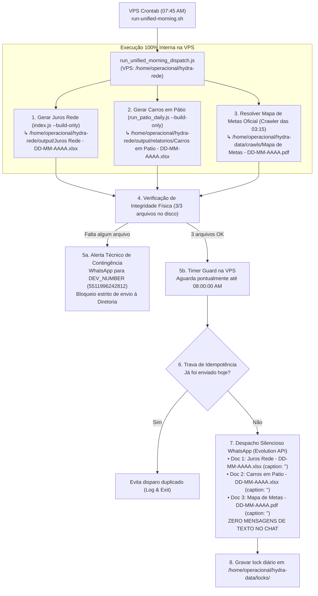

# Especificação de Design — Despacho Matinal 100% VPS (hydra-clean-trio-dispatch)

**Spec ID:** `hydra-clean-trio-dispatch`  
**Data:** 09/10/2026  
**Status:** Planejamento  
**Ambiente:** 100% VPS Linux (`operacional@100.126.50.101`)  

---

## 1. Arquitetura do Sistema na VPS Linux



---

## 2. Componentes e Módulos na VPS

### 2.1. Orquestrador Unificado: `projects/hydra-rede/src/run_unified_morning_dispatch.js`
Roda 100% na VPS e executa em sequência:
1. `execSync('node src/index.js --build-only', { cwd: BASE_DIR })`: Gera a planilha de Juros com nome padronizado `Juros Rede - DD-MM-AAAA.xlsx`.
2. `execSync('node src/run_patio_daily.js --build-only --no-sync', { cwd: BASE_DIR })`: Gera a planilha de Pátio com nome padronizado `Carros em Patio - DD-MM-AAAA.xlsx` a partir dos dados do crawler que já estão em `/home/operacional/hydra-data/crawls/`.
3. Localiza `/home/operacional/hydra-data/crawls/Mapa de Metas - DD-MM-AAAA.pdf`.
4. Valida se os 3 arquivos existem e possuem tamanho > 5KB.
5. Aguarda até 08:00:00 AM (suporta `--immediate` para testes).
6. Dispara via `dispararRelatoriosMatinaisSilenciosos` com `caption: ""` via Evolution API.

### 2.2. Shell Script na VPS: `projects/hydra-rede/scripts/run-unified-morning.sh`
```bash
#!/usr/bin/env bash
set -euo pipefail

DIR="$(cd "$(dirname "${BASH_SOURCE[0]}")/.." && pwd)"
cd "$DIR"

mkdir -p /home/operacional/hydra-data/logs
mkdir -p /home/operacional/hydra-data/locks

echo "$(date --iso-8601=seconds) Iniciando despacho matinal unificado dos 3 relatorios..." >> /home/operacional/hydra-data/logs/matinal-trio.log
/usr/bin/node "$DIR/src/run_unified_morning_dispatch.js" "$@" >> /home/operacional/hydra-data/logs/matinal-trio.log 2>&1
```

### 2.3. Despachador Silencioso: `projects/hydra-rede/src/whatsapp_unified_dispatcher.js`
- Lê diretamente `/home/operacional/hydra-data/crawls/` para o Mapa de Metas sem necessidade de SSH/SCP (pois já está na própria máquina Linux).
- Envia cada documento com `caption: ""`.
- Não emite nenhum `sendText` para os destinatários oficiais.

### 2.4. Desativação Completa no Windows Local
Script executado no Windows para neutralizar as tarefas legadas:
- `schtasks /delete /tn "Hydra-Patio-OS-Diario" /f`
- `schtasks /delete /tn "Hydra-Rede-Juros-Diario" /f`
- Modificar `run_patio_reconciliation.bat` e `run_juros_rede.bat` para exibir mensagem avisando que a execução é 100% na VPS.

---

## 3. Configuração do Crontab na VPS

No usuário `operacional` da VPS (`operacional@100.126.50.101`):
```cron
# 1. Crawler Noturno (03:15 AM)
15 3 * * * /home/operacional/hydra/scripts/run-hydra-daily-full.sh

# 2. Despacho Matinal Oficial dos 3 Relatórios (07:45 AM -> Disparo 08:00 AM)
45 7 * * 1-5 /home/operacional/hydra-rede/scripts/run-unified-morning.sh >> /home/operacional/hydra-data/logs/matinal-trio.log 2>&1
```

---

## 4. Critérios de Homologação

1. **Zero Textos:** O chat da diretoria não recebe nenhum texto, nenhum balão de boas-vindas, nenhum resumo executivo e nenhuma legenda.
2. **Exatamente 3 Documentos:** Recebe exclusivamente os 3 arquivos oficiais.
3. **Execução Autônoma na VPS:** Se o computador local do usuário estiver desligado ou sem internet, a entrega ocorre pontualmente às 08:00:00 AM sem nenhuma falha.
