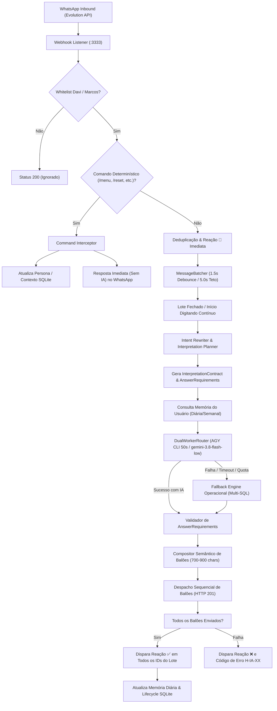

# Design Técnico: Hydra Conversacional, Adaptável e Multi-Persona

**ID da Spec:** `hydra-conversational-adaptable`  
**Data:** 30/09/2026  
**Status:** ESPECIFICAÇÃO DE DESIGN  
**Target:** Node.js 22 LTS / TypeScript strict / SQLite WAL / Evolution API v2

---

## 1. Fluxo de Dados e Ciclo de Vida da Requisição



---

## 2. Esquema de Banco de Dados (SQLite `/home/operacional/hydra-data/hydra_ops.db`)

### 2.1. Tabela de Memória e Preferências do Usuário (`hydra_user_memory`)
```sql
CREATE TABLE IF NOT EXISTS hydra_user_memory (
  phone TEXT PRIMARY KEY,
  generation_id INTEGER NOT NULL DEFAULT 1,
  active_persona TEXT NOT NULL DEFAULT 'socio',
  default_loja_slug TEXT,
  daily_topics_json TEXT NOT NULL DEFAULT '{}',
  weekly_preferences_json TEXT NOT NULL DEFAULT '[]',
  last_command TEXT,
  updated_at DATETIME DEFAULT CURRENT_TIMESTAMP
);

CREATE INDEX IF NOT EXISTS idx_user_memory_updated ON hydra_user_memory(updated_at);
```

### 2.2. Tabela de Despachos de Briefings (`hydra_briefing_dispatches`)
Garante idempotência estrita por data, destinatário e periodicidade:
```sql
CREATE TABLE IF NOT EXISTS hydra_briefing_dispatches (
  id INTEGER PRIMARY KEY AUTOINCREMENT,
  data_referencia TEXT NOT NULL,
  destinatario TEXT NOT NULL,
  tipo_relatorio TEXT NOT NULL, -- 'diario' | 'semanal'
  status_envio TEXT NOT NULL,   -- 'preview' | 'enviado' | 'falha'
  topicos_inclusos TEXT,
  payload_hash TEXT NOT NULL,
  sent_at DATETIME DEFAULT CURRENT_TIMESTAMP,
  UNIQUE(data_referencia, destinatario, tipo_relatorio)
);

CREATE INDEX IF NOT EXISTS idx_briefing_dispatch ON hydra_briefing_dispatches(data_referencia, tipo_relatorio);
```

### 2.3. Tabela de Glossário Semântico (`hydra_semantic_glossary`)
Isolada dos registros de OS, com FTS5 para busca lexical rápida e mapeamento de métricas:
```sql
CREATE TABLE IF NOT EXISTS hydra_semantic_glossary (
  id INTEGER PRIMARY KEY AUTOINCREMENT,
  termo TEXT NOT NULL,
  categoria TEXT NOT NULL, -- 'metrica' | 'area' | 'loja' | 'sinonimo' | 'regra'
  alvo_canonica TEXT NOT NULL,
  tabela_fonte TEXT NOT NULL,
  coluna_filtro TEXT,
  descricao TEXT NOT NULL
);

CREATE INDEX IF NOT EXISTS idx_glossary_termo ON hydra_semantic_glossary(termo);
CREATE INDEX IF NOT EXISTS idx_glossary_cat ON hydra_semantic_glossary(categoria);
```

---

## 3. Interfaces TypeScript Estritas

### 3.1. Contrato de Interpretação e Capacidades Versionadas (`conversation_contract.ts`)

```typescript
export const CAPABILITIES_VERSION = '1.1.0';

export interface AnswerRequirement {
  id: string;
  description: string;
  targetMetric: string;
  targetScope: 'store' | 'all_stores' | 'network';
  targetLojaSlug?: string;
  targetArea?: string;
  fulfilled: boolean;
  sourceTable?: string;
  missingReason?: string;
}

export interface InterpretationContract {
  turnId: string;
  conversationKey: string;
  intents: Array<
    | 'list_os'
    | 'os_detail'
    | 'store_overview'
    | 'financial_alerts'
    | 'aging_cars'
    | 'checklist_audit'
    | 'service_search'
    | 'store_cmv'
    | 'store_area_cmv'
    | 'media_survey'
    | 'goal_gap'
    | 'general_query'
  >;
  metric?: 'cmv' | 'faturamento' | 'os_count' | 'ticket_medio' | 'media_survey' | 'goal_gap';
  dimensions: Array<'loja' | 'area' | 'canal' | 'status' | 'dia'>;
  scope: 'store' | 'all_stores' | 'network' | 'unspecified';
  period: {
    type: 'hoje' | 'ontem' | 'mes_atual' | 'ultimos_30d' | 'personalizado';
    start?: string;
    end?: string;
    label?: string;
  };
  filters: {
    onlyOpen?: boolean;
    noDeposit?: boolean;
    minSaldo?: number;
    minDiasPatio?: number;
    area?: string;
    serviceTerms?: string[];
    focusWorst?: boolean;
  };
  entities: {
    loja?: {
      raw: string;
      slug: string;
      name: string;
      prep: string;
      confidence: number;
    };
    area?: string;
    placa?: string;
    osId?: string;
  };
  source: 'cmv_lojas' | 'faturamento_areas' | 'pesquisa_midia' | 'metas_consolidado' | 'ordens_servico' | 'mixed';
  confidence: number;
  missingInformation: string[];
  answerRequirements: AnswerRequirement[];
  userPersona?: 'socio' | 'gerente';
  defaultLojaSlug?: string;
}
```

### 3.2. Módulo de Comandos Determinísticos (`command_interceptor.ts`)

```typescript
export interface CommandResult {
  isCommand: boolean;
  commandName?: string;
  replyText?: string;
  abortedPreviousTurn?: boolean;
  newPersona?: 'socio' | 'gerente';
  newLojaSlug?: string;
  newGenerationId?: number;
}

export function handleDeterministicCommand(
  db: import('better-sqlite3').Database,
  phone: string,
  rawText: string
): CommandResult;
```

### 3.3. Compositor Semântico de Balões (`balloon_composer.ts`)

```typescript
export interface BalloonComposeOptions {
  maxCharactersPerBalloon?: number; // Padrão: 800
  totalTurnBudget?: number;         // Padrão: 3200
  enforceNoTablePipes?: boolean;    // Converte | em listas legíveis
}

export interface ComposedBalloonsResult {
  balloons: string[];
  totalCharacters: number;
  truncated: boolean;
}

export function composeSemanticBalloons(
  directAnswer: string,
  analysisText: string,
  detailsSection?: string,
  metadataFooter?: string,
  options?: BalloonComposeOptions
): ComposedBalloonsResult;
```

### 3.4. Códigos de Erro Padronizados do Sistema

| Código | Descrição para o Usuário | Causa no Log Técnico |
| :--- | :--- | :--- |
| `H-IA-01` | "Não consegui consultar os dados agora. Tente novamente em instantes. Código H-IA-01." | Timeout excedido nos workers AGY CLI e no fallback |
| `H-IA-02` | "Tivemos uma oscilação na conexão com a base de dados. Pode repetir a pergunta? Código H-IA-02." | Falha SQL / conexão SQLite WAL corrompida ou bloqueada |
| `H-IA-03` | "Essa consulta requer especificar uma loja ou o escopo de rede. Código H-IA-03." | Pergunta ambígua com ausência de entidade obrigatória |
| `H-IA-04` | "Os dados desta métrica ainda não foram atualizados hoje na fonte oficial. Código H-IA-04." | Métrica vazia ou coleta desatualizada além da tolerância |

---

## 4. Distribuição por Worktrees e Módulos

```
hydra-bot/
├── src/hydra-sync/
│   ├── types/
│   │   └── conversation_contract.ts      [Frente A] (Novos tipos e contratos)
│   ├── intent_rewriter.ts                [Frente A] (Planejador de intenções e catalog)
│   ├── semantic_glossary.ts              [Frente A] (Glossário semântico e áreas)
│   ├── operational_adapter.ts            [Frente A] (Multi-queries e CMV por área)
│   ├── dual_worker_router.ts             [Frente A] (Timeout 50s + telemetria de erro)
│   │
│   ├── user_memory_repository.ts         [Frente B] (Memória diária e semanal SQLite)
│   ├── ai_briefing.ts                    [Frente B] (Briefing personalizado por destinatário)
│   ├── hydra_auditor_service.ts          [Frente B] (Extensão com idempotência e preview)
│   │
│   ├── command_interceptor.ts            [Frente C] (Comandos determinísticos /menu, etc.)
│   ├── balloon_composer.ts               [Frente C] (Composição semântica 700-900 chars)
│   ├── format_utils.ts                   [Frente C] (Sanitização e quebras naturais)
│   │
│   ├── webhook_listener.js               [INTEGRADOR PRINCIPAL] (Ingress e orquestração)
│   └── agent_dispatcher.ts               [INTEGRADOR PRINCIPAL] (Ligação IA + histórico)
```

---

## 5. Estratégia de Preservação e Compatibilidade

1. **Evolution API e WhatsApp LID:** Nenhuma alteração nos contratos de webhook `messages.upsert`, detecção de LID (`@lid`) e envio de reações 👀 / ✅.
2. **Batcher:** Mantém o debounce de 1,5s e teto de 5,0s. Comandos determinísticos ignoram o batcher e respondem imediatamente (<20ms).
3. **Catálogo de Lojas Oficial:** Todas as rotinas utilizam `CATALOGO_10_LOJAS` de `db_repository.ts`. A tabela `lojas` vazia é deliberadamente ignorada.
4. **Retrocompatibilidade de Testes:** Todos os 389 testes anteriores permanecem verdes.
