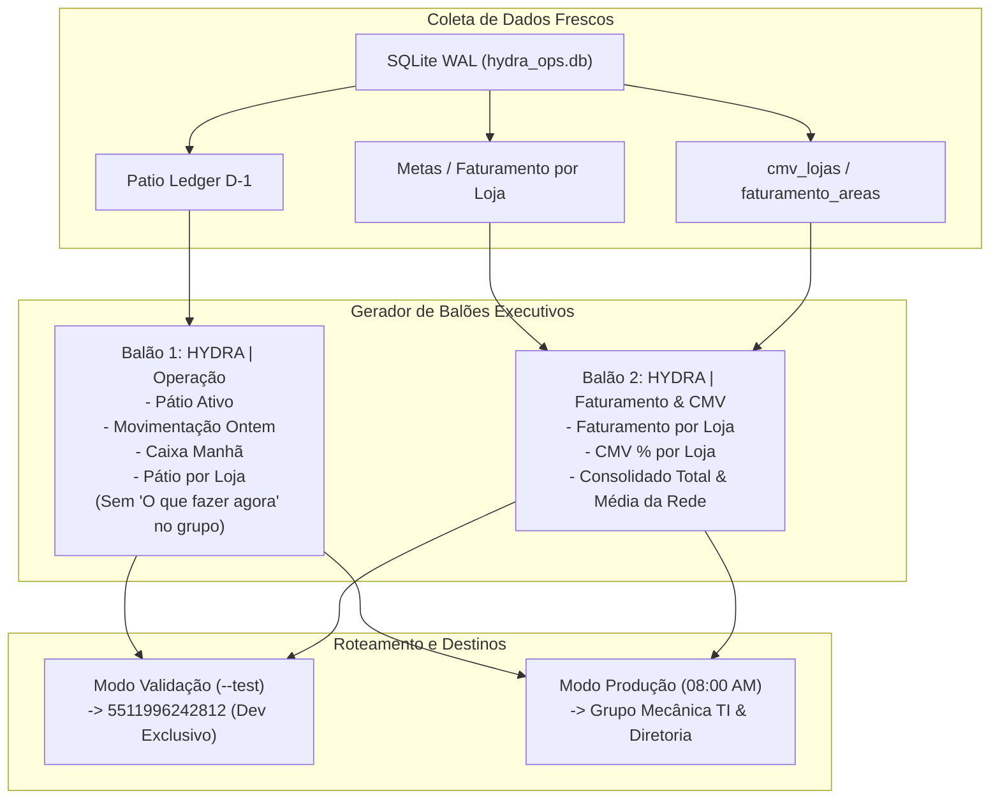

# Design Técnico: Higienização de Relatórios Noturnos, Padronização Institucional e Balão Dedicado de Faturamento & CMV

**Spec ID:** `hydra-daily-report-sanitization-and-branding`  
**Data:** 09/10/2026  
**Status:** Planejamento  

---

## 1. Arquitetura de Despacho em Múltiplos Balões



---

## 2. Contratos de Dados e Funções

### 2.1. Formatação do Balão 1 (`*HYDRA | Operação*`) com Supressão no Grupo

Em `projects/hydra-rede/src/whatsapp_patio_dispatcher.js` e `src/hydra-sync/whatsapp_formatter.ts`:

```javascript
/**
 * Constrói o texto do Resumo Executivo Operacional.
 * Se isGroup === true, a seção 'O que fazer agora' é OBRIGATORIAMENTE suprimida.
 */
function buildExecutiveSummaryText(summaryData, referenceDateStr, customNote = null, isGroup = false) {
  const refDateBR = summaryData.diaReferenciaD1 || referenceDateStr || 'Ontem';
  const formas = summaryData.recebimentosPorForma || { Credito: 0, PIX: 0, Debito: 0, Dinheiro: 0, total: 0 };
  const liq = summaryData.liquidacaoPrevistaHoje || {
    debitoCaindoHojeD1: formas.Debito || 0,
    pixDisponivel: formas.PIX || 0,
    dinheiroDisponivel: formas.Dinheiro || 0,
    totalDisponivelManha: (formas.Debito || 0) + (formas.PIX || 0) + (formas.Dinheiro || 0)
  };

  const blocos = [];

  // 1. Cabeçalho Oficial Canônico
  blocos.push(`*HYDRA | Operação*\n\n${refDateBR} · Pátio & OS (D-1)`);

  // 2. Visão Geral do Pátio
  const patioLinhas = [
    `*Pátio ativo*`,
    `- Veículos com OS aberta: *${summaryData.totalOSsAbertas}* ordens`,
    `- Saldo total pendente: *${formatBRL(summaryData.totalSaldoPendente)}*`,
    `- Saídas de pátio ontem: *${summaryData.totalOSsFechadasOntem}* ordens finalizadas`
  ];
  blocos.push(patioLinhas.join('\n'));

  // 3. Movimentação Recebida Ontem
  const totalRecebido = summaryData.totalRecebidoOntem !== undefined ? summaryData.totalRecebidoOntem : formas.total;
  const movLinhas = [
    `*Movimentação recebida ontem (${refDateBR})*`,
    `- Total recebido: *${formatBRL(totalRecebido)}*`,
    `- Crédito: ${formatBRL(formas.Credito)}`,
    `- Pix: ${formatBRL(formas.PIX)}`,
    `- Dinheiro: ${formatBRL(formas.Dinheiro)}`,
    `- Débito: ${formatBRL(formas.Debito)}`
  ];
  if (formas.Boleto > 0) movLinhas.push(`- Boleto: ${formatBRL(formas.Boleto)}`);
  blocos.push(movLinhas.join('\n'));

  // 4. Previsão de Liquidação em Caixa (Manhã)
  const caixaLinhas = [
    `*Disponibilidade imediata em caixa*`,
    `- Débito de ontem caindo hoje (D+1): *${formatBRL(liq.debitoCaindoHojeD1)}*`,
    `- Já liquidado ontem (Pix e dinheiro): ${formatBRL(liq.pixDisponivel + liq.dinheiroDisponivel)}`,
    `> Total disponível na manhã: *${formatBRL(liq.totalDisponivelManha)}*`
  ];
  blocos.push(caixaLinhas.join('\n'));

  // 5. Pátio por Unidade
  const lojasLinhas = [`*Pátio por unidade*`];
  OFFICIAL_STORES.forEach((store, idx) => {
    const s = (summaryData.lojas || []).find(l => l.storeKey === store.slug) || {
      abertas: 0,
      saldoPendente: 0,
      recebidoOntem: 0,
      fechadasOntem: 0
    };
    const recebidoTxt = s.recebidoOntem > 0 ? ` | Ontem: ${formatBRL(s.recebidoOntem)}` : '';
    const fechadasTxt = s.fechadasOntem > 0 ? ` (${s.fechadasOntem} saídas)` : '';
    lojasLinhas.push(`${idx + 1}. *${store.displayName}:* ${s.abertas} OSs | ${formatBRL(s.saldoPendente)}${recebidoTxt}${fechadasTxt}`);
  });
  blocos.push(lojasLinhas.join('\n'));

  // Se NÃO for grupo, e houver orientações específicas, inclui ações
  if (!isGroup && summaryData.proximasAcoes && summaryData.proximasAcoes.length > 0) {
    const acoesLinhas = [`*O que fazer agora*`];
    summaryData.proximasAcoes.forEach((a, idx) => acoesLinhas.push(`${idx + 1}. ${a.textoAcao}`));
    blocos.push(acoesLinhas.join('\n'));
  }

  if (customNote) {
    blocos.push(`_Nota: ${customNote}_`);
  }

  return blocos.join('\n\n');
}
```

---

### 2.2. Novo Balão 2: Faturamento & CMV por Unidade

Criar a função geradora de balão `formatarBalaoFaturamentoECmv`:

```javascript
/**
 * Gera balão exclusivo de Faturamento e CMV por Unidade no padrão institucional Hydra
 */
function formatarBalaoFaturamentoECmv({ dataReferencia, lojas, faturamentoTotal, cmvMedioRede }) {
  const blocos = [];

  blocos.push(`*HYDRA | Faturamento & CMV por Unidade*\n\n${dataReferencia} · Posição Mês`);

  const lojasLinhas = [`*Desempenho por unidade*`];
  lojas.forEach((l, idx) => {
    const cmvTxt = l.cmvPercentual != null ? `${l.cmvPercentual.toFixed(1).replace('.', ',')}%` : 'N/D';
    lojasLinhas.push(`${idx + 1}. *${l.nome}:* ${formatBRL(l.faturamento)} · CMV: *${cmvTxt}*`);
  });
  blocos.push(lojasLinhas.join('\n'));

  const consolidadoLinhas = [
    `*Consolidado da rede*`,
    `- Faturamento acumulado no mês: *${formatBRL(faturamentoTotal)}*`,
    `- CMV médio da rede: *${cmvMedioRede != null ? cmvMedioRede.toFixed(1).replace('.', ',') + '%' : 'N/D'}*`
  ];
  blocos.push(consolidadoLinhas.join('\n'));

  return blocos.join('\n\n');
}
```

---

### 2.3. Script de Validação e Teste em `5511996242812`

Criar `src/hydra-sync/tests/test_dispatch_validation_phone.ts`:
- Consulta os dados reais mais frescos do SQLite WAL (`hydra_ops.db`):
  - Ledger D-1 para o Balão 1 (`HYDRA | Operação`).
  - Metas e CMV para o Balão 2 (`HYDRA | Faturamento & CMV por Unidade`).
- Formata ambos os textos.
- Dispara via Evolution API (`https://evo.tork.services/message/sendText/hydra`):
  - Destinatário: **exclusivamente `5511996242812`**.
  - Delay de 1500ms entre o balão 1 e o balão 2 para ordem cronológica perfeita no WhatsApp.
- Registra status e `messageId` de cada balão.
- Garante trava: se o número for diferente de `5511996242812`, o teste é abortado.

---

### 2.4. Sanitização do Watchdog (`daily-health.js`)

Remoção de `120363425738307789@g.us` do script e trava programática:
```javascript
const TECHNICAL_EVO_TARGETS = ['5511947645967']; // Joacir Barros (Admin Técnico)

for (const evoTarget of TECHNICAL_EVO_TARGETS) {
  if (String(evoTarget).endsWith('@g.us')) {
    console.warn(`[Watchdog Health] 🛡️ Trava de segurança: Envio para grupo (${evoTarget}) bloqueado.`);
    continue;
  }
  // Envio técnico normal
  ...
}
```
