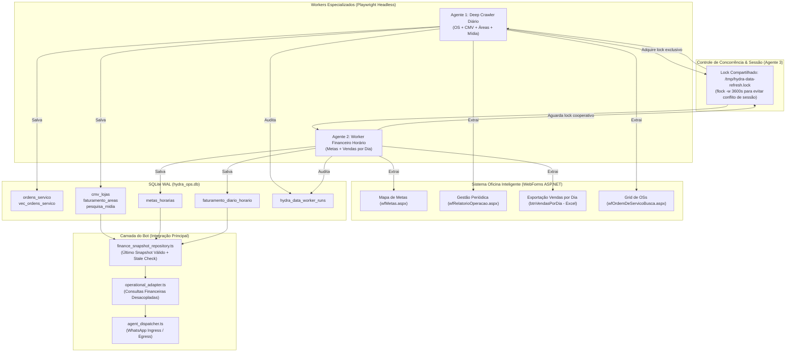

# Design Técnico — Atualização dos Dados do Hydra (Crawlers & Ingestão Operacional)

> **ID da Spec:** `hydra-data-crawlers`  
> **Status:** DESIGN TÉCNICO DETALHADO  
> **Data:** 2026-09-30  

---

## 1. Arquitetura Geral de Dados e Fluxo de Coleta



---

## 2. Modelagem de Dados (Schemas SQLite)

### 2.1 Tabela `metas_horarias`
Histórico horário da captura do Mapa de Metas para as 10 lojas operacionais.
```sql
CREATE TABLE IF NOT EXISTS metas_horarias (
  data_referencia TEXT NOT NULL,       -- YYYY-MM-DD (America/Sao_Paulo)
  posicao_hora TEXT NOT NULL,          -- HH (ex: "09", "10", "14")
  loja_slug TEXT NOT NULL,             -- ex: "MPSantoAndre"
  faturamento_mes REAL NOT NULL,       -- R$ faturamento acumulado no mês até o momento
  volume_os INTEGER NOT NULL,          -- quantidade de OSs faturadas no mês
  ticket_medio REAL NOT NULL,          -- ticket médio apurado
  meta_mes REAL,                       -- meta estipulada para o mês
  previsao_mes REAL,                   -- projeção calculada pelo ERP
  percentual_meta REAL,                -- % de atingimento da meta
  captured_at TEXT NOT NULL,           -- ISO8601 da captura
  PRIMARY KEY (data_referencia, posicao_hora, loja_slug)
);
CREATE INDEX IF NOT EXISTS idx_metas_h_loja_ref ON metas_horarias(loja_slug, data_referencia);
```

### 2.2 Tabela `faturamento_diario_horario`
Armazena a captura da exportação oficial de **Vendas por Dia**, garantindo a precisão das vendas de hoje sem dedução por deltas mensais.
```sql
CREATE TABLE IF NOT EXISTS faturamento_diario_horario (
  data_referencia TEXT NOT NULL,       -- YYYY-MM-DD da data de hoje
  posicao_hora TEXT NOT NULL,          -- HH da captura
  loja_slug TEXT NOT NULL,             -- ex: "MPJorgeBeretta"
  faturamento_dia REAL NOT NULL,       -- R$ faturamento oficial do dia de hoje
  volume_os_dia INTEGER NOT NULL,      -- volume de OSs faturadas hoje
  captured_at TEXT NOT NULL,           -- ISO8601 da captura
  fonte TEXT NOT NULL DEFAULT 'VENDAS_POR_DIA_OFICIAL',
  PRIMARY KEY (data_referencia, posicao_hora, loja_slug)
);
CREATE INDEX IF NOT EXISTS idx_fat_dia_loja_ref ON faturamento_diario_horario(loja_slug, data_referencia);
```

### 2.3 Tabela `hydra_data_worker_runs`
Auditoria e observabilidade de execuções de coleta sem dados sensíveis.
```sql
CREATE TABLE IF NOT EXISTS hydra_data_worker_runs (
  id INTEGER PRIMARY KEY AUTOINCREMENT,
  kind TEXT NOT NULL,                  -- 'OPERACAO' | 'VENDAS_DIA' | 'METAS'
  loja_slug TEXT NOT NULL,             -- slug da loja
  data_referencia TEXT NOT NULL,       -- data da referência
  started_at TEXT NOT NULL,            -- ISO8601 de início
  finished_at TEXT NOT NULL,           -- ISO8601 de conclusão
  status TEXT NOT NULL,                -- 'SUCCESS' | 'ERROR'
  item_count INTEGER NOT NULL DEFAULT 0,
  error TEXT,                          -- motivo resumido sem dados sensíveis
  created_at DATETIME DEFAULT CURRENT_TIMESTAMP
);
CREATE INDEX IF NOT EXISTS idx_worker_runs_kind_status ON hydra_data_worker_runs(kind, status);
```

### 2.4 Tabelas Operacionais Existentes no SQLite (`hydra_ops.db`)
As tabelas `cmv_lojas`, `faturamento_areas` e `pesquisa_midia` já possuem suporte a upsert com constraints únicas:
- `cmv_lojas`: `UNIQUE(loja_slug, data_inicio, data_fim)`
- `faturamento_areas`: `UNIQUE(loja_slug, data_inicio, data_fim, area)`
- `pesquisa_midia`: `UNIQUE(loja_slug, data_inicio, data_fim, canal)`

---

## 3. Contratos de Interface (TypeScript)

### 3.1 Contrato de Leitura de Snapshots (`finance_snapshot_repository.ts`)
```typescript
export interface DailyRevenueSnapshot {
  lojaSlug: string;
  dataReferencia: string;
  posicaoHora: string;
  faturamentoDia: number;
  volumeOsDia: number;
  capturedAt: string;
  isStale: boolean;
  staleMinutes: number;
}

export interface MetasSnapshot {
  lojaSlug: string;
  dataReferencia: string;
  posicaoHora: string;
  faturamentoMes: number;
  volumeOs: number;
  ticketMedio: number;
  metaMes: number;
  previsaoMes: number;
  percentualMeta: number;
  capturedAt: string;
  isStale: boolean;
}

export interface CMVSnapshotConsolidado {
  lojasCompletas: number;
  totalLojasEsperadas: number;
  lojasFaltantes: string[];
  dataInicio: string;
  dataFim: string;
  capturedAt: string;
  isStale: boolean;
  dadosPorLoja: Record<string, {
    faturamentoTotal: number;
    custoTotal: number;
    cmvPercentual: number;
    lucroBruto: number;
    areas: Array<{ area: string; faturamento: number; custo: number; cmvPercentual: number }>;
  }>;
}
```

### 3.2 Contrato de Extração Operacional (`relatorio_operacao_crawler.ts`)
```typescript
export interface ExtracaoRelatorioLoja {
  lojaSlug: string;
  dataInicio: string;
  dataFim: string;
  cmv: {
    loja_slug: string;
    data_inicio: string;
    data_fim: string;
    faturamento_total: number;
    desconto_total: number;
    custo_total: number;
    cmv_percentual: number;
    lucro_bruto: number;
    lucro_bruto_percentual: number;
  };
  areas: Array<{
    loja_slug: string;
    data_inicio: string;
    data_fim: string;
    area: string;
    faturamento: number;
    faturamento_percentual: number;
    desconto: number;
    custo: number;
    cmv_percentual: number;
    lucro_bruto: number;
    lucro_bruto_percentual: number;
  }>;
  midia: Array<{
    loja_slug: string;
    data_inicio: string;
    data_fim: string;
    canal: string;
    faturamento: number;
    faturamento_percentual: number;
    qtd_os: number;
    ticket_medio: number;
  }>;
  dataHoraCaptura: string;
}
```

---

## 4. Estratégia de Lock Compartilhado & Concorrência

Para evitar colisão de sessão WebForms na Oficina Inteligente entre os dois processos:

1. **Arquivo de Lock:** `/tmp/hydra-data-refresh.lock`.
2. **Ciclo Diário (`run-hydra-daily-full.sh`):**
   - Roda uma vez ao dia (ex: 03:00 da manhã ou disparado sob demanda).
   - Executa `exec 9>/tmp/hydra-data-refresh.lock; flock -n 9`.
   - Se outro crawler estiver rodando, registra aviso e aborta silenciosamente para não desestabilizar.
3. **Ciclo Horário (`run-hydra-hourly-finance.sh`):**
   - Roda de hora em hora.
   - Executa `exec 9>/tmp/hydra-data-refresh.lock; flock -w 3600 9`.
   - Se o crawler diário estiver em execução, o worker horário **aguarda até 3.600 segundos (1 hora)**. Assim que o diário liberar o lock, ele imediatamente executa a coleta financeira e atualiza as metas e vendas do dia.

---

## 5. Regras de Transição e Validação de Dados

| Cenário | Comportamento Obrigatório |
|---|---|
| Loja com 0 vendas de hoje confirmado pela planilha | Salva `faturamento_dia = 0.00` e `volume_os_dia = 0` com flag de sucesso. |
| Erro de download ou timeout em 1 loja | Registra erro em `hydra_data_worker_runs`. Mantém snapshot anterior. **Não insere 0.** |
| Divergência entre somatório de áreas e CMV total | Rejeita o snapshot da loja (`throw Error`) e preserva dados anteriores no SQLite. |
| Inclusão inadvertida de `MPMaster` | Filtro em nível de entrada impede execução de crawler para essa empresa. |
| Consulta do bot a dados com mais de 120 min | Retorna o último dado válido acompanhado de aviso amigável de idade do dado. |
| Consulta de faturamento de hoje às 08:00 (sem vendas ainda) | Informa que não houve movimentação confirmada na data de hoje até o momento. |

---

## 6. Integração na Camada de Leitura do Hydra

```typescript
// operational_adapter.ts
export async function getStoreDailyRevenueOrStale(db: Db, lojaSlug: string): Promise<string> {
  const [snapshot] = getLatestDailyRevenue(db, todaySP(), lojaSlug);
  if (!snapshot) {
    return `Não há registro de vendas confirmado para hoje para a loja solicitada.`;
  }
  const staleNotice = snapshot.isStale 
    ? `\n_(Dado de ${snapshot.posicaoHora}h, atualização em andamento)_` 
    : '';
  return `Faturamento hoje: R$ ${formatBR(snapshot.faturamentoDia)} (${snapshot.volumeOsDia} OSs)${staleNotice}`;
}
```
