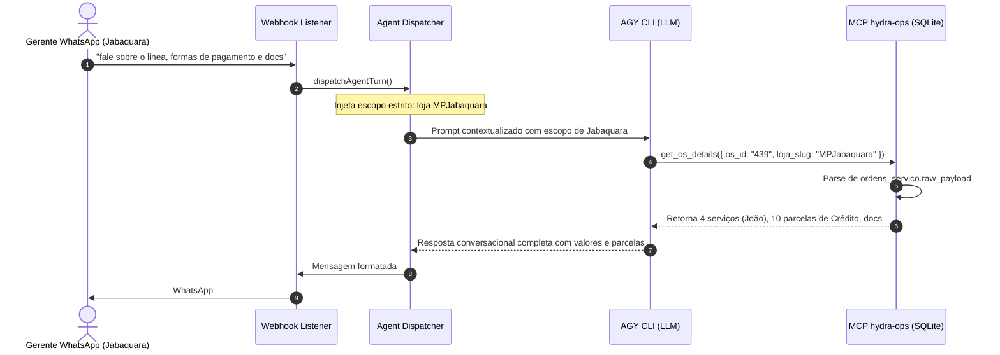

# Design Técnico — Detalhamento Profundo de OS e Isolamento de Loja

**Spec:** `hydra-deep-os-and-store-isolation`  
**Data:** 06/10/2026  
**Status:** Proposta de Arquitetura

---

## 1. Fluxo de Dados e Componentes



---

## 2. Modificações em Módulos

### 2.1. `src/hydra-sync/db_repository.ts`
Implementar a função de consulta e extração profunda:
```typescript
export function getDetailedOS(db: Database.Database, osId: string, lojaSlug?: string): OSFullDetail | null;
```
Lógica:
1. `SELECT * FROM ordens_servico WHERE os_id = ?` (e `AND loja_slug = ?` se informado).
2. Se não encontrar ou `raw_payload` for nulo, compõe objeto com dados básicos.
3. Se `raw_payload` for string JSON válida:
   - Extrai `itens` separando produtos/peças de serviços (pelo tipo ou pela descrição/código).
   - Extrai `pagamentos` detalhando parcelas, datas de vencimento, forma de pagamento (Crédito, Débito, etc.) e valores.
   - Extrai `documentos_anexos`, `checklists` e `notas_fiscais`.
   - Extrai contatos completos (`cliente_telefone_sms`, `cliente_cpf`).

### 2.2. `src/hydra-sync/mcp_server.ts`
1. **Adicionar Tool `get_os_details`:**
   ```typescript
   {
     name: 'get_os_details',
     description: 'Consulta os dados completos e aprofundados de uma ordem de serviço: serviços executados, peças aplicadas, executores/mecânicos, formas de pagamento discriminadas por parcela, checklists e documentos anexos.',
     inputSchema: {
       type: 'object',
       properties: {
         os_id: { type: 'string', description: 'Número da ordem de serviço (ex: "439")' },
         loja_slug: { type: 'string', description: 'Slug da loja (opcional, ex: "MPJabaquara")' }
       },
       required: ['os_id']
     }
   }
   ```
2. **Atualizar Tool `search_os`:**
   - Adicionar o parâmetro opcional `loja_slug?: string`.
   - Se a busca encontrar exatamente 1 registro, automaticamente enriquecer com os itens e parcelas de pagamento parseados do `raw_payload`.

### 2.3. `src/hydra-sync/agent_dispatcher.ts` (Isolamento de Loja)
No prompt do AGY CLI:
- Quando `activeProfile.persona === 'gerente'`, injetar no prompt:
  ```
  # RESTRIÇÃO DE ACESSO (PERFIL GERENTE):
  Você está atendendo o gerente da unidade ${activeProfile.lojaSlug}.
  É ESTRITAMENTE PROIBIDO pesquisar, citar ou revelar dados de outras lojas da rede.
  Qualquer consulta de veículo, ordem de serviço ou pátio DEVE ser filtrada exclusivamente para a unidade '${activeProfile.lojaSlug}'.
  Se o operador perguntar sobre um veículo (ex: "fale sobre o linea"), busque apenas na loja '${activeProfile.lojaSlug}'.
  ```
- E na resolução de veículo:
  Se o gerente perguntar sobre um modelo de veículo, passar `requestedByLojaSlug = activeProfile.lojaSlug` para que o resolvedor nunca retorne carros de outras unidades como opção.

### 2.4. `src/hydra-sync/hybrid_retrieval.ts`
- Incluir `raw_payload` na query `SELECT` quando a busca for específica de OS (`looksLikeOS || looksLikePlaca`) ou quando solicitada por ID.
