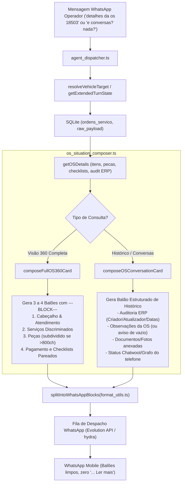

# Design Técnico — Hermes Balões Executivos, Hierarquia de Vistorias e Auditoria de Conversas

**ID da Spec:** `hydra-hermes-balloons-and-os-audit`  
**Data:** 08/10/2026

---

## 1. Fluxo de Dados e Arquitetura



---

## 2. Contratos de Dados e Interfaces TypeScript

### 2.1 Interface Expandida de Detalhes da OS (`OSDetailRecord`)
```typescript
export interface OSDetailRecord {
  osId: string;
  lojaSlug: string;
  veiculo: string;
  placa: string;
  clienteNome?: string;
  clienteCpf?: string;
  clienteTelefone?: string;
  responsavel?: string;
  status_grid?: string;
  isAberta: boolean;
  diasNoPatio: number;
  dataInicio?: string;
  valorTotal: number;
  saldoDevedor: number;
  observacao?: string;
  historicoCriadoEm?: string;
  historicoCriadoPor?: string;
  historicoAtualizadoEm?: string;
  historicoAtualizadoPor?: string;
  servicos: OSServicoItem[];
  pecas: OSPecaItem[];
  pagamentos: OSPagamentoItem[];
  checklists: OSChecklistItem[];
  checklistAudit?: {
    temChecklistEntrada: boolean;
    temChecklistMecanico: boolean;
    detalhes?: string;
  };
  temNf: boolean;
  documentosAnexos: Array<{
    origem: string;
    data: string;
    descricao: string;
    opcao?: string;
  }>;
  extracaoCompleta: boolean;
}
```

### 2.2 Parâmetros de `composeOSConversationCard`
```typescript
export interface OSConversationCardParams {
  osId: string | number;
  lojaSlug: string;
  vehicleModel?: string;
  vehiclePlate?: string;
  clientName?: string;
  clientPhone?: string;
  statusGrid?: string;
  isOpen?: boolean;
  daysInYard?: number;
  totalAmount?: number;
  remainingBalance?: number;
  // Auditoria do ERP
  observacao?: string;
  historicoCriadoEm?: string;
  historicoCriadoPor?: string;
  historicoAtualizadoEm?: string;
  historicoAtualizadoPor?: string;
  documentosAnexos?: Array<{
    origem: string;
    data: string;
    descricao: string;
  }>;
  // Grafo / IA
  caseContext?: {
    documentedDelayReason?: string;
    nextPromisedStep?: string;
    lastObservationDate?: string;
    conversationSummary?: string;
    partsBalanceSummary?: string;
    budgetStatus?: string;
    coverage?: string;
    evidenceOrigin?: string;
  };
}
```

---

## 3. Módulos a Modificar

### Módulo 1: `src/hydra-sync/os_situation_composer.ts`
1. **Formatação Inteligente e Escaneável de Serviços e Peças:**
   - **Fim da Caixa Alta Gritante:** Utilitário `toCleanTitleCase(text)` converte `DIAGNOSTICO NACIONAL` em `Diagnóstico Nacional`.
   - **Higienização de Placeholders e Códigos:** Suprime strings como `(Preencher Executor...)`, `(0)`, ou códigos de barras internos `(AP89123803120)` da visualização padrão.
   - **Cabeçalhos Totalizados:**
     - `> *Serviços Discriminados (7 itens · R$ 1.850,90)*`
     - `> *Peças e Insumos (19 itens · R$ 4.880,20)*`
   - **Agrupamento Semântico por Sistemas do Carro:**
     Em vez de um despejo plano de 26 linhas aleatórias, os itens são categorizados automaticamente por palavras-chave:
     - ⚡ **Elétrica & Eletrônica:** Alternador, Chicote, Bateria, Módulo, Motor de Partida.
     - 🌡️ **Arrefecimento:** Radiador, Aditivo, Água, Cebolão, Bomba d'água, Válvula Termostática, Tampa Reservatório.
     - 🔩 **Suspensão & Rodagem:** Amortecedores, Coxins, Buchas, Rolamentos, Coifas, Alinhamento, Geometria.
     - 🛑 **Freios:** Pastilhas, Discos, Tambor, Fluido, Alavanca de Freio.
     - 📦 **Revisão & Apoio:** Diagnóstico, Motoboy, Filtros, Lubrificantes.
   - **Hierarquia Visual com Bullets Executivos:** Cada grupo exibe seus itens com valores destacados e subtotais por sistema, facilitando a leitura imediata sem cansaço mental.

2. **Particionamento em Balões Nativos:**
   - Em `composeFullOS360Card`, utilizar `\n\n---BLOCK---\n\n` como delimitador entre blocos temáticos:
     - Bloco 1: Cabeçalho Executivo + Posição de Atendimento no Grafo.
     - Bloco 2: Serviços Categorizados por Sistema.
     - Bloco 3: Peças Categorizadas por Sistema (subdividido se >800ch).
     - Bloco 4: Formas de Pagamento + Vistorias e Documentos.
   - Cada bloco inicia compulsoriamente com `> *Título do Bloco*` na primeira linha, sem linhas soltas de traços no topo do balão.
3. **Hierarquização e Pareamento de Checklists:**
   - Criar função utilitária `formatChecklistLines(checklists, audit)`:
     - Identificar itens de entrada (`tipo` contendo `inspeção`, `inspecao`, `entrada`, `recepção` ou sem termo de mecânico).
     - Renderizar `- *Checklist de Entrada:* Realizado`.
     - Indentar logo abaixo: `  └ *Check-List de Inspeção:* Finalizado (Roberto Aquino Carneiro Lima, 02/10/26)`.
     - Renderizar `- *Checklist do Mecânico:* ${temMec ? 'Realizado' : 'Pendente'}`.
     - Se houver checklist do mecânico, indentar logo abaixo deste.
3. **Card Completo de Auditoria de Histórico e Conversas (`composeOSConversationCard`):**
   - Se houver alinhamento/resumo de conversa no grafo, exibir com destaque.
   - Se não houver conversa no grafo, exibir a auditoria transparente do caso:
     - `> *Auditoria da OS no ERP*`
     - Criado por: `${criadoPor}` em `${criadoEm}`
     - Última movimentação no sistema: `${atualizadoPor}` em `${atualizadoEm}`
     - Observações do sistema: `${observacao ? observacao : 'Em branco (sem anotações pelo consultor)'}`
     - Documentos e fotos arquivadas: listar itens com datas (`06/10: DOCUMENTO`, `07/10: CCI_001246.jpg`)
     - Comunicação com cliente: `${clientPhone ? `Telefone ${clientPhone}: sem chat vinculado nos canais integrados` : 'Telefone não cadastrado'}`.

### Módulo 2: `src/hydra-sync/operational_data_repository.ts`
- Atualizar `getOSDetails` para extrair do `raw_payload`:
  - `cliente_telefone_sms` -> `clienteTelefone`
  - `cliente_cpf` -> `clienteCpf`
  - `observacao` -> `observacao`
  - `historico_criado_em` -> `historicoCriadoEm`
  - `historico_criado_por` -> `historicoCriadoPor`
  - `historico_atualizado_em` -> `historicoAtualizadoEm`
  - `historico_atualizado_por` -> `historicoAtualizadoPor`

### Módulo 3: `src/hydra-sync/agent_dispatcher.ts`
- Propagar os novos campos de auditoria de `osDetail` para `composeOSConversationCard` e `composeFullOS360Card`.
- Manter a anáfora de veículo ativa (`TurnState`) em turnos subsequentes ("mas não tem detalhes da conversa?").

---

## 4. Estratégia de Testes Automatizados
- Criar suíte de testes `src/hydra-sync/tests/test_hermes_balloons_and_audit.ts`:
  1. **Gate 1 (Balões com `---BLOCK---`):** Validar que `composeFullOS360Card` gera múltiplos blocos separados por `---BLOCK---` e nenhum balão ultrapassa 900 caracteres.
  2. **Gate 2 (Hierarquia de Checklists):** Validar que o "Check-List de Inspeção" aparece estritamente antes de "Checklist do Mecânico".
  3. **Gate 3 (Card de Conversas & Auditoria):** Validar que perguntas sobre histórico/conversas sem chat no grafo entregam a auditoria completa do ERP (criador, atualizador, observação em branco, anexos e telefone).
  4. **Gate 4 (Sem Duplo Asterisco):** Validar que toda a formatação cumpre a regra de ouro do WhatsApp (zero asteriscos duplos `**`).
