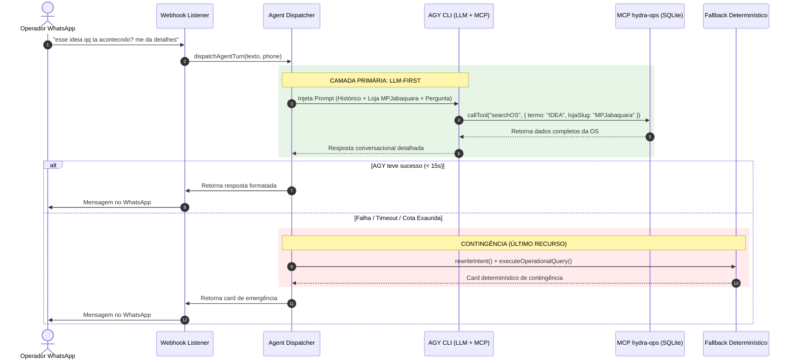

# Design Técnico — Arquitetura LLM-First com Contingência Determinística

**Spec:** `hydra-llm-first-architecture`  
**Data:** 06/10/2026  
**Status:** Proposta de Arquitetura

---

## 1. Visão Geral da Arquitetura

O sistema passa a operar em duas camadas bem delimitadas:
1. **Camada Primária (Agente Autônomo com MCP):**
   - Recebe a mensagem natural do operador.
   - Fornece contexto de conversação (histórico recente + loja ativa em foco).
   - O LLM (`agy cli` com modelo `gemini-3.8-flash-low`) raciocina, chama autonomamente ferramentas MCP (`hydra-ops`), sintetiza a resposta e entrega diretamente.
2. **Camada Secundária (Fallback Determinístico de Último Recurso):**
   - Acionada **somente** se o LLM falhar (timeout, erro 429 de cota, erro de rede).
   - Invoca o `rewriteIntent` e o `executeOperationalQuery` como contingência para não deixar o operador sem resposta.

---

## 2. Fluxo de Dados Detalhado



---

## 3. Interfaces TypeScript

```typescript
/**
 * Contexto de diálogo ativo injetado no prompt do LLM
 */
export interface ActiveDialogContext {
  phone: string;
  activePersona: 'socio' | 'gerente';
  currentLojaSlug?: string;
  currentLojaName?: string;
  lastReferencedVehicle?: string;
  lastReferencedPlate?: string;
  lastReferencedOSId?: string;
  recentTurns: Array<{
    role: 'user' | 'assistant';
    content: string;
    timestamp: string;
  }>;
}

/**
 * Configuração de execução do motor LLM-First
 */
export interface LLMFirstConfig {
  primaryTimeoutMs: number;          // 15.000 ms (15s máximo antes de fallback)
  model: string;                      // gemini-3.8-flash-low
  dangerouslySkipPermissions: boolean;
  enableMcp: boolean;
  mcpServerName: string;              // hydra-ops
}

/**
 * Resultado da tentativa de execução primária
 */
export interface LLMExecutionResult {
  success: boolean;
  replyText?: string;
  toolsCalled: string[];
  latenciaMs: number;
  motorUsed: 'AGY_PRIMARY' | 'AGY_SECONDARY' | 'FALLBACK_API';
  errorDetails?: {
    code: string;
    message: string;
    isTimeout: boolean;
    isQuota: boolean;
  };
}
```

---

## 4. Modificações Necessárias por Módulo

### 4.1. `src/hydra-sync/agent_dispatcher.ts`
- **Inversão da ordem de chamada:**
  - Remover a reescrita semântica obrigatória (`rewriteIntent`) do caminho crítico antes do LLM.
  - Montar o prompt com a mensagem **original** do usuário, o histórico dos últimos 4 turnos e o contexto operacional ativo (`currentLojaSlug`, veículo ou OS recente).
  - Executar primeiramente o AGY CLI via router.
  - Somente se o router falhar (`!routerResult.success`), acionar o bloco de fallback que roda `rewriteIntent` e `executeOperationalQuery`.
- **Eliminação de coerção no prompt:**
  - Remover do prompt a instrução restritiva `# REGRA DE ISOLAMENTO DE TURNO: Responda EXCLUSIVAMENTE à solicitação canônica acima.` que forçava o LLM a obedecer cegamente à canonicalQuestion adulterada.

### 4.2. `src/hydra-sync/dual_worker_router.ts`
- **Ajuste de Timeouts:**
  - Reduzir o timeout do worker primário de 40.000 ms para **15.000 ms**.
  - Evitar esperas de 60s a 90s no WhatsApp; se o LLM não responder em 15s, o sistema degrada rapidamente para o fallback sem deixar o usuário esperando.
- **Tratamento de Argumentos do CLI:**
  - Garantir passagem correta de flags não interativas: `-p`, `--dangerously-skip-permissions`, `--model gemini-3.8-flash-low`.

### 4.3. `src/hydra-sync/operational_adapter.ts` (Higienização de Encoding)
- Substituir as interrogações literais corrompidas (`?`) por caracteres válidos nos templates de contingência:
  - `Ordens de Servi?o` -> `Ordens de Serviço`
  - `ve?culo` -> `veículo`
  - Separadores `?` -> `•`

### 4.4. `src/hydra-sync/turn_context_repository.ts`
- Salvar no `hydra_turn_contexts` o contexto ativo da conversa pós-turno do LLM:
  - Se o LLM respondeu sobre uma loja (`MPJabaquara`), registrar `loja_slug`.
  - Se respondeu sobre um veículo/OS (`IDEA`, `#454`), registrar `veiculo` e `os_id` para facilitar turnos subsequentes.
