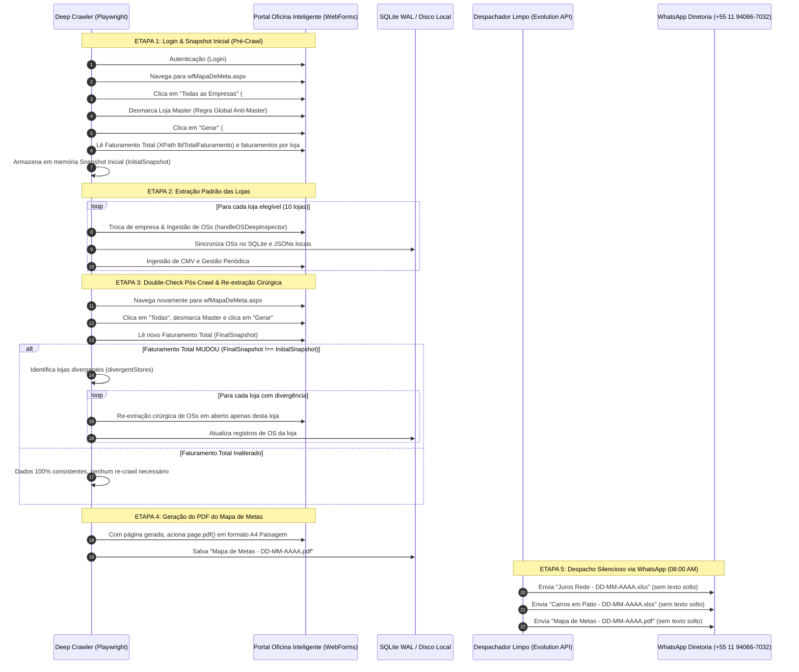

# Design Técnico: Reconciliação Bidirecional do Mapa de Metas & Despacho Silencioso

**Spec ID:** `hydra-mapa-metas-reconcile-and-clean-dispatch`  
**Data:** 08/10/2026  
**Status:** Planejamento  

---

## 1. Arquitetura e Fluxo de Dados



---

## 2. Interfaces TypeScript e Contratos de Tipos

```typescript
// src/hydra-sync/types/meta_reconciliation_contract.ts

export interface StoreRevenueSnapshot {
  slug: string;
  nome: string;
  faturamentoTotal: number;
  volumeOS: number;
  ticketMedio: number;
  meta: number;
}

export interface MapaMetasReconciliationSnapshot {
  capturedAt: string;
  faturamentoTotalRede: number;
  totalOSsRede: number;
  stores: Record<string, StoreRevenueSnapshot>;
}

export interface ReconcileDeltaResult {
  hasChanged: boolean;
  initialTotal: number;
  finalTotal: number;
  deltaAmount: number;
  divergentStores: string[];
  storeDeltas: Record<string, { initial: number; final: number; delta: number }>;
}

export interface UnifiedDailyReportsPayload {
  referenceDateStr: string; // Ex: "08/10/2026"
  jurosRedePath: string;    // Ex: "output/Juros Rede - 08-10-2026.xlsx"
  carrosPatioPath: string;  // Ex: "output/relatorios/Carros em Patio - 08-10-2026.xlsx"
  mapaMetasPdfPath: string; // Ex: "output/relatorios/Mapa de Metas - 08-10-2026.pdf"
  targetNumber?: string | string[];
  forceImmediate?: boolean;
}
```

---

## 3. Especificação dos Módulos

### 3.1. Módulo de Reconciliação do Mapa de Metas (`crawler_meta_reconciliation.ts`)
Local: `src/hydra-sync/crawler_meta_reconciliation.ts`

Funções principais:
1. `capturarSnapshotMapaMetas(page: Page): Promise<MapaMetasReconciliationSnapshot>`:
   - Navega para `wfMapaDeMeta.aspx`.
   - Clica em `#ctl00_cph_ucMapaDeMeta_btnEmpresaTodas`.
   - Desmarca Loja Master via evaluate DOM (`label:has-text("master")`).
   - Clica em `#btnGerar` e aguarda `networkidle` e `#ctl00_cph_ucMapaDeMeta_grd`.
   - Extrai o total pelo seletor XPath fornecido pelo usuário `//*[@id="ctl00_cph_ucMapaDeMeta_grd_ctl13_lblTotalFaturamento"]`, com fallback para `span[id*="lblTotalFaturamento"]` ou última linha da grade.
   - Extrai cada loja comercial da grade mapeando para `StoreRevenueSnapshot`.
   - Retorna o snapshot completo.

2. `compararSnapshotsMetas(inicial: MapaMetasReconciliationSnapshot, final: MapaMetasReconciliationSnapshot): ReconcileDeltaResult`:
   - Compara `faturamentoTotalRede` dos dois momentos com tolerância de R$ 0,05 para arredondamentos.
   - Se houver diferença, itera pelos slugs das 10 lojas e calcula `delta = Math.abs(final - inicial)`.
   - Retorna `hasChanged: true`, `divergentStores: [...]` e os deltas por loja.

3. `gerarPdfMapaMetas(page: Page, outputPath: string): Promise<string>`:
   - Aplica estilos de impressão no DOM via `page.addStyleTag({ content: '@page { size: A4 landscape; margin: 10mm; } body { zoom: 85%; }' })`.
   - Executa `page.pdf({ path: outputPath, format: 'A4', landscape: true, printBackground: true })`.
   - Retorna o caminho absoluto do arquivo PDF gerado.

---

### 3.2. Integração no Deep Crawler (`deep-crawler.ts`)
Local: `src/hydra-sync/deep-crawler.ts`

Alterações:
- Logo após `await login(page)`:
  - Invoca `const initialSnapshot = await capturarSnapshotMapaMetas(page)`.
  - Registra nos logs o faturamento inicial capturado da rede.
- Executa o loop padrão das 10 lojas (`slugs`).
- Ao finalizar o loop ("no final no final mesmo"):
  - Invoca `const finalSnapshot = await capturarSnapshotMapaMetas(page)`.
  - Executa `const delta = compararSnapshotsMetas(initialSnapshot, finalSnapshot)`.
  - Se `delta.hasChanged === true`:
    - Registra aviso nos logs: `Movimentação de faturamento detectada durante o crawl: Delta R$ ${delta.deltaAmount.toFixed(2)} em ${delta.divergentStores.join(', ')}`.
    - Executa `handleOSDeepInspector(page, { loja: slug })` apenas para os slugs presentes em `delta.divergentStores`.
    - Atualiza os registros dessas lojas no SQLite WAL e arquivos parciais.
- Na sequência, executa `gerarPdfMapaMetas(page, pathMapaMetasPdf)`:
  - Salva em `/home/operacional/hydra-data/crawls/Mapa de Metas - DD-MM-AAAA.pdf`.

---

### 3.3. Nomenclatura Padronizada dos Arquivos
1. **Pátio (`excel_patio_builder.js`):**
   - Nomenclatura anterior: `CONCILIACAO_PATIO_${dateTag}.xlsx`.
   - Nova nomenclatura oficial: `Carros em Patio - ${formattedDateBR.replace(/\//g, '-')}.xlsx` (ex: `Carros em Patio - 08-10-2026.xlsx`).
2. **Juros Rede (`index.js`):**
   - Nomenclatura anterior: `JUROS REDE - ${dateTag}.xlsx`.
   - Nova nomenclatura oficial: `Juros Rede - ${targetDateBR.replace(/\//g, '-')}.xlsx` (ex: `Juros Rede - 08-10-2026.xlsx`).
3. **Mapa de Metas (`crawler_meta_reconciliation.ts`):**
   - Nomenclatura oficial: `Mapa de Metas - ${targetDateBR.replace(/\//g, '-')}.pdf` (ex: `Mapa de Metas - 08-10-2026.pdf`).

---

### 3.4. Despachador Silencioso Unificado (`whatsapp_unified_dispatcher.js`)
Local: `projects/hydra-rede/src/whatsapp_unified_dispatcher.js`

Regras de Operação:
1. Recebe os caminhos dos 3 arquivos (`Juros Rede`, `Carros em Patio`, `Mapa de Metas`).
2. Aguarda pontualmente as 08:00:00 AM (`Timer Guard`), a menos que `--immediate` esteja ativo.
3. Para cada destinatário oficial (`CLIENT_NUMBER` / diretoria):
   - **Zero texto solto:** Não envia introduções textuais, sumários ou mensagens soltas.
   - Dispara em sequência os 3 documentos via Evolution API (`/message/sendMedia/hydra`):
     - `sendDocument({ filePath: jurosRedePath, fileName: 'Juros Rede - DD-MM-AAAA.xlsx', caption: '' })`
     - Delay de 1.500ms
     - `sendDocument({ filePath: carrosPatioPath, fileName: 'Carros em Patio - DD-MM-AAAA.xlsx', caption: '' })`
     - Delay de 1.500ms
     - `sendDocument({ filePath: mapaMetasPdfPath, fileName: 'Mapa de Metas - DD-MM-AAAA.pdf', caption: '' })`
4. Alertas de falha ou contingência continuam disparados exclusivamente para o número do Dev (`DEV_NUMBER`).
