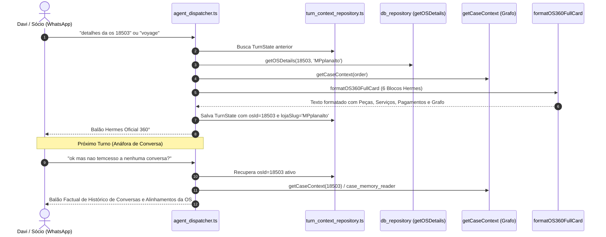

# Design Técnico: Padronização Hermes 360° da OS & Continuidade do Grafo de Conversas

**Spec ID:** `hydra-os-360-formatting-and-conversation-continuity`  
**Data:** 08/10/2026  
**Stack:** TypeScript Strict, SQLite WAL, WhatsApp Native Markdown  

---

## 1. Arquitetura e Fluxo de Decisão



---

## 2. Modificações em Módulos

### 2.1. Novo Formatador Canônico em `src/hydra-sync/os_situation_composer.ts`
Implementar a função centralizadora `composeFullOS360Card(osDetail: OSDetailData, caseCtx?: CaseContextResult)`:
- Garante os 6 blocos obrigatórios.
- Se `osDetail.pecas` for vazio mas `osDetail.valorTotal > osDetail.totalServicos`, gera a linha de `Peças / Reparo de Bancada: R$ [DIFERENÇA]`.
- Se o Grafo de Atendimento tiver motivo de demora ou próximo passo, injeta no bloco 2.

### 2.2. Roteamento de Anáfora de Conversas em `src/hydra-sync/agent_dispatcher.ts`
- Adicionar detector de anáfora de diálogos da OS:
  ```typescript
  export function isOSConversationQuery(text: string): boolean {
    const norm = text.toLowerCase().normalize('NFD').replace(/[\u0300-\u036f]/g, '');
    return /\b(conversa|conversas|audio|audios|dialogo|dialogos|falou|falaram|combinou|combinado|alinhamento|disse|atendimento ao cliente)\b/i.test(norm);
  }
  ```
- Quando `isOSConversationQuery(norm)` for verdadeiro e houver `previousState.osId`:
  - Não repassa para o LLM responder texto de FAQ institucional.
  - Consulta imediatamente o Grafo de Atendimento da OS ativa (`getCaseContext`).
  - Se houver histórico: formata o balão executivo de conversas e alinhamentos daquela OS.
  - Se não houver conversa vinculada àquela OS específica: responde pontualmente que aquela OS não possui registro de conversa no Grafo até o momento.

### 2.3. Blindagem no Prompt do LLM (`src/hydra-sync/system_prompt.md`)
- Incluir formalmente a ferramenta `get_os_case_history` e a diretriz estrita:
  ```markdown
  # HISTÓRICO DE ATENDIMENTO E CONVERSAS DE CLIENTES DA OS
  - O Hydra POSSUI acesso ao Grafo de Atendimento e às conversas registradas com clientes das OSs.
  - É ESTRITAMENTE PROIBIDO dizer que o sistema não tem acesso a conversas de clientes ou que elas "não passam pelo barramento do Hydra".
  - Quando o operador perguntar sobre conversas, áudios ou o que foi falado/combinado sobre uma OS ou carro, você deve SEMPRE consultar o histórico daquela OS via ferramenta 'get_os_case_history'.
  - Se a ferramenta não retornar conversas para aquela OS, declare com precisão: "Não há conversas ou alinhamentos registrados para a OS #XXXX no Grafo de Atendimento."
  ```

---

## 3. Contratos de Tipos e Assinaturas

```typescript
export interface OS360CardParams {
  osId: string;
  lojaSlug: string;
  vehicleModel: string;
  vehiclePlate: string;
  clientName?: string;
  statusGrid: string;
  isOpen: boolean;
  daysInYard: number;
  totalAmount: number;
  remainingBalance: number;
  servicos: Array<{ descricao: string; valorTotal: number; executor?: string }>;
  pecas: Array<{ descricao: string; valorTotal: number; qtd?: number; codigo?: string }>;
  pagamentos: Array<{ parcela: number; valor: number; modalidade: string; vencimento?: string }>;
  checklists?: Array<{ tipo: string; status: string; realizado_por?: string; data?: string }>;
  checklistAudit?: { temChecklistEntrada?: boolean; temChecklistMecanico?: boolean; detalhes?: string };
  temNf?: boolean;
  documentosAnexosCount?: number;
  caseContext?: {
    documentedDelayReason?: string;
    nextPromisedStep?: string;
    lastObservationDate?: string;
    conversationSummary?: string;
    partsBalanceSummary?: string;
    budgetStatus?: string;
  };
}
```
