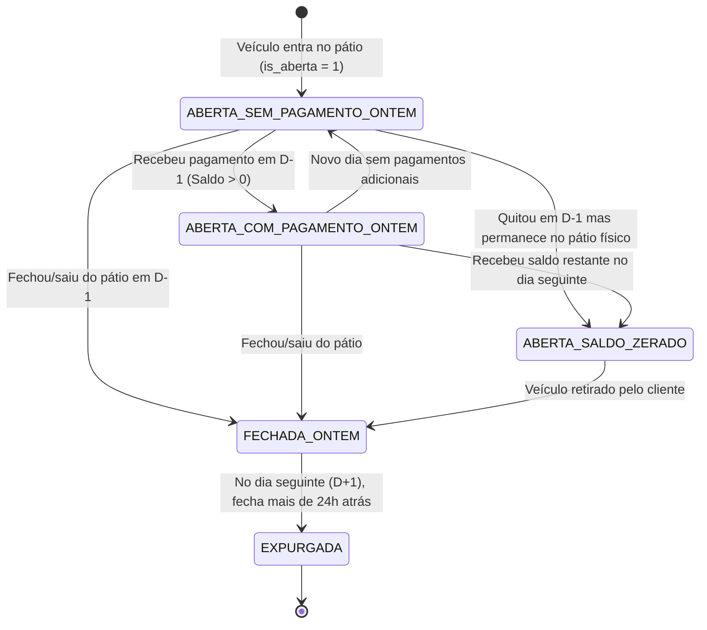

# Design Técnico: Motor de Conciliação de Pátio D-1 & Classificação de Movimentações

**Spec ID:** `hydra-patio-d1-reconciliation`  
**Data:** 07/10/2026  
**Status:** PROPOSTA / EM REVISÃO  

---

## 1. Fluxograma Arquitetural da Lógica

```mermaid
flowchart TD
    A["Execução da Conciliação no Dia D (ex: 07/10 ou 10/10)"] --> B["Definir Dia de Referência: D-1 (ex: 06/10 ou 09/10)"]
    B --> C["Carregar OSs e Pagamentos das 10 Lojas (Hydra Bot Crawler / Ledger)"]
    
    C --> D{"A OS está em aberto no pátio? (is_aberta === 1)"}
    D -->|Sim| F["ELEGÍVEL: Incluir no Relatório"]
    D -->|Não| E{"Foi fechada em D-1? (data_fechamento == D-1)"}
    
    E -->|Sim| F
    E -->|Não (fechada em D-2 ou anterior)| G["DESCARTADA: Não incluir no relatório"]
    
    F --> H["Calcular Saldo Pendente Acumulado: Valor Total OS - Total Todos Pagamentos"]
    H --> I["Filtrar Pagamentos Exclusivos de D-1 (ontem)"]
    
    I --> J{"Houve pagamento incluído em D-1?"}
    J -->|Sim| K["Coluna PAGAMENTOS: Exibir formas e valores de D-1\nAplicar Destaque Visual 🔵 (Accent Blue)"]
    J -->|Não| L["Coluna PAGAMENTOS: Exibir '—'\nEstilo Padrão (Sem destaque)"]
    
    K --> M["Consolidação dos Totais"]
    L --> M
    
    M --> N1["Somar Recebimentos de D-1 por Forma (Crédito, PIX, Débito, Dinheiro)"]
    M --> N2["Somar Saldo Total Pendente da Rede"]
```

---

## 2. Diagrama de Estados do Ciclo de Vida da OS no Pátio



---

## 3. Contratos de Dados (Interfaces TypeScript / JS)

### 3.1. Item de OS para Conciliação (`PatioRecordD1`)

```typescript
interface PatioRecordD1 {
  osNumber: number;
  dataEntrada: string;            // "DD/MM/YYYY" (data de início da OS)
  lojaSlug: string;               // Ex: "brasicar_planalto"
  lojaNomeDisplay: string;        // Ex: "Planalto"
  cliente: string;
  placa: string;
  veiculo: string;
  
  // Status Operacional vs Status Contábil
  isAberta: boolean;              // true se veículo está fisicamente no pátio
  dataFechamento: string | null;  // "DD/MM/YYYY" se fechada
  fechadaOntem: boolean;          // true se dataFechamento === D_minus_1
  
  // Valores
  valorTotalOS: number;           // Valor bruto da OS
  totalPagoHistorico: number;     // Soma de todos os pagamentos da vida da OS
  saldoPendente: number;          // valorTotalOS - totalPagoHistorico (Coluna "Valor:")
  
  // Movimentação de D-1 (Ontem)
  pagamentosOntem: PaymentDetailD1[]; // Apenas parcelas de ontem
  tevePagamentoOntem: boolean;        // pagamentosOntem.length > 0
  textoPagamentosOntem: string;       // Formatado para a coluna PAGAMENTOS: (ex: "Crédito: R$ 2.560,00" ou "—")
  destaqueVisual: boolean;            // true se tevePagamentoOntem (aciona 🔵 e cor #E0F2FE)
}

interface PaymentDetailD1 {
  forma: string;                  // "PIX", "Credito", "Debito", "Dinheiro"
  valor: number;
  vencimento: string;             // "DD/MM/YYYY"
  dataRegistro: string;           // "DD/MM/YYYY"
}
```

### 3.2. Resumo Consolidado de Conciliação (`ReconciliationSummaryD1`)

```typescript
interface ReconciliationSummaryD1 {
  diaReferencia: string;          // "DD/MM/YYYY" (D-1)
  diaExecucao: string;            // "DD/MM/YYYY" (D)
  
  // Totais de Recebimento de D-1 por Forma
  recebimentosOntem: {
    credito: number;
    pix: number;
    dinheiro: number;
    debito: number;
    outros: number;
    total: number;
  };
  
  // Saldo Pendente da Rede
  saldoTotalPendente: number;     // Soma do saldo pendente de todas as OSs abertas
  totalOSsAbertas: number;        // Quantidade de OSs ativas no pátio
  totalOSsFechadasOntem: number;  // Quantidade de OSs fechadas em D-1
  
  // Detalhamento por Loja
  lojas: Array<{
    storeSlug: string;
    nomeDisplay: string;
    ossAbertas: number;
    saldoPendente: number;
    recebidoOntem: number;
    ossFechadasOntem: number;
  }>;
}
```

---

## 4. Algoritmo de Identificação e Filtro

### 4.1. Determinação de Datas
- Se data informada for `--date=YYYY-MM-DD`, $D$ é essa data. Caso contrário, $D$ é a data corrente do sistema.
- Dia de referência $D-1$: subtrai 1 dia de calendário de $D$ (respeitando fins de semana ou passível de override via `--refDate=YYYY-MM-DD`).

### 4.2. Critério de Elegibilidade de Linhas
Para cada documento `doc` em `os_store_<slug>.json`:
```javascript
function isEligibleForReport(doc, targetD1BR) {
  // 1. Apenas OS (exclui OR de orçamento)
  if (doc.tipo && doc.tipo !== 'OS') return false;

  // 2. Se está aberta no pátio ativo, ENTRA SEMPRE
  if (doc.is_aberta === 1) return true;

  // 3. Se fechou ontem, ENTRA
  const dataFechamento = parseDateBR(doc.faturamento_data || doc.data_fim || doc.historico_atualizado_em);
  if (dataFechamento === targetD1BR) return true;

  // 4. Fechada em qualquer outro dia: FORA
  return false;
}
```

### 4.3. Filtro de Pagamentos de $D-1$
```javascript
function extractPaymentsOnD1(doc, targetD1BR, previousSnapshotDoc = null) {
  const pagamentosD1 = [];
  const todosPagamentos = doc.pagamentos || [];

  for (const p of todosPagamentos) {
    const vencimentoBR = parseDateBR(p.vencimento);
    const docUpdBR = parseDateBR(doc.historico_atualizado_em);

    // Condição 1: Vencimento ou pagamento no dia D-1
    if (vencimentoBR === targetD1BR) {
      pagamentosD1.push(p);
    }
    // Condição 2: Transação de cartão parcelado (vencimentos futuros) lançada em D-1
    else if (docUpdBR === targetD1BR && isVencimentoFuturo(vencimentoBR, targetD1BR)) {
      // Se temos o snapshot de D-2, confere se a parcela é nova; se não temos, o update em D-1 valida
      if (!previousSnapshotDoc || isNewPaymentParcel(p, previousSnapshotDoc)) {
        pagamentosD1.push(p);
      }
    }
  }

  return pagamentosD1;
}
```

---

## 5. Especificação Visual da Planilha Excel

### 5.1. Colunas da Aba Principal (`OS`)
| Coluna | Cabeçalho | Alinhamento | Formatação | Comportamento D-1 |
|:---:|:---:|:---:|:---:|:---|
| **B** | `OS:` | Centro | Inteiro (`#`) | Número da OS |
| **C** | `Data Entrada:` | Centro | Data (`DD/MM/YYYY`) | Data de entrada do veículo |
| **D** | `Valor:` | Direita | Moeda (`R$ #,##0.00`) | **Saldo Pendente Real Acumulado**. Pode ser `R$ 0,00` se quitada |
| **E** | `PAGAMENTOS:` | Esquerda | Texto | Apenas pagamentos de $D-1$. Se teve: `🔵 Crédito: R$ 2.560,00`. Se não teve: `—` |

### 5.2. Estilização de Linhas com Pagamento em $D-1$
- **Fundo da Linha (Cols B-E):** Preenchimento azul celeste suave `#E0F2FE` (Sky 100) com bordas suaves `#BAE6FD`.
- **Prefixo do Texto:** Símbolo `🔵` no início da coluna `PAGAMENTOS:`.
- **Se Fechada Ontem:** Anotação sutil `[Fechada em DD/MM]` no final do texto de pagamentos.

### 5.3. Nova Tabela de Síntese Financeira de $D-1$
Abaixo do bloco de lojas (ou na aba `Resumo Pátio`):
```text
┌────────────────────────────────────────────────────────┐
│ 📊 RESUMO DA CONCILIAÇÃO DE D-1 (dd/mm/aaaa)           │
├─────────────────────────────────────┬──────────────────┤
│ Crédito recebido em D-1             │ R$   25.400,00   │
│ Pix recebido em D-1                 │ R$    8.950,00   │
│ Dinheiro recebido em D-1            │ R$    1.200,00   │
│ Débito recebido em D-1              │ R$    3.450,00   │
├─────────────────────────────────────┼──────────────────┤
│ 🔵 TOTAL RECEBIDO EM D-1            │ R$   39.000,00   │
├─────────────────────────────────────┼──────────────────┤
│ 🚗 SALDO TOTAL PENDENTE NO PÁTIO    │ R$   54.800,00   │
└─────────────────────────────────────┴──────────────────┘
```

---

## 6. Template de Mensagem WhatsApp

```text
🚗 *RELATÓRIO DIÁRIO — PÁTIO DE VEÍCULOS & OS*
📅 *Execução:* {dataExecucao} | *Referência:* {dataReferenciaD1}

📊 *MOVIMENTAÇÃO DE ONTEM ({dataReferenciaD1}):*
• 💳 Crédito: {totalCredito}
• ⚡ Pix: {totalPix}
• 💵 Dinheiro: {totalDinheiro}
• 💳 Débito: {totalDebito}
👉 *Total Recebido Ontem:* {totalRecebidoOntem}

🚗 *SITUAÇÃO DO PÁTIO ATIVO:*
• Veículos com Saldo Pendente: {totalAbertas} ordens
• Saldo Total a Receber: {saldoTotalPendente}
• OSs Finalizadas Ontem: {totalFechadasOntem} ordens

🏢 *POR UNIDADE (Pátio Ativo):*
1. *Planalto:* {abertas} OSs | {saldo} ({recebidoOntemTxt})
...
10. *Jabaquara:* {abertas} OSs | {saldo} ({recebidoOntemTxt})

ℹ️ _Legenda da Planilha: Linhas com 🔵 indicam recebimento registrado ontem (mesmo em OSs ainda em execução)._
📎 _Planilha detalhada em anexo com aba OS e Resumo Pátio._
```
