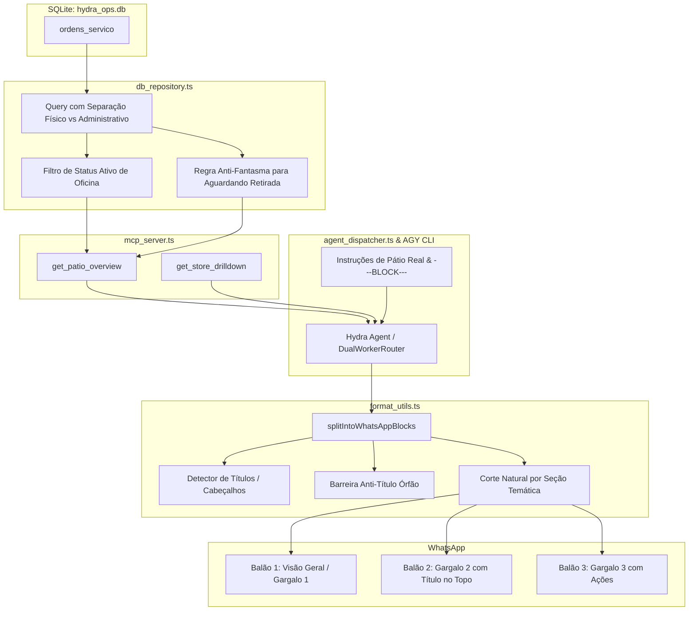

# Design Técnico: Pátio Físico Operacional Real & Divisão Inteligente de Balões por Título

**Spec ID:** `hydra-patio-real-count-and-balloon-titles`  
**Data:** 07/10/2026  
**Status:** DESIGN / EM REVISÃO (SDD Hard Stop)  

---

## 1. Arquitetura e Fluxo de Dados



---

## 2. Contratos de Dados e Interfaces TypeScript

### 2.1 Interface de Pátio no Repositório (`db_repository.ts`)

```typescript
export interface PatioOverviewRow {
  loja_slug: string;
  /** Quantidade de veículos fisicamente presentes na oficina em atendimento ativo (~3 a 6 por loja) */
  veiculos_patio_fisico: number;
  /** Ordens marcadas como abertas no ERP mas que são pendências administrativas (quitadas antigas, etc.) */
  pendencias_baixa_erp: number;
  /** Total bruto de ordens abertas registradas no sistema (físico + pendências) */
  total_ordens_sistema: number;
  /** Valor total em serviço dos veículos fisicamente no pátio */
  total_valor_patio: number;
  /** Saldo a receber dos veículos fisicamente no pátio */
  total_restante_patio: number;
  /** Saldo a receber de ordens com pendência administrativa */
  total_restante_administrativo: number;
}
```

### 2.2 SQL Refinada em `getPatioOverview` (`src/hydra-sync/db_repository.ts`)

Status ativos de oficina:
- `VEICULO EM EXECUÇÃO`
- `EM DIAGNOSTICO`
- `EM TESTE`
- `AGUARDANDO PEÇA`
- `SERVIÇO TERCEIRIZADO`
- `NA FILA PARA EXECUÇÃO`
- `AGUARDANDO DIAGNOSTICO AVANÇADO`
- `NECESSITA SUPORTE ESPECIALIZADO`
- `ABERTO` recente (ou com movimentação operacional ativa)

Regra para `AGUARDANDO RETIRADA`:
- Só é considerado físico se tiver `valor_restante > 0` OU tiver menos de 5 dias no pátio.
- Se `valor_restante <= 0` e > 5 dias, é `pendencias_baixa_erp`.

```sql
SELECT 
  loja_slug,
  -- 1. Veículos fisicamente no pátio da oficina
  COUNT(CASE 
    WHEN (
      UPPER(TRIM(COALESCE(status_grid, ''))) IN (
        'VEICULO EM EXECUÇÃO', 'EM DIAGNOSTICO', 'EM TESTE', 
        'AGUARDANDO PEÇA', 'SERVIÇO TERCEIRIZADO', 'NA FILA PARA EXECUÇÃO', 
        'AGUARDANDO DIAGNOSTICO AVANÇADO', 'NECESSITA SUPORTE ESPECIALIZADO'
      )
      OR (
        UPPER(TRIM(COALESCE(status_grid, ''))) = 'ABERTO' 
        AND UPPER(TRIM(COALESCE(estado_operacional, ''))) != 'TRANSICAO_PENDENTE'
      )
      OR (
        UPPER(TRIM(COALESCE(status_grid, ''))) = 'AGUARDANDO RETIRADA' 
        AND (valor_restante > 0 OR COALESCE(dias_no_patio, 0) > 0)
      )
    ) AND is_aberta = 1 THEN 1 
  END) AS veiculos_patio_fisico,

  -- 2. Pendências administrativas (ordens no ERP sem presença física na oficina)
  COUNT(CASE 
    WHEN (
      UPPER(TRIM(COALESCE(status_grid, ''))) = 'AGUARDANDO RETIRADA' 
      AND (valor_restante <= 0 AND COALESCE(dias_no_patio, 0) <= 0)
    ) OR is_aberta = 0 THEN 1 
  END) AS pendencias_baixa_erp,

  -- 3. Total de ordens em aberto no ERP (compatibilidade)
  COUNT(CASE WHEN is_aberta = 1 THEN 1 END) AS total_abertas,

  -- 4. Valores financeiros dos veículos físicos
  SUM(CASE 
    WHEN (
      UPPER(TRIM(COALESCE(status_grid, ''))) != 'AGUARDANDO RETIRADA' 
      OR valor_restante > 0 OR COALESCE(dias_no_patio, 0) > 0
    ) AND is_aberta = 1 THEN total_os ELSE 0 
  END) AS total_valor,

  SUM(CASE 
    WHEN (
      UPPER(TRIM(COALESCE(status_grid, ''))) != 'AGUARDANDO RETIRADA' 
      OR valor_restante > 0 OR COALESCE(dias_no_patio, 0) > 0
    ) AND is_aberta = 1 THEN valor_restante ELSE 0 
  END) AS total_restante

FROM ordens_servico
WHERE is_aberta = 1
GROUP BY loja_slug
ORDER BY veiculos_patio_fisico DESC
```

---

## 3. Algoritmo de Divisão Inteligente de Balões por Título (`format_utils.ts`)

### 3.1 Detector de Títulos / Cabeçalhos (`isSectionHeader`)

Um parágrafo é classificado como cabeçalho de seção estruturada se satisfazer:
1. Iniciar com citação e negrito/número de WhatsApp: `^>\s*(\*\d+\.|\d+\.|\*[^*]+\*|[A-ZÀ-Ú0-9])`
   Exemplos: `> 1. Gargalo...`, `> *Ranking de Faturamento:*`, `> Diagnóstico de Gargalos...`
2. Ou título destacado numerado: `^\*\d+\.\s+[^*]+\*` ou `^\d+\.\s+\*[^*]+\*`
   Exemplos: `*1. Gargalo de Volume*`, `1. *Gargalo de Volume*`
3. E tiver tamanho conciso de cabeçalho (tipicamente <= 120 caracteres, sem quebras de múltiplas linhas de conteúdo no mesmo parágrafo).

```typescript
export function isSectionHeader(text: string): boolean {
  if (!text) return false;
  const trimmed = text.trim();
  const firstLine = trimmed.split('\n')[0].trim();
  
  // Título WhatsApp nativo com blockquote (> )
  if (/^>\s*(\*\d+\.|\d+\.|\*[^*]+\*|[0-9]+\.\s+|[A-ZÀ-Ú][a-zA-ZÀ-ú0-9\s—–:-]{3,60})/i.test(firstLine)) {
    // Se o parágrafo for curto (<= 140 chars) ou consistir apenas do cabeçalho
    return trimmed.length <= 140 || trimmed.split('\n').length <= 2;
  }

  // Título em negrito no início da linha
  if (/^(\*\d+\.\s+[^*]+\*|\d+\.\s+\*[^*]+\*|\*[A-ZÀ-Ú][^*]{3,50}:\*)/.test(firstLine)) {
    return trimmed.length <= 140;
  }

  return false;
}
```

### 3.2 O Algoritmo `splitIntoWhatsAppBlocks` com Consciência de Títulos

1. **Passo 1: Preservação de `---BLOCK---` Explícito:**
   Se a IA incluiu o delimitador, divide diretamente e higieniza.
2. **Passo 2: Parse de Unidades Semânticas:**
   Divide o texto em blocos separados por quebras duplas (`\n\s*\n`).
3. **Passo 3: Regra Anti-Título Órfão (Anti-Orphan-Title):**
   Ao iterar os blocos:
   - Se o bloco atual `p` for um título (`isSectionHeader(p)`):
     - Inspeciona o bloco seguinte `nextP` (o conteúdo do título).
     - Se `currentChunk.length + p.length + nextP.length > maxBlockLength`:
       - **NÃO** anexa o título no `currentChunk` atual!
       - Envia o `currentChunk` acumulado para a lista de balões.
       - Inicia um novo balão com `p` (o título) no topo!
4. **Passo 4: Quebra Natural por Seção Temática (Natural Section Split):**
   - Se `p` for um novo título de seção principal (ex: `> 2. Gargalo...`, `> Diagnóstico...`):
     - Se o balão corrente já possui conteúdo substancial (ex: `currentChunk.length >= 300`), realiza o corte antes do título para dar ênfase visual limpa em cada balão no WhatsApp.
5. **Passo 5: Limite de Segurança:**
   Se um único bloco de conteúdo (sem título) exceder o limite máximo, divide respeitando quebras de linhas de itens (`\n- `) para nunca cortar palavras ou valores no meio.

---

## 4. Módulos a Modificar

1. **`src/hydra-sync/db_repository.ts`:**
   - Atualizar `getPatioOverview`, `getStoreDrilldown`, `getAgingCars` com a nova query discriminada.
2. **`src/hydra-sync/mcp_server.ts`:**
   - Atualizar a tool `get_patio_overview` e `get_store_drilldown` para expor `veiculos_patio_fisico` e documentar a métrica.
3. **`src/hydra-sync/format_utils.ts`:**
   - Adicionar `isSectionHeader` e atualizar `splitIntoWhatsAppBlocks` com a lógica Anti-Orphan-Title e quebra por seções.
4. **`src/hydra-sync/system_prompt.md` & `agent_dispatcher.ts`:**
   - Atualizar instrução sobre pátio: "Veículos no Pátio = carros físicos em atendimento ativo (3 a 6 por loja, total da rede ~35 a 40)".
   - Adicionar diretriz para uso de `---BLOCK---` em diagnósticos analíticos com múltiplos tópicos numerados.
5. **Testes Unitários:**
   - Criar `src/hydra-sync/tests/test_balloon_title_splitter.ts` validando os casos de teste:
     - Título nunca fica órfão no final do balão;
     - Seções numeradas (1., 2., 3.) quebram nos títulos;
     - Respostas curtas permanecem em balão único.
   - Criar `src/hydra-sync/tests/test_real_patio_overview.ts` validando a consulta de pátio real contra o banco SQLite.
