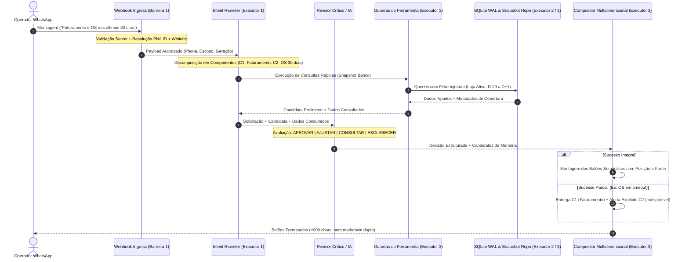

# Design — Hydra: Manual de Consultas, Interpretação Semântica e Dados Confiáveis (v2 Revisado)

## 1. Arquitetura do Sistema e Separação de Responsabilidades



---

## 2. Ontologia e Vocabulário de Negócio

Para erradicar ambiguidades entre termos operacionais e cadastrais, o Hydra adota definições estritas no código:

| Conceito | Definição no Sistema | Regra de Verificação no Banco | Declaração Padrão Obrigatória |
|:---|:---|:---|:---|
| **OS Aberta** | Ordem de serviço cujo estado cadastral no sistema da concessionária não é fechado, faturado ou cancelado. | `is_aberta = 1` E `status_grid NOT IN ('FECHADO', 'FATURADO', 'CANCELADO')`. | *"OS em aberto no sistema da unidade X."* |
| **OS Encerrada** | Ordem com conclusão de serviços ou faturamento formalizado na origem. | `status_grid IN ('FECHADO', 'FATURADO')` ou confirmação nominal individual na ficha com data de término. | *"OS encerrada em DD/MM/AAAA."* |
| **Veículo com OS Aberta** | Veículo único (deduplicado por `placa` confiável ou `os_id`) com pelo menos uma OS aberta. | `COUNT(DISTINCT NULLIF(TRIM(placa), ''))`. Registros sem placa são reportados à parte como "veículos não identificáveis". | *"X veículos identificados com ordens em aberto."* |
| **Veículo no Pátio (Presença Física)** | Veículo fisicamente presente nas instalações da oficina, sustentado por checklist de entrada, portaria ou evento do dia. | Requer campo explícito de presença física (`presenca_confirmada = 1`). **OS aberta NÃO comprova presença física.** | **Se ausente evidência operacional de pátio:** *"Tenho a posição de OS abertas no sistema; ela não confirma quais veículos estão fisicamente no pátio."* |
| **Estado Desconhecido** | Registro com status nulo, corrompido ou com transição não confirmada. | `estado_operacional = 'DESCONHECIDO'`. | Proibido converter em aberto ou encerrado; reportado como pendente de auditoria. |
| **Subtotal Não Certificado / Dado Suspeito** | Total apurado após a exclusão preventiva de ordens sob quarentena ou suspeitas de anomalia material (ex: OS 9202 em Kennedy). | Filtro `qualidade_dado = 'VALIDADO'` sobre registros que contêm suspeitos isolados. | **Proibido declarar como total oficial.** Declaração obrigatória: *"Subtotal em aberto apurado: R$ X (não certificado: 1 ordem sob auditoria excluída — OS 9202 de R$ 999.999,00)."* Metadados propagados: `quality = 'SUSPECT'`, `coverage = 'PARTIAL'`. |

---

## 3. Regras e Convenções Temporais

1. **Fuso Horário Obrigatório de Negócio:** `America/Sao_Paulo`. A data corrente ("hoje") é resolvida exatamente **uma vez** por turno no início do processamento. Todas as conversões de string e comparações temporais no backend utilizam explicitamente este fuso.
2. **Precisão Original e Proibição de Horas Fictícias:**
   - O parsing das strings preserva estritamente a granularidade do texto de origem.
   - Padrão `DD/MM/YY HH:MM` (ex: `'01/09/26 11:49'`): os minutos são preservados integralmente; converte-se para ISO `'2026-09-01 11:49:00'` (segundos fixados em `:00` apenas para conformidade sintática com ISO SQL).
   - Se o campo de origem contiver apenas data (`DD/MM/YYYY`), armazena-se unicamente `'YYYY-MM-DD'`; é **terminantemente proibido inventar horários fictícios** (como `'00:00:00'` ou `'23:59:59'`) para fingir precisão de timestamp.
3. **Separação Estrita de `data_evento_iso` e `data_observacao_iso`:**
   - `data_evento_iso`: Registra o momento real em que o fato de negócio ocorreu na concessionária (data/hora de abertura cadastrada, data/hora de conclusão de serviço ou data/hora de faturamento).
   - `data_observacao_iso`: Registra o timestamp exato em que o crawler ou o coletor do Hydra capturou o registro da tela ou do banco de dados operacional.
   - **Regra de Ouro:** Todas as consultas, relatórios e filtros temporais de negócio filtram e ordenam estritamente por `data_evento_iso`. É terminantemente proibido usar `data_observacao_iso` no lugar de `data_evento_iso`. O campo `data_observacao_iso` destina-se exclusivamente à auditoria interna de frescor (`freshness`).
4. **Resolução de "Últimos 30 Dias":**
   - Convenção: Intervalo civil de 30 datas consecutivas: `[Hoje - 29 dias 00:00:00, Hoje 23:59:59]`.
   - Evento considerado: **Data de abertura** (`data_inicio_iso` / `data_evento_iso`), qualquer que seja o estado cadastral atual da OS.
   - Declaração obrigatória: *"Ordens abertas entre DD/MM e DD/MM (inclui as já encerradas)."*
5. **Resolução de "OS Abertas Agora":**
   - Convenção: Estado operacional ativo (`is_aberta = 1`), **sem corte ou filtro de idade**. Ordens abertas há 60, 90 ou 180 dias permanecem na contagem enquanto não comprovado o encerramento.
6. **Resolução de "OS Encerradas no Período":**
   - Evento considerado: **Data de encerramento** (`data_fim_iso`) dentro do intervalo especificado, independentemente da data em que foram abertas.
7. **Meses Civis vs Janelas Móveis:**
   - *"Faturamento do Mês"* = Do dia 1º do mês corrente até a posição mais recente da fonte oficial no mês civil.
   - *"Mês Passado"* = Do dia 1º ao último dia do mês anterior fechado.
   - Proibido tratar mês civil como janela móvel de 30 dias.
8. **Datas Parciais e Posição do Dia:**
   - Consultas sobre "hoje" devem explicitar no rodapé a hora da coleta: *"Posição das vendas de hoje atualizada até às HH:MM."*

---

## 4. Ciclo de Vida das OS, Ingestão, Quarentena e Reconciliação (Executor 2)

### 4.1 Horizontes Independentes e Política de Retenção sem Expurgo
- **Horizonte de Coleta:** Intervalo temporal de captura disparado pelo crawler na origem (ordens abertas da grid e fechamentos recentes).
- **Horizonte de Retenção (Piso Mínimo de Cobertura sem Expurgo Implícito):**
  - O sistema mantém no SQLite operacional a união do mês corrente, do mês anterior completo e das últimas 30 datas civis, mantendo indefinidamente ordens abertas ou com transição pendente.
  - **Regra de Ouro:** Esse horizonte é um piso de cobertura mínima de serviço, e **NUNCA uma autorização para apagar dados anteriores**. Comandos destrutivos de expurgo (`DELETE FROM ordens_servico WHERE data_inicio < ...`) são sumariamente proibidos nesta especificação.
- **Horizonte de Consulta:** O período expressamente solicitado pelo operador na mensagem (ex: "ontem", "esta semana", "últimos 30 dias").

### 4.2 Mecanismo Demonstrado de Divergência vs Causalidade Histórica
1. **Mecanismo de Falha Demonstrado no Código:**
   - O arquivo `src/workers/oficina-agent/playwright/actions/os_deep_inspector.ts` (linha 720) executa:
     ```typescript
     store.os_map[id].is_aberta = openOsIdsSet.has(id) ? 1 : 0;
     ```
   - E o arquivo `src/hydra-sync/db_repository.ts` (linhas 870–877) executa:
     ```sql
     UPDATE ordens_servico
     SET is_aberta = 0, dias_no_patio = 0, updated_at = CURRENT_TIMESTAMP
     WHERE loja_slug = ? AND os_id NOT IN (${placeholders}) AND is_aberta = 1;
     ```
   - **Demonstração:** Quando uma OS deixa de vir no lote da grade visual extraída pelo crawler, o código força `is_aberta = 0` no SQLite **sem alterar a string textual do `status_grid`**. Isso gerou comprovadamente no banco de produção as 153 OSs com `status_grid = 'ABERTO'` e as 206 com `'AGUARDANDO RETIRADA'` com `is_aberta = 0`.
2. **Causalidade Histórica (Hipótese não Comprovada Universalmente):**
   - A razão exata pela qual cada uma dessas ordens deixou de ser incluída na extração da grade visual em execuções passadas (se quebra de sessão Playwright, timeout de paginação, filtros aplicados na tela da concessionária ou encerramento manual na oficina não refletido na grade) é uma hipótese que requer auditoria individual e não pode ser assumida como verdade a priori.

### 4.3 Desacoplamento entre Aceitação de Lote e Encerramento Individual de OS
- **Aceitação de Lote:** A aceitação de um lote pelo crawler certifica unicamente que a extração técnica da sessão Playwright foi bem-sucedida e que 100% da paginação foi percorrida.
- **Encerramento de OS é Evento Individual:** A aceitação do lote **NÃO encerra nenhuma OS no banco de dados**.
- Ordens ausentes em um lote aceito com cobertura comprovada são movidas exclusivamente para `estado_operacional = 'TRANSICAO_PENDENTE'`.
- O encerramento de qualquer OS individual exige **comprovação nominal individualizada**:
  1. Leitura da ficha cadastral detalhada da OS na concessionária comprovando o status formal de fechamento/faturamento com sua data nominal; OU
  2. Verificação ativa nominal de encerramento disparada pelo crawler.

### 4.4 Cobertura Comprovada Obrigatória e Quarentena de Lotes
1. **Cobertura Comprovada Obrigatória em Todo Lote:**
   - A prova de cobertura completa da paginação nativa da grade (`tr.pgr` percorrida até a última página, sem saltos e com o total de registros extraídos correspondendo ao seletor oficial de contagem) é **requisito obrigatório para a aceitação de QUALQUER lote**, independentemente da variação percentual (seja queda de 5%, queda de 50%, estabilidade ou aumento).
2. **Critérios de Entrada na Quarentena de Lotes:**
   - **Lote Retido em Quarentena:** Qualquer lote que não apresente prova cabal e determinística de cobertura de paginação completa ou que sofra erro técnico (quebra de sessão Playwright, timeout de elemento, erro de DOM) é **imediatamente retido em `ordens_servico_staging` com status `QUARANTINE`**.
   - **Comportamento Protetivo:** Durante a quarentena, **nenhum registro de produção é modificado e nenhuma OS é alterada para `TRANSICAO_PENDENTE` ou encerrada**.
3. **Critérios de Saída da Quarentena e Aceite de Queda Real:**
   - **Queda Real Aceita:** Se e somente se a cobertura de paginação for 100% comprovada na origem e as ordens ausentes forem confirmadas fora da grade, a queda é considerada legítima (ex: mutirão de fechamento de fim de mês) e o lote é promovido a aceito, movendo as ausentes para `TRANSICAO_PENDENTE`.
   - **Limite de 2 Ciclos:** Se a inconsistência técnica persistir por duas execuções consecutivas na mesma loja, registra ocorrência deduplicada em `hydra_data_worker_runs` com `status = 'ERROR'` para intervenção operacional, sem travar o processamento das outras 9 lojas.

### 4.5 Schema Normalizado e Migração Aditiva de Datas
A migração é estritamente aditiva (preserva `data_inicio` e `data_fim` originais em formato string brasileiro para compatibilidade com queries legadas):

```sql
-- Migration Aditiva para ordens_servico
ALTER TABLE ordens_servico ADD COLUMN estado_operacional TEXT NOT NULL DEFAULT 'ABERTA';
ALTER TABLE ordens_servico ADD COLUMN qualidade_dado TEXT NOT NULL DEFAULT 'VALIDADO';
ALTER TABLE ordens_servico ADD COLUMN data_inicio_iso TEXT;
ALTER TABLE ordens_servico ADD COLUMN data_fim_iso TEXT;
ALTER TABLE ordens_servico ADD COLUMN data_evento_iso TEXT;
ALTER TABLE ordens_servico ADD COLUMN data_observacao_iso TEXT;
ALTER TABLE ordens_servico ADD COLUMN origem_transicao TEXT DEFAULT 'GRID_CRAWLER';

CREATE INDEX IF NOT EXISTS idx_os_loja_estado ON ordens_servico(loja_slug, estado_operacional);
CREATE INDEX IF NOT EXISTS idx_os_qualidade ON ordens_servico(qualidade_dado);
CREATE INDEX IF NOT EXISTS idx_os_data_inicio_iso ON ordens_servico(data_inicio_iso);
CREATE INDEX IF NOT EXISTS idx_os_data_fim_iso ON ordens_servico(data_fim_iso);
CREATE INDEX IF NOT EXISTS idx_os_data_evento_iso ON ordens_servico(data_evento_iso);
```

#### Script de Backfill Determinístico de Datas
Para os 517 registros existentes no banco:
1. Parse da string brasileira `DD/MM/YY HH:MM` (ex: `'01/09/26 11:49'`).
2. Mapeamento de ano de 2 dígitos: `26` $\rightarrow$ `2026` (rejeita datas fora do intervalo razoável 2020–2030).
3. Conversão para formato ISO no fuso `America/Sao_Paulo`: `'2026-09-01 11:49:00'`.
4. População de `data_evento_iso` a partir de `data_inicio_iso`.
5. População de `data_observacao_iso` a partir de `updated_at` / `CURRENT_TIMESTAMP`.
6. Registros com datas nulas (como a OS 9202) são gravados com `data_inicio_iso = NULL` e `qualidade_dado = 'SUSPEITO_QUARENTENA'`.

### 4.6 Rotina de Reconciliação e Saneamento dos 517 Registros Existentes
Para tratar as ordens atualmente em divergência no banco operacional (`153` ordens com `status_grid = 'ABERTO'` e `206` com `'AGUARDANDO RETIRADA'` gravadas com `is_aberta = 0`):
1. **Varredura Inicial:** O script identifica todos os registros onde `is_aberta = 0` mas `status_grid NOT IN ('FECHADO', 'FATURADO', 'CANCELADO')`.
2. **Classificação Provisória Segura:** Essas ordens são atualizadas para `estado_operacional = 'TRANSICAO_PENDENTE'`. O campo `is_aberta` permanece temporariamente como `0` para não inflar saldos sem comprovação nominal.
3. **Fila de Verificação Nominal Individual:**
   - O crawler enfileira essas ordens para consulta pontual de ficha cadastral na concessionária.
   - Ordens confirmadas abertas na ficha recebem: `estado_operacional = 'ABERTA'`, `is_aberta = 1`, `qualidade_dado = 'VALIDADO'`.
   - Ordens confirmadas encerradas recebem: `estado_operacional = 'ENCERRADA'`, `is_aberta = 0`, `qualidade_dado = 'VALIDADO'` e `data_fim_iso` preenchida com a data real do encerramento.
   - Ordens não localizadas na origem permanecem com `estado_operacional = 'DESCONHECIDO'` e `qualidade_dado = 'EM_AUDITORIA'`.

### 4.7 Protocolo de Investigação Finita da OS 9202 (Kennedy)
- **Registro Factual:** `os_id = '9202'`, `loja_slug = 'MPkennedy'`, `total_os = 999999.0`, `status_grid = 'Aberta'`, `is_aberta = 0`, `data_inicio = NULL`.
- **Classificação:** `estado_operacional = 'DESCONHECIDO'`, `qualidade_dado = 'SUSPEITO_QUARENTENA'`.
- **Roteiro de Investigação do Executor 2 (Teto: 4 horas úteis):**
  1. Verificar em `ordens_servico_staging` e arquivos JSON brutos em `/home/operacional/hydra-data/crawls/` a primeira captura da OS 9202.
  2. Inspecionar o `raw_payload` armazenado para identificar se o valor `999999.0` constava do texto original da tela ou se resultou de falha em `parseMoeda`.
  3. Se comprovado erro de digitação da concessionária ou teste local, documentar o achado e manter o registro com `qualidade_dado = 'SUSPEITO_QUARENTENA'`.
  4. Se inconclusivo ao término das 4 horas, manter o isolamento e emitir relatório de fechamento provisório sem paralisar a entrega das demais frentes.

---

## 5. Catálogo de Ferramentas e Manual de Consultas (Executor 1)

### 5.1 Catálogo de Capacidades Operacionais Reais
Cada capacidade reflete ferramentas existentes no código, documentadas com precisão:

| ID da Capacidade | Ferramenta Real | Parâmetros Obrigatórios | Fonte de Dados Oficial | Limitações Declaradas |
|:---|:---|:---|:---|:---|
| `CAP-REVENUE-DAY` | `getLatestDailyRevenue` | `lojaSlug`, `dataReferencia` | `faturamento_diario_horario` (Vendas por Dia Excel) | Posição consolidada horária. Não decompõe itens ou peças. |
| `CAP-REVENUE-MONTH` | `getLatestMetasSnapshot` | `lojaSlug`, `dataReferencia` | `metas_horarias` (Mapa de Metas Oficial) | Posição mensal acumulada. Não substitui balancete contábil. |
| `CAP-CMV-STORE` | `getLatestCMVSnapshot` | `lojaSlug`, `dataInicio`, `dataFim` | `cmv_lojas` e `faturamento_areas` (Gestão Periódica) | Extração diária oficial. Linha totalizadora com percentual do sistema. |
| `CAP-OS-LIST` | `queryOrdersByFilter` | `lojaSlug`, `periodo`, `estadoOperacional` | `ordens_servico` (Reconciliada) | Paginação fixa de 20 itens. Sem comprovação de pátio físico. |
| `CAP-OS-DETAIL` | `getOSDetailComplete` | `lojaSlug`, `osId` | `ordens_servico` + checklists + peças | Exige número específico e loja autorizada. Não vaza dados cross-store. |

### 5.2 Decomposição em Componentes e Sucesso Parcial
Um turno do usuário pode demandar múltiplos componentes independentes. O Intent Rewriter analisa a mensagem e produz um plano estruturado:

```typescript
export interface QueryPlan {
  planId: string;
  turnId: string;
  phone: string;
  effectivePersona: 'socio' | 'gerente';
  activeLojaSlug: string | null;
  components: QueryComponent[];
}

export interface QueryComponent {
  componentId: string;
  capabilityId: string;
  priority: number;
  params: Record<string, any>;
  status: 'PENDING' | 'SUCCESS' | 'PARTIAL' | 'TIMEOUT' | 'UNSUPPORTED' | 'DENIED';
  result?: any;
  errorMessage?: string;
}
```

**Regra de Sucesso Parcial e Fallback Preservativo:**
Se o operador perguntar: *"Qual o faturamento e as ordens abertas da Kennedy?"*:
- O plano decompõe em `comp_faturamento_dia` (Vendas por Dia) e `comp_lista_os` (Ordens de Serviço).
- Se `comp_lista_os` sofrer timeout (>20s), o bot **não cancela o faturamento**.
- A resposta renderiza o faturamento com sua fonte e data/hora oficial e anexa o aviso:
  `> *Aviso Operacional:* A listagem de ordens de serviço atingiu o tempo limite e não pôde ser carregada. O faturamento acima reflete a posição oficial mais recente.`

### 5.3 Registro e Deduplicação de Lacunas (`hydra_query_gaps`)
Perguntas sem suporte operacional ou com campos não coletados são sanitizadas e registradas:

```sql
CREATE TABLE IF NOT EXISTS hydra_query_gaps (
  gap_key TEXT PRIMARY KEY,               -- SHA-256 da intenção normalizada
  category TEXT NOT NULL,                 -- 'UNSUPPORTED_FIELD', 'OUT_OF_SCOPE', 'AMBIGUOUS'
  sanitized_example TEXT NOT NULL,        -- Pergunta sanitizada sem números ou placas
  first_seen_at DATETIME DEFAULT CURRENT_TIMESTAMP,
  last_seen_at DATETIME DEFAULT CURRENT_TIMESTAMP,
  occurrence_count INTEGER DEFAULT 1,
  status TEXT DEFAULT 'NEW'               -- 'NEW', 'UNDER_REVIEW', 'PLANNED', 'WONT_FIX'
);
```

---

## 6. Consultas, Guardas e Matriz de Métricas (Executor 3)

### 6.1 Matriz de Métricas Comprovada no Código

| Métrica | Definição de Negócio | Tabela & Módulo Fonte | Filtros Obrigatórios | Fórmula Aritmética | Tratamento de Divergência |
|:---|:---|:---|:---|:---|:---|
| **Faturamento do Dia** | Total bruto de vendas realizadas hoje na loja. | `faturamento_diario_horario`<br>[`hourly_finance_worker.ts:62`](file:///home/operacional/hydra-staging/src/hydra-sync/hourly_finance_worker.ts#L62) | `data_referencia = :hoje` E `loja_slug = :loja` | `faturamento_dia` extraído da linha TOTAL do relatório oficial Excel. | Ausência no dia informa "sem vendas confirmadas" ou "extração pendente"; proibido calcular por subtração. |
| **Faturamento do Mês** | Total acumulado de vendas do mês civil corrente. | `metas_horarias`<br>[`hourly_finance_worker.ts:50`](file:///home/operacional/hydra-staging/src/hydra-sync/hourly_finance_worker.ts#L50) | `data_referencia = :hoje` E `loja_slug = :loja` | `faturamento_mes` do Mapa de Metas oficial. | Prevalece o Mapa de Metas; divergência com a soma diária superior a R$ 500 é rotulada no rodapé. |
| **Atingimento de Meta** | Percentual da meta mensal atingido. | `metas_horarias`<br>[`format_utils.ts:48`](file:///home/operacional/hydra-staging/src/hydra-sync/format_utils.ts#L48) | `loja_slug = :loja` | `(faturamento_mes / meta_mes) * 100`. Se meta = 0, retorna "N/A". | Proibido exibir valores negativos decorrentes de campos de desvio da grid. |
| **CMV Geral da Loja** | Custo de Mercadorias Vendidas percentual consolidado. | `cmv_lojas`<br>[`relatorio_operacao_crawler.ts`](file:///home/operacional/hydra-staging/src/hydra-sync/relatorio_operacao_crawler.ts) | Período fechado na loja ativa | Linha totalizadora oficial do sistema (`cmv_percentual`). | Prevalece a linha totalizadora; proibido fazer média aritmética das áreas. |
| **CMV de Óleo** | CMV específico da área de lubrificantes e filtros. | `faturamento_areas`<br>[`relatorio_operacao_crawler.ts`](file:///home/operacional/hydra-staging/src/hydra-sync/relatorio_operacao_crawler.ts) | `area = 'OLEO'` na loja ativa | `cmv_percentual` da linha de Óleo. | Proibido substituir pelo CMV geral da loja. |
| **Saldo em Aberto** | Total financeiro pendente de recebimento em OSs abertas. | `ordens_servico`<br>[`operational_adapter.ts:2230`](file:///home/operacional/hydra-staging/src/hydra-sync/operational_adapter.ts#L2230) | `is_aberta = 1` E `qualidade_dado = 'VALIDADO'` | `SUM(valor_restante)`. | A OS 9202 em Kennedy é estritamente excluída pelo filtro `qualidade_dado = 'VALIDADO'`. Aplica regra de **Não-Certificação de Totais**. |

### 6.2 Definição Determinística de Zero Financeiro vs Extração Indisponível
Para evitar que problemas técnicos sejam interpretados falsamente como inexistência de faturamento:
1. **Zero Financeiro (`R$ 0,00`):**
   - Só pode ser afirmado e renderizado se houver uma extração técnica bem-sucedida da planilha oficial (`VENDAS POR DIA`) ou relatório de operação, na qual a linha TOTAL contenha explicitamente `0,00` ou onde todas as colunas de faturamento das áreas confirmarem R$ 0,00 para o período.
   - Declaração: *"Sem vendas registradas hoje na unidade X até o momento."*
2. **Extração Indisponível / Falha Técnica:**
   - Se o crawler falhar ao baixar o relatório Excel, ocorrer timeout de navegação, sessão desconectada ou arquivo corrompido, é **terminantemente proibido assumir faturamento zero**.
   - O sistema emite aviso explícito de indisponibilidade e preserva a posição anterior:
     `> *Aviso Operacional:* A extração de vendas de hoje para a unidade X está temporariamente indisponível. A última posição válida registrada foi de R$ Y em DD/MM às HH:MM.`
   - O payload registra obrigatoriamente: `freshness = 'STALE'` e `execution = 'PARTIAL'`.

### 6.3 Regra de Não-Certificação de Totais com Suspeitos
Quando qualquer registro suspeito (como a OS 9202 de R$ 999.999,00 em Kennedy) for excluído de uma consulta agregadora de saldo ou pátio:
1. **Proibição de Certificar como Total Oficial:** O bot nunca emitirá a resposta como "Total em aberto: R$ X".
2. **Renderização de Subtotal Incompleto:** O bot emite:
   `Subtotal em aberto apurado: R$ X (não certificado: 1 ordem sob auditoria excluída — OS 9202 de R$ 999.999,00).`
3. **Propagação Obrigatória de Metadados:**
   - `quality = 'SUSPECT'`
   - `coverage = 'PARTIAL'`

### 6.4 Paginação Determinística com Cursor
- **Tamanho fixo da página:** 20 itens.
- **Ordenação determinística:** `ORDER BY data_inicio_iso DESC, os_id DESC`.
- **Cursor Base64:** Contém hash dos filtros, `lojaSlug`, snapshot e chaves de corte (`lastDataInicioIso`, `lastOsId`).
- **Invalidação de Sessão:** A alternância de persona (`/socio`) ou `/reset` invalida imediatamente cursores anteriores, impedindo a continuação de buscas de outra loja.

### 6.5 Protocolo Multidimensional de Resposta (9 Dimensões)
```typescript
export interface MultidimensionalResponse {
  execution: 'SUCCESS' | 'PARTIAL' | 'TIMEOUT' | 'CANCELLED';
  access: 'AUTHORIZED' | 'DENIED' | 'DOWNGRADED';
  support: 'FULL' | 'LIMITED' | 'UNSUPPORTED';
  coverage: 'COMPLETE' | 'PARTIAL' | 'UNKNOWN';
  freshness: 'FRESH' | 'STALE' | 'UNKNOWN';
  quality: 'RECONCILED' | 'CONFLICT' | 'SUSPECT' | 'UNASSESSED';
  payload: {
    itemsCount: number;
    totalProvenCount?: number;
    hasMore: boolean;
    data: any;
  };
  provenance: {
    source: string;
    capturedAt: string;
    periodApplied: string;
  };
  continuation?: {
    cursor?: string;
    nextPageAvailable: boolean;
  };
}
```

---

## 7. Interfaces TypeScript Compartilhadas

```typescript
// src/hydra-sync/types/query_contract.ts

export type OrderOperationalState = 
  | 'ABERTA' 
  | 'ENCERRADA' 
  | 'CANCELADA' 
  | 'TRANSICAO_PENDENTE' 
  | 'DESCONHECIDO';

export type OrderDataQuality = 
  | 'VALIDADO' 
  | 'SUSPEITO_QUARENTENA' 
  | 'CONFLITO' 
  | 'EM_AUDITORIA';

export interface OrderRecord {
  osId: string;
  lojaSlug: string;
  tipo: string;
  statusGrid: string;
  isAberta: boolean;
  estadoOperacional: OrderOperationalState;
  qualidadeDado: OrderDataQuality;
  dataInicioRaw?: string;
  dataInicioIso?: string;
  dataFimRaw?: string;
  dataFimIso?: string;
  dataEventoIso?: string;
  dataObservacaoIso: string;
  diasNoPatio: number;
  veiculo?: string;
  placa?: string;
  clienteNome?: string;
  responsavel?: string;
  totalOs: number;
  valorPago: number;
  valorRestante: number;
  temNf: boolean;
  origemTransicao: string;
}

export interface MetricDefinition {
  metricId: string;
  name: string;
  authoritySource: string;
  scopeType: 'loja' | 'rede';
  formulaDescription: string;
  unit: 'BRL' | 'PERCENT' | 'COUNT';
  nullHandling: 'ZERO' | 'NOT_APPLICABLE' | 'UNKNOWN';
}

export interface GapRecord {
  gapKey: string;
  category: 'UNSUPPORTED_FIELD' | 'OUT_OF_SCOPE' | 'AMBIGUOUS';
  sanitizedExample: string;
  firstSeenAt: string;
  lastSeenAt: string;
  occurrenceCount: number;
  status: 'NEW' | 'UNDER_REVIEW' | 'PLANNED' | 'WONT_FIX';
}
```
