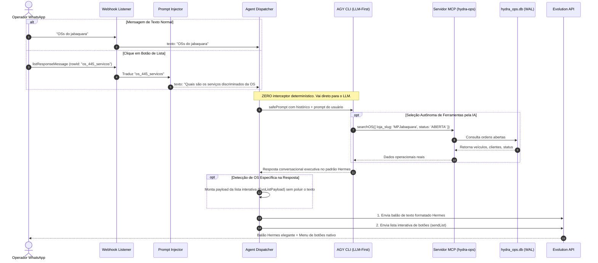

# Design Técnico: 100% LLM-First com Botões Interativos Injetores de Prompt

**Spec ID:** `hydra-query-routing-and-formatting-fix`  
**Data:** 09/10/2026  
**Status:** Planejamento  

---

## 1. Fluxo de Execução Unificado (100% LLM-First)



---

## 2. Injetor de Prompts para Botões Interativos

### 2.1. Mapeamento de `rowId` para Prompt Conversacional

No arquivo `webhook-listener.js` e em `agent_dispatcher.ts`, toda entrada de botão interativo é mapeada para uma pergunta humana em linguagem natural:

```typescript
export function translateInteractiveRowToPrompt(rowId: string): string {
  const osMatch = rowId.match(/^os_(\d{1,8})_([a-z_]+)$/i);
  if (!osMatch) return rowId;

  const osId = osMatch[1];
  const module = osMatch[2].toLowerCase();

  switch (module) {
    case 'servicos':
      return `Quais são os serviços discriminados da OS #${osId}?`;
    case 'pecas':
      return `Quais são as peças e materiais aplicados na OS #${osId}?`;
    case 'pagamentos':
      return `Quais são as formas de pagamento e parcelas da OS #${osId}?`;
    case 'documentos':
      return `Mostre as vistorias, checklists e documentos da OS #${osId}.`;
    case 'historico':
      return `Qual o histórico de atendimento, conversas e alinhamentos da OS #${osId}?`;
    default:
      return `Detalhe a Ordem de Serviço #${osId}.`;
  }
}
```

Quando o operador toca no botão `1. Serviços`, a IA recebe exatamente `"Quais são os serviços discriminados da OS #445?"`.  
A IA então chama `getOSDetails({ os_id: "445" })`, extrai os serviços do `raw_payload`, mecânico executor e valores, e responde de forma natural, rica e precisa.

---

## 3. Desativação do Interceptor Determinístico em `agent_dispatcher.ts`

### 3.1. Remoção do Curto-Circuito
O bloco de código das linhas 842 a 1179 que executava:
```typescript
if (isExplicitVehicleRequest && (currentModel || currentPlate || currentOsId)) {
  // resolveVehicleTarget -> composeExecutiveOSSummary -> return FALLBACK_API
}
```
será **desativado como rota de resposta primária**.

1. O fluxo passa direto para:
   ```typescript
   const routerResult = await hydraDualRouter.routeRequest(safePrompt, {
     conversationId: agyConvId || undefined
   });
   ```
2. O AGY CLI assume 100% da responsabilidade de responder qualquer pergunta sobre:
   - Ordens de serviço de uma loja ("OSs do jabaquara");
   - Situação de um veículo específico ("como tá o linea?");
   - Detalhes de serviços, peças, pagamentos e conversas;
   - Pátio, metas e retenção.
3. Se o AGY CLI identificar uma OS individual no diálogo, ele entrega a resposta textual Hermes e o dispatcher anexa o `interactiveList` nativo para permitir navegação subsequente.
4. **Fallback determinístico:** Se e somente se o AGY CLI falhar (`routerResult.success === false` por timeout de rede ou queda da API), o sistema aciona o adaptador determinístico como contingência para que o usuário não fique sem resposta.

---

## 4. Limpeza Definitiva do Padrão Visual Hermes

1. **Remoção de Rodapé de URA:**
   Expurgar completamente de `composeExecutiveOSSummary`:
   ```text
   Selecione uma opção no menu ou digite:
   SERVICOS 445
   PECAS 445
   ...
   ```
2. **Zero Poluição de Botões de Texto:**
   Os botões são entregues **estritamente pela Evolution API via `sendList`**, aparecendo como um botão nativo no WhatsApp ("Abrir detalhes"), deixando o chat limpo e elegante.
