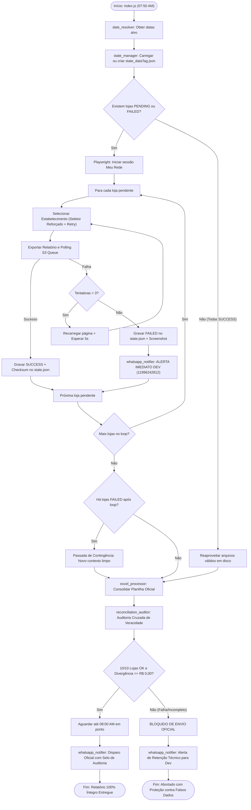

# Design Técnico: Gerenciador de Estado Persistente, Resume, Alerta Dev & Auditoria de Veracidade Cruzada

**Spec ID:** `hydra-rede-state-contingency-audit`  
**Data:** 08/10/2026  
**Status:** PROPOSTA ATUALIZADA / AGUARDANDO APROVAÇÃO (SDD Hard Stop)  

---

## 1. Arquitetura e Fluxo de Execução



---

## 2. Interfaces TypeScript & Tipagem Estrita

```typescript
export type StoreStatus = 'PENDING' | 'DOWNLOADING' | 'SUCCESS' | 'FAILED';

export interface StoreDefinition {
  nomePortal: string;
  ec: string;
  nomePlanilha: string;
  tipoCol: number;
  dataStartRow: number;
  clearRows: number;
  totalCell: string;
}

export interface StoreStateRecord {
  nomePlanilha: string;
  nomePortal: string;
  ec: string;
  status: StoreStatus;
  attempts: number;
  filePath: string | null;
  fileSize: number;
  fileSha256: string | null;
  transacoesCount: number;
  bruto: number;
  liquido: number;
  vendaJuros: number;
  lastError: string | null;
  updatedAt: string;
}

export interface ExecutionState {
  dateTag: string;
  displayPeriod: string;
  createdAt: string;
  updatedAt: string;
  overallStatus: 'COLLECTING' | 'READY_FOR_AUDIT' | 'AUDITED_OK' | 'FAILED_INCOMPLETE';
  stores: Record<string, StoreStateRecord>; // Key: EC da loja
}

export interface RawFileMetrics {
  loja: string;
  ec: string;
  filePath: string;
  linhasLidas: number;
  linhasNoAlvo: number;
  transacoesValidas: number;
  totalBruto: number;
  totalLiquido: number;
  totalVendaJuros: number;
  jurosRetidos: number;
}

export interface WorkbookMetrics {
  loja: string;
  transacoesCard: number;
  brutoCard: number;
  liquidoCard: number;
  vendaJurosCard: number;
  jurosCard: number;
}

export interface StoreAuditComparison {
  loja: string;
  ec: string;
  status: 'MATCH' | 'MISMATCH';
  rawBruto: number;
  wbBruto: number;
  diffBruto: number;
  rawLiquido: number;
  wbLiquido: number;
  diffLiquido: number;
  rawVendaJuros: number;
  wbVendaJuros: number;
  diffVendaJuros: number;
  rawTx: number;
  wbTx: number;
  diffTx: number;
}

export interface ReconciliationResult {
  dateTag: string;
  auditedAt: string;
  status: 'AUDIT_PASSED' | 'AUDIT_FAILED';
  totalConfiguredStores: number;
  successfulStores: number;
  failedStores: string[];
  reconciliationTotals: {
    rawBruto: number;
    wbBruto: number;
    diffBruto: number;
    rawLiquido: number;
    wbLiquido: number;
    diffLiquido: number;
    rawVendaJuros: number;
    wbVendaJuros: number;
    diffVendaJuros: number;
    rawTx: number;
    wbTx: number;
    diffTx: number;
  };
  storesComparison: StoreAuditComparison[];
  canDispatch: boolean;
  blockReason?: string;
}
```

---

## 3. Módulos do Sistema

### 3.1. `projects/hydra-rede/src/state_manager.js` (Novo)
Responsável pelo ciclo de vida do arquivo de estado em disco:
* `getOrInitState(dateTag, displayPeriod, lojas)`: Carrega o `state_<dateTag>.json` existente ou inicializa as 10 lojas com status `PENDING`.
* `getPendingStores(state)`: Retorna apenas lojas cujo status não é `SUCCESS` ou cujo arquivo físico foi removido/corrompido.
* `validateDownloadedFile(filePath)`: Valida se o arquivo baixado existe, tem > 5KB, abre no `xlsx` e possui cabeçalhos esperados.
* `recordStoreSuccess(state, ec, { filePath, stats, dados })`: Atualiza o registro da loja com `SUCCESS`, calcula sha256 do arquivo, salva contagens e persiste o JSON em disco atomicamente.
* `recordStoreFailure(state, ec, errorMsg)`: Incrementa `attempts`, registra `lastError`, status `FAILED` e persiste o JSON em disco.
* `isStateComplete(state)`: Retorna `true` estritamente se todas as 10 lojas estiverem com `status === 'SUCCESS'`.

### 3.2. Notificação Imediata de Falhas ao Dev (`whatsapp_notifier.js`)
* Nova função: `enviarAlertaFalhaLojaDev({ loja, ec, erro, tentativa, maxTentativas })`:
  * Disparada **no momento exato da falha** no scraper (ex: às 07:54 quando Santo André der timeout).
  * Formato executivo da mensagem enviada para `WHATSAPP_DEV_NUMBER` (`5511996242812`):
  ```text
  ⚠️ *HYDRA ALERTA • FALHA DE EXTRAÇÃO REDE*
  
  *Loja:* Santo André (EC 101422997)
  *Horário:* 07:54:25
  *Status:* Falha na tentativa 3 de 3 (Timeout seletor)
  *Detalhe:* locator.click: Timeout 30000ms exceeded waiting for locator('button.changeApplyButton')
  
  _Robô iniciando segunda passada de contingência. Relatório oficial RETIDO para proteção._
  ```

### 3.3. `projects/hydra-rede/src/reconciliation_auditor.js` (Novo)
Responsável pela auditoria independente de veracidade:
* `auditarVeracidadeRelatorio({ state, outputPath, targetDatesInfo })`:
  1. Para cada loja no estado: abre o arquivo bruto via `xlsx` e recalcula `rawMetrics`.
  2. Abre `outputPath` (`JUROS REDE - <dateTag>.xlsx`) usando `exceljs`.
  3. Extrai valores dos cartões por loja, do Resumo Executivo e dos KPIs de topo (`A5`, `D5`, `G5`).
  4. Executa a comparação numérica centavo a centavo (tolerância zero).
  5. Salva o laudo completo em `projects/hydra-rede/logs/audit_<dateTag>.json`.
  6. Retorna `ReconciliationResult`.

### 3.4. `projects/hydra-rede/src/scraper.js` (Refatoração de Resiliência)
* Integração com `state_manager`:
  * Na inicialização, consulta quais lojas já foram baixadas com sucesso. Se todas as 10 estiverem salvas no estado, pula o navegador completamente.
  * Para lojas pendentes:
    * Seletor de estabelecimento robusto:
      * Clica no dropdown de perfil.
      * Clica em trocar estabelecimento.
      * Aguarda o radio button da loja carregar explicitamente.
      * Rola o botão "aplicar" para visualização (`scrollIntoViewIfNeeded`).
      * Executa clique forçado (`{ force: true }`) e aguarda o fechamento do modal e atualização do DOM.
    * Retentativa automática de até 3 vezes por loja em caso de timeout.
    * Disparo do alerta imediato para o Dev caso uma loja esgote as tentativas.
    * Segunda passada de contingência com limpeza de contexto do browser para lojas que falharam na primeira rodada.

### 3.5. `projects/hydra-rede/src/index.js` (Orquestrador & Gates)
* **Gate de Integridade Obrigatório:**
  * Executa `auditarVeracidadeRelatorio(...)`.
  * Se `canDispatch === false` (loja em erro ou discrepância nos dados):
    * **ABORTA** o envio oficial para o grupo/diretoria.
    * Monta mensagem de diagnóstico com lista das lojas pendentes e discrepâncias.
    * Dispara notificação de contingência exclusivamente para o número do Dev (`11996242812`).
    * Retorna código de erro para o sistema.
* **Selo de Auditoria no WhatsApp:**
  * Se a auditoria for aprovada (10/10 lojas íntegras):
    * Acrescenta na legenda executiva:
      `🔒 *Integridade Auditada:* 10/10 lojas conciliadas contra arquivos brutos da Rede (100% verificado).`
