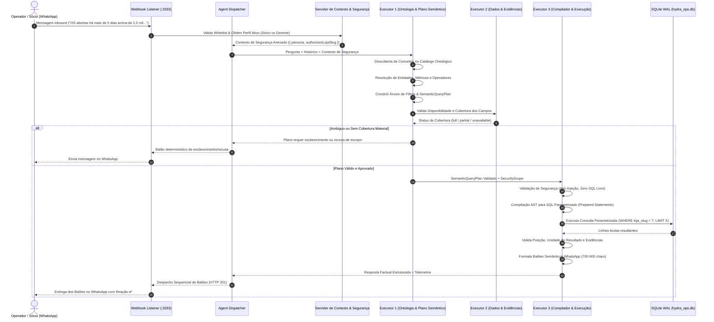
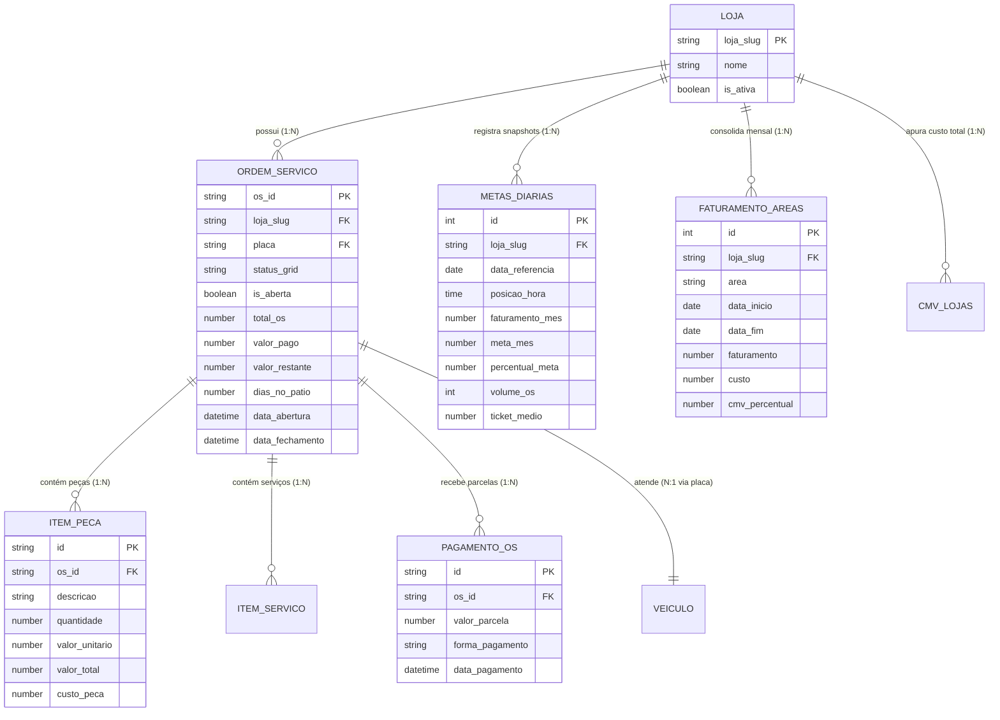

# Design Técnico: Hydra — Camada Semântica de Negócio com Consultas Guiadas por Ontologia

**ID da Spec:** `hydra-semantic-layer`  
**Data:** 02/10/2026  
**Status:** ESPECIFICAÇÃO DE DESIGN  
**Target:** Node.js 22 LTS / TypeScript strict / SQLite WAL / Evolution API v2  
**Referência Normativa:** Versão 1 — 02/10/2026 (Complemento da versão 3 do plano principal)

---

## 1. Arquitetura do Pipeline Semântico e Fluxo de Dados

O diagrama abaixo detalha o ciclo de vida completo de uma pergunta dentro da camada semântica, desde o recebimento do webhook até a entrega dos balões no WhatsApp:



---

## 2. Modelo Ontológico de Entidades e Relações



---

## 3. Interfaces e Contratos TypeScript (Strict Mode)

Os contratos a seguir definem rigorosamente as estruturas semânticas, sem utilizar `any` e em total compatibilidade com o strict mode do TypeScript.

### 3.1. Contrato da Ontologia de Negócio (`types/ontology.ts`)
```typescript
export type ConceptCategory = 
  | 'entity' 
  | 'dimension' 
  | 'metric' 
  | 'relation' 
  | 'term' 
  | 'event' 
  | 'operator' 
  | 'availability';

export interface BusinessEntity {
  id: string; // Ex: 'loja', 'ordem_servico', 'veiculo', 'pagamento'
  displayName: string;
  primaryKey: string;
  sourceTable: string;
  scopeField?: string; // Ex: 'loja_slug'
  description: string;
}

export interface BusinessDimension {
  id: string; // Ex: 'area_operacional', 'status_os', 'responsavel_fechamento'
  entityId: string;
  dataType: 'string' | 'number' | 'boolean' | 'date';
  sourceColumn: string;
  allowedValues?: string[];
  nullable: boolean;
}

export type MetricAggregationType = 'sum' | 'count' | 'avg' | 'weighted_ratio' | 'latest_snapshot';

export interface BusinessMetric {
  id: string; // Ex: 'cmv_percentual', 'faturamento_bruto', 'saldo_restante'
  displayName: string;
  entityId: string;
  formula: string; // Ex: '(sum(custo) / sum(faturamento)) * 100'
  numeratorColumn?: string;
  denominatorColumn?: string;
  aggregation: MetricAggregationType;
  unit: 'BRL' | 'percent' | 'count' | 'days';
  requiresWeightedAggregation: boolean;
}

export interface BusinessRelation {
  id: string; // Ex: 'os_pecas', 'os_pagamentos', 'loja_metas'
  parentEntityId: string;
  childEntityId: string;
  cardinality: '1:1' | '1:N' | 'N:N';
  parentKey: string;
  childKey: string;
  multiplicationRisk: boolean; // Se true, o compilador exige subconsultas correlacionadas ou EXISTS
}
```

### 3.2. Contrato do Plano Semântico (`types/semantic_plan.ts`)
```typescript
export type FilterOperator = 
  | 'EQUALS' 
  | 'NOT_EQUALS' 
  | 'GREATER_THAN' 
  | 'GREATER_EQUAL' 
  | 'LESS_THAN' 
  | 'LESS_EQUAL' 
  | 'BETWEEN' 
  | 'IN' 
  | 'NOT_IN' 
  | 'IS_NULL' 
  | 'IS_NOT_NULL' 
  | 'EXISTS' 
  | 'NOT_EXISTS' 
  | 'LIKE';

export interface SemanticFilterCondition {
  dimensionOrMetricId: string;
  operator: FilterOperator;
  value?: unknown;
  secondaryValue?: unknown; // Para operadores BETWEEN
}

export interface SemanticFilterNode {
  logic: 'AND' | 'OR' | 'NOT';
  conditions: (SemanticFilterCondition | SemanticFilterNode)[];
}

export interface SemanticAggregation {
  metricId: string;
  alias: string;
}

export interface SemanticSort {
  fieldId: string;
  direction: 'ASC' | 'DESC';
}

export interface SemanticPeriod {
  type: 'mes_atual' | 'mes_anterior' | 'ultimos_30d' | 'custom';
  startDate?: string;
  endDate?: string;
  comparisonPeriod?: {
    type: 'mes_anterior_homologo' | 'ano_anterior';
    startDate?: string;
    endDate?: string;
  };
}

export interface SecurityContext {
  persona: 'socio' | 'gerente';
  authorizedLojaSlug?: string;
  authorizedPhones: string[];
}

export interface SemanticQueryPlan {
  planId: string;
  catalogVersion: string; // '1.2.0'
  primaryEntityId: string;
  projections: string[];
  filters: SemanticFilterNode;
  aggregations: SemanticAggregation[];
  groupByDimensions: string[];
  orderBy: SemanticSort[];
  limit: number;
  period?: SemanticPeriod;
  relationsToTraverse: string[];
  securityScope: SecurityContext;
  coverageStatus: 'full' | 'partial_warning' | 'insufficient';
  executionStrategy: 'scalar_correlated' | 'exists_subquery' | 'pre_aggregated_cte';
}
```

### 3.3. Contrato do Compilador e Resultado (`types/compiler_contract.ts`)
```typescript
export interface CompiledParameterizedQuery {
  sql: string;
  parameters: (string | number | null)[];
  estimatedCostMs: number;
  antiDuplicationEnforced: boolean;
  storeScopeFilterApplied: boolean;
}

export interface CompilationResult {
  success: boolean;
  query?: CompiledParameterizedQuery;
  errorReason?: string;
  errorCode?: 'INVALID_CONCEPT' | 'CARDINALITY_VIOLATION' | 'SECURITY_VIOLATION' | 'UNSUPPORTED_OPERATOR';
}
```

---

## 4. Esquema de Banco de Dados SQLite (`hydra_ops.db`)

Para suportar o catálogo semântico persistente e auditoria:

```sql
-- Catálogo Ontológico Formal Versionado
CREATE TABLE IF NOT EXISTS hydra_ontology_catalog (
  id INTEGER PRIMARY KEY AUTOINCREMENT,
  categoria TEXT NOT NULL,          -- 'entity' | 'dimension' | 'metric' | 'relation' | 'term'
  identificador TEXT NOT NULL UNIQUE, -- 'cmv_percentual', 'os_id', 'status_os'
  nome_amigavel TEXT NOT NULL,
  tabela_fonte TEXT,
  coluna_fonte TEXT,
  formula_calculo TEXT,
  cardinalidade TEXT,              -- '1:1' | '1:N' | 'N:N'
  requer_ponderacao INTEGER DEFAULT 0,
  versao_catalogo TEXT NOT NULL DEFAULT '1.2.0',
  updated_at DATETIME DEFAULT CURRENT_TIMESTAMP
);

CREATE INDEX IF NOT EXISTS idx_ontology_categoria ON hydra_ontology_catalog(categoria);
CREATE INDEX IF NOT EXISTS idx_ontology_identificador ON hydra_ontology_catalog(identificador);

-- Registro de Evidências e Qualidade de Coleta por Tabela/Fonte
CREATE TABLE IF NOT EXISTS hydra_semantic_evidence (
  id INTEGER PRIMARY KEY AUTOINCREMENT,
  loja_slug TEXT NOT NULL,
  tabela TEXT NOT NULL,
  cobertura_status TEXT NOT NULL,   -- 'COMPLETA' | 'PARCIAL' | 'AUSENTE'
  data_coleta_recente TEXT NOT NULL,
  registros_contabilizados INTEGER NOT NULL,
  incompletude_motivo TEXT,
  updated_at DATETIME DEFAULT CURRENT_TIMESTAMP,
  UNIQUE(loja_slug, tabela)
);

CREATE INDEX IF NOT EXISTS idx_semantic_evidence_loja ON hydra_semantic_evidence(loja_slug, tabela);
```

---

## 5. Regras de Compilação SQL e Blindagem Anti-Erro

O compilador segue quatro mandamentos arquiteturais estritos para evitar distorções de dados:

### 5.1. Regra Anti-Explosão Cartesiana 1:N (Cenário T29)
**Problema:** Uma consulta ingênua com `LEFT JOIN` entre `ordens_servico`, `itens_pecas` e `pagamentos` gera múltiplas linhas para a mesma OS, multiplicando os totais de faturamento e saldo.
**Solução do Compilador:** O compilador nunca gera joins diretos 1:N no mesmo `FROM`. Em vez disso, compila agregações em **CTEs pré-agregadas** ou **subconsultas correlacionadas escalares**:

```sql
-- Padrão Compilado Seguro para T29:
WITH pagamentos_agregados AS (
  SELECT os_id, SUM(valor_parcela) AS total_recebido
  FROM pagamentos_os
  GROUP BY os_id
)
SELECT 
  os.os_id,
  os.loja_slug,
  os.total_os,
  COALESCE(p.total_recebido, 0) AS valor_pago_efetivo
FROM ordens_servico os
LEFT JOIN pagamentos_agregados p ON p.os_id = os.os_id
WHERE os.loja_slug = ? AND os.is_aberta = 1;
```

### 5.2. Proibição Terminante de `SUM(DISTINCT)`
O compilador rejeita e nunca emite a instrução `SUM(DISTINCT coluna)`. Se duas ordens de serviço têm valor de R$ 1.000,00, `SUM(DISTINCT)` calcula R$ 1.000,00 em vez dos corretos R$ 2.000,00. A deduplicação é feita por granularidade de linha (chaves primárias), nunca por valor.

### 5.3. Posições Acumuladas por Horário (Snapshots)
Para métricas oriundas de `metas_diarias`:
O compilador compila com seleção obrigatória do snapshot mais recente do dia/mês:
```sql
SELECT faturamento_mes, meta_mes, percentual_meta
FROM metas_diarias
WHERE loja_slug = ? AND data_referencia = (SELECT MAX(data_referencia) FROM metas_diarias WHERE loja_slug = ?)
ORDER BY id DESC LIMIT 1;
```
Zero soma de snapshots horários.

### 5.4. Injeção Obrigatória de Escopo de Gerente
Se `securityScope.persona === 'gerente'`:
O compilador adiciona compulsoriamente `AND loja_slug = ?` em toda cláusula `WHERE`, e passa o valor `authorizedLojaSlug` no array de parâmetros. Se o usuário mencionar outra loja ou tentar injeção em sub-queries, a compilação é abortada com erro `SECURITY_VIOLATION`.

---

## 6. Mapeamento de Arquivos por Executor e Dependências

```
/opt/bots/src/hydra-sync/
├── types/
│   ├── conversation_contract.ts    [Atualizado com SemanticQueryPlan]
│   └── semantic_contract.ts        [Novo: tipos da ontologia e compilador - Executor 1]
├── ontology_catalog.ts             [Novo: registro de conceitos e operadores - Executor 1]
├── semantic_glossary.ts            [Atualizado: resolvedor semântico - Executor 1]
├── intent_rewriter.ts              [Atualizado: gerador de SemanticQueryPlan - Executor 1]
├── data_dictionary.ts              [Novo: dicionário de fontes e eventos temporais - Executor 2]
├── evidence_repository.ts          [Novo: matriz de cobertura e incompletude - Executor 2]
├── fixtures/
│   └── semantic_fixtures.ts        [Novo: dados de teste T29 controlados - Executor 2]
├── semantic_compiler.ts            [Novo: compilador AST -> SQL parametrizado - Executor 3]
├── query_builder_safe.ts           [Novo: construtor seguro anti-duplicação - Executor 3]
├── semantic_executor.ts            [Novo: executor com timeout/orçamento - Executor 3]
├── balloon_composer.ts             [Atualizado: formatação de balões com ressalvas - Executor 3]
├── agent_dispatcher.ts             [Atualizado: orquestração central pré-IA - Agente Principal]
├── webhook-listener.js             [Integrador central de Ingress/Cancelamento - Agente Principal]
└── tests/
    ├── test_semantic_interpretation.ts [Novo: testes de plano semântico - Executor 1]
    ├── test_semantic_data_evidence.ts   [Novo: testes de qualidade e T29 - Executor 2]
    ├── test_semantic_compiler.ts        [Novo: testes do compilador SQL - Executor 3]
    └── test_semantic_end_to_end.ts      [Novo: suíte completa T01–T40 - Agente Principal]
```
