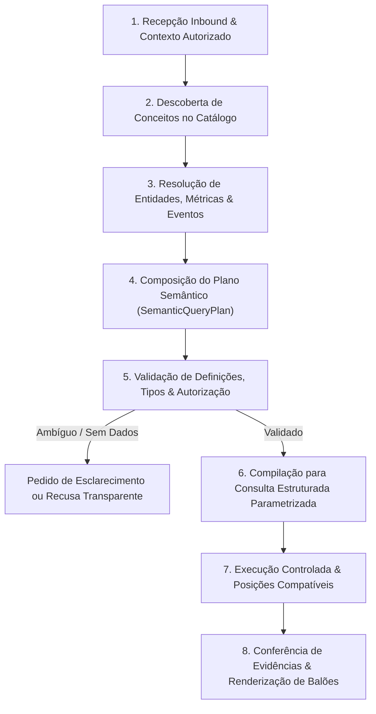

# Proposta: Hydra — Camada Semântica de Negócio com Consultas Guiadas por Ontologia

**ID da Spec:** `hydra-semantic-layer`  
**Data:** 02/10/2026  
**Status:** PROPOSTA / AGUARDANDO APROVAÇÃO (`/vibe-apply hydra-semantic-layer`)  
**Papel do Agente Atual:** Orquestrador e Integrador Principal  
**Versão Normativa:** Versão 1 — 02/10/2026 (Complemento normativo da versão 3 do plano principal)  
**Ambiente:** VPS Operacional (`100.126.50.101`) / Repositório Staging `/home/operacional/hydra-staging/` / Produção `/opt/bots/src/hydra-sync/`

---

> [!IMPORTANT]
> **DIRETRIZ DE PLANEJAMENTO PURO (CIRCUIT BREAKER DE SDD):**
> Este documento é uma especificação formal de planejamento. Ele **NÃO executa sessões, código, consultas operacionais, migrações de banco ou implantação em produção**.
> A implementação só poderá ser iniciada após aprovação explícita via `/vibe-apply hydra-semantic-layer`.
> O trabalho é distribuído **estritamente entre as três sessões existentes**, com o Agente Principal atuando como coordenador de contratos, revisão e integração de artefatos.

---

## 1. Resultado Esperado e Abordagem Técnica

### 1.1. Amplitude Composicional vs. Frases Prontas
O objetivo desta especificação é capacitar o Hydra a responder a perguntas específicas, complexas e inéditas formuladas pelos operadores, gestores e sócios da Mecânica Popular, compondo dinamicamente conceitos e operações sobre os dados reais da operação.
- **Unidade de Modelagem:** A unidade de modelagem é o **conceito de negócio**, sua relação demonstrada com os dados reais e os operadores formais disponíveis; **não** uma frase pronta cadastrada ou uma ferramenta ad-hoc criada para cada nova pergunta.
- **Nome Técnico da Abordagem:** Camada Semântica de Negócio com consultas guiadas por ontologia e tradução de linguagem natural para um plano semântico validado, compilado em consultas estruturadas parametrizadas (*Ontology-Guided Business Semantic Layer & Validated Query Plan Compilation*).
- **Escopo e Limites de Amplitude:** "Qualquer pergunta" é uma meta de amplitude composicional, **não uma garantia universal de onisciência**. A resposta depende comprovadamente da existência dos dados brutos, histórico coletado, autorização da persona, definições ontológicas vigentes e operadores implementados.
- **Classificação Transparente de Falhas:** O sistema deve distinguir com precisão:
  1. *Falta de dados:* O dado nunca foi coletado ou não cobre o período.
  2. *Falta de modelagem:* O conceito existe no negócio, mas não está catalogado na ontologia.
  3. *Falta de operador:* O cálculo exige uma transformação matemática/relacional ainda não implementada.
  4. *Falta de permissão:* O usuário está sob escopo que veda o acesso (ex: persona gerente tentando ver rede).
- **Sem Invenção Causal:** A camada semântica não cria informações ausentes nem comprova automaticamente causalidade, correlação profunda ou previsões futuras sem fontes explícitas.
- **Aproveitamento da Infraestrutura Existente:** Utiliza exclusivamente o banco SQLite WAL operacional (`hydra_ops.db`), o MCP `hydra-ops`, o `TurnContract` v1.1.0 e as rotinas existentes. *dbt Semantic Layer* e *AskTable* são tratadas como referências conceituais de arquitetura, sem demandar contratação de SaaS, instalação de pacotes pesados ou novo banco de grafos.

---

## 2. Estrutura de Delegação: Três Executores Existentes

O trabalho de implementação não criará novas sessões nem um quarto executor concorrente. Reutilizará estritamente as três sessões de trabalho fornecidas pelo usuário:

| Executor | Sessão Designada | ID da Sessão | Escopo de Domínio e Propriedade Exclusiva |
| :--- | :--- | :--- | :--- |
| **Executor 1** | Hydra Operational Context Handoff | `de5452f5-ae9d-4de2-af64-0b12f075f5ea` | **Interpretação e Semântica de Negócio:** Ontologia de conceitos, glossário semântico, catálogo de termos/sinônimos, contrato semântico estendido, interpretação composicional, raciocínio operacional e detecção de ambiguidades/lacunas. |
| **Executor 2** | Hydra Ecosystem Context Transfer | `7b9923e9-f4d2-46ff-8a6b-ea932132e04d` | **Dados e Evidências:** Dicionário de dados reais, fontes, granularidade, cardinalidade observada, eventos temporais, matriz de qualidade/incompletude, fixtures de teste com valores sentinela e comprovação de cobertura. |
| **Executor 3** | Hydra Ecosystem Operational Handover | `5dffcfaf-5e84-438e-81f0-88558655f4c0` | **Compilação, Consultas e Resposta:** Compilador semântico de consultas parametrizadas, operadores relacionais seguros, validação estrita anti-duplicação 1:N, executor com timeout/orçamento, composição de balões WhatsApp e tratamento factual de respostas parciais. |

### Papel Exclusivo do Agente Principal (Orquestrador)
- Coordena os contratos entre as três frentes (interfaces TypeScript sem `any`).
- Mantém a propriedade estrita de arquivos (zero conflito de escrita).
- Realiza a revisão cruzada dos patches e artefatos gerados.
- Integra o pipeline central no [`src/hydra-sync/agent_dispatcher.ts`](file:///opt/bots/src/hydra-sync/agent_dispatcher.ts) e [`webhook-listener.js`](file:///home/operacional/hydra/webhook-listener.js).
- Executa a suíte completa de testes (T01 a T40), o build gate e o deploy assistido.

---

## 3. Caminho de Uma Pergunta (Ciclo de Vida em 8 Etapas)

Toda mensagem do usuário transita por um pipeline único e auditável:



1. **Recepção do Inbound:** Recebe texto/áudio/mídia, referência da conversa, histórico recente e **contexto de segurança anexado pelo servidor** (persona `socio` vs. `gerente`, loja vinculada).
2. **Descoberta no Catálogo:** Identifica conceitos, dimensões e métricas pertinentes na ontologia, sem inspecionar registros brutos de lojas não autorizadas para decidir como responder.
3. **Resolução Semântica:** Mapeia termos, sinônimos, unidades de análise, eventos temporais (abertura vs. fechamento vs. faturamento) e filtros booleanos (AND/OR/NOT).
4. **Composição do Plano Semântico (`SemanticQueryPlan`):** Gera representação estruturada tipada contendo intenções, granularidade, métricas solicitadas, relações e projeções. Identifica ambiguidades materiais.
5. **Validação Pré-Execução:** O servidor valida se os conceitos são compatíveis, se a persona tem autorização para o escopo e se as relações possuem cobertura comprovada.
6. **Compilação Determinística:** O compilador traduz o plano em queries SQL estritamente parametrizadas (ou chamadas ao MCP existente). **Zero SQL livre vindo de modelo ou do usuário.**
7. **Execução Controlada:** Roda dentro do orçamento de tempo (budget de turno), selecionando posições/snapshots compatíveis no banco.
8. **Conferência e Renderização:** Valida se o retorno corresponde à unidade solicitada; formata balões WhatsApp respeitando a ordem semântica (resposta direta -> leitura -> detalhe -> fonte/período). Se faltar dado de parte da pergunta, explicita a lacuna sem inventar valores.

---

## 4. Ontologia e Modelo de Negócio

O modelo semântico é mantido em um registro formal e versionado (`ontology_catalog.ts`), definindo os 8 elementos obrigatórios:

| Elemento | Conteúdo Obrigatório | Exemplo no Domínio Hydra |
| :--- | :--- | :--- |
| **Entidade** | Identidade estável, chaves primárias, fonte e escopo de existência. | Loja (`loja_slug`), Ordem de Serviço (`os_id`), Veículo (`placa`), Peça/Item (`item_id`). |
| **Dimensão** | Tipo de dado, unidade/domínio, tratamento de nulos, valores permitidos. | Área operacional (`OLEO`, `FILTRO`, `MECANICA`), Status da OS (`Aberta`, `Fechada`, `Cancelada`). |
| **Métrica** | Fórmula matemática, população elegível, unidade de medida, agregação. | CMV Percentual (`(custo_total / faturamento_total) * 100`), Faturamento Bruto, Ticket Médio. |
| **Relação** | Chaves de ligação, cardinalidade (1:1, 1:N, N:N), temporalidade. | OS ➔ Peças (1:N via `os_id`), Loja ➔ Metas Diárias (1:N temporal via `loja_slug`). |
| **Termo** | Sinônimos, abreviações, sentidos possíveis e **não equivalências**. | "sem sinal" (`valor_pago <= 0` E `valor_restante > 0`); "parado" NÃO significa fisicamente retido sem OS. |
| **Evento** | Tipo de ocorrência, entidade afetada, carimbo de data/hora e precisão. | Data de abertura da OS (`data_abertura`), Data de fechamento (`data_fechamento`), Coleta (`created_at`). |
| **Operador** | Entradas/saídas tipadas, pré-condições, limites de volume e regra de compilação. | `EQUALS`, `IN`, `BETWEEN`, `EXISTS`, `NOT_EXISTS`, `SUM`, `AVG_WEIGHTED`, `RANK_TOP_N`. |
| **Disponibilidade** | Campo efetivamente coletado na fonte, período disponível, atualização. | Faturamento de áreas (disponível mensalmente); Histórico de peças (disponível por OS extraída). |

### Regras Semânticas de Domínio:
- **Identidade de Cliente:** O nome do cliente **não** é identidade confiável para cruzamentos (homônimos frequentes).
- **Atribuição de Responsável:** O mecânico executor, o consultor de abertura e o responsável pelo fechamento são papéis distintos. Não intercambiar.
- **Relações de Nomes Semelhantes:** A mera existência de colunas com nomes parecidos em tabelas diferentes não comprova relação de chave estrangeira.
- **Termos Operacionais Rigorosos:**
  - "Parado" / "Atrasado" ➔ Exige dias no pátio comprovados (`dias_no_patio >= X`) ou data de abertura antiga; não inferir presença física sem OS ativa.
  - "Sem sinal" ➔ Diferente de sinal desconhecido. Exige confirmação de recebíveis.
  - "Perdendo dinheiro" ➔ Exige CMV apurado acima da meta ou margem de contribuição negativa comprovada; faturamento baixo isolado não é prejuízo.

---

## 5. Unidade de Análise, Relações e Agregações (10 Regras Cruciais)

Cada fonte declara sua granularidade nativa (ex: uma linha em `ordens_servico` é uma OS; uma linha em `faturamento_areas` é uma área/mês).

1. **Prevenção de Multiplicação em Junções 1:N:** A junção de uma OS com múltiplas peças e pagamentos **nunca pode multiplicar o valor total da OS**. Deve-se utilizar pré-agregação em subconsultas correlacionadas, `EXISTS` ou queries separadas por dimensão.
2. **Proibição de `SUM(DISTINCT valor)`:** `SUM(DISTINCT valor)` **não** resolve multiplicação de join, pois duas OSs distintas podem ter legitimamente o mesmo valor (ex: duas revisões de R$ 1.000). Usar `SUM(DISTINCT)` introduz erro silencioso gravíssimo.
3. **Relações Muitos-para-Muitos (N:N):** Exigem tabela intermediária e regra determinística de deduplicação antes de qualquer agregação.
4. **Vedação de Rateio Artificial:** Métrica oficial disponível apenas em nível consolidado de loja/mês (ex: CMV de loja) **não pode ser rateada por consultor/mecânico** sem uma fonte de atribuição de custos de peças por profissional. É proibido inventar rateio ou substituir faturamento contábil por soma de orçamentos de OS.
5. **Posições Acumuladas por Horário são Snapshots:** Registros em `metas_diarias` com `posicao_hora` são fotos pontuais do faturamento acumulado no mês até aquele instante. **É terminantemente proibido somar snapshots** ao longo do dia; deve-se selecionar a posição mais recente do período de referência.
6. **Saldos são Posições, Não Fluxos:** O saldo a receber de uma OS é uma posição estática no tempo; somar saldos ao longo de dias sucessivos duplica a dívida.
7. **Ponderação Obrigatória de Médias e Índices:** Tickets médios e percentuais de CMV combinados usam numeradores e denominadores somados individualmente (`sum(custos) / sum(faturamento) * 100`). É terminantemente proibida a média aritmética simples de percentuais entre lojas ou grupos com pesos diferentes.
8. **Ausência Comprovada vs. Ausência de Coleta:** Afirmar que uma OS "não teve pagamentos" só é válido se a tabela de pagamentos possuir cobertura completa para aquela OS. Se os pagamentos da loja não foram coletados, a resposta deve ser "dados de pagamentos não disponíveis para esta unidade", e não "zero pagamentos".
9. **Propagação de Incompletude por Nulos ou Qualidade Suspeita:** Registros com pendências ou suspeitas materiais propagam o aviso de incompletude aos totais agregados afetados.
10. **Denominadores e Rankings Restritos ao Universo Autorizado:** Rankings e cálculos de participação percentual utilizam estritamente as 10 lojas elegíveis (expurgando a unidade administrativa Master) e, no caso de gerente, limitam-se à unidade ativa autorizada.

### Fixture Independente de Validação (T29):
Para validar a conformidade com as regras 1 e 2, o sistema deve ser testado contra o seguinte cenário controlado:
- OS 101: Valor R$ 1.000,00 | 2 peças associadas | 2 pagamentos (R$ 300,00 e R$ 200,00).
- OS 102: Valor R$ 1.000,00 | 1 peça associada | 1 pagamento (R$ 500,00).
- *Comportamento Esperado:* 
  - Faturamento total das OSs: exatamente **R$ 2.000,00** (a junção ingênua produziria R$ 4.000; o uso ingênuo de `SUM(DISTINCT)` produziria R$ 1.000).
  - Total recebido: exatamente **R$ 1.000,00** (R$ 500 da OS 101 + R$ 500 da OS 102).

---

## 6. Operadores Combináveis Tipados

A camada semântica expõe operadores relacionais e estatísticos rigorosamente tipados:
- **Seleção e Projeção:** Projeção estrita de campos autorizados do catálogo.
- **Filtros Booleanos Complexos:** Combinações livres de `AND`, `OR`, `NOT`, intervalos (`BETWEEN`), pertinência (`IN`), comparações (`>`, `<`, `>=`, `<=`) e teste de `NULL`/`IS_NOT_NULL`. Precedência de parênteses estritamente preservada.
- **Predicados de Existência:** `EXISTS` e `NOT_EXISTS` com verificação de cobertura suficiente.
- **Agregadores Matemáticos:** `COUNT(entidade)`, `SUM(métrica)`, `MIN(métrica)`, `MAX(métrica)`, `AVG_WEIGHTED(métrica, peso)`.
- **Agrupamento:** `GROUP_BY` por dimensões ontologicamente compatíveis (loja, área, período, status).
- **Classificação e Ranking:** `ORDER_BY` com critérios estáveis de desempate e `LIMIT / OFFSET`.
- **Comparação Homogênea entre Períodos:** Alinhamento temporal obrigatório (ex: D-30 vs D-60, ou 1 a 15 deste mês vs 1 a 15 do mês anterior), com cálculo de variação absoluta e relativa (p.p. ou percentual).
- **Drill-Down Conciliável:** Capacidade de listar as ordens ou itens específicos que formam o montante agregado.
- **Busca Semântica Delimitada:** Casos similares recuperados via busca lexical/vetorial são tratados como **amostras candidatas**, nunca promovidos a total exaustivo da população.

---

## 7. Contrato do Plano Semântico (`SemanticQueryPlan`)

O plano semântico estende a interface [`TurnContract`](file:///opt/bots/src/hydra-sync/types/conversation_contract.ts) existente:

```typescript
export interface SemanticQueryPlan {
  planId: string;
  catalogVersion: string; // Ex: '1.2.0'
  primaryEntity: 'loja' | 'ordem_servico' | 'veiculo' | 'meta' | 'area_operacional';
  dimensions: string[];   // Identificadores de dimensões no catálogo (nunca nomes SQL livres)
  metrics: string[];      // Identificadores de métricas no catálogo
  filters: SemanticFilterNode[]; // Árvore booleana de filtros tipados
  aggregations: SemanticAggregation[];
  groupBy?: string[];
  orderBy?: SemanticSort[];
  limit?: number;
  period?: SemanticPeriod;
  relationsRequired: string[]; // Relações que o compilador deve conectar
  coverageRequired: 'full' | 'partial_allowed';
  securityScope: {
    persona: 'socio' | 'gerente';
    authorizedLojaSlug?: string;
  };
  missingRequirements?: string[];
  executionMode: 'exact_sql' | 'mcp_tool' | 'clarify';
}
```

---

## 8. Compilação e Fronteira de Segurança

O **Executor 3** implementa o compilador de consultas (`semantic_compiler.ts`):
1. **Zero SQL Arbitrário:** O compilador nunca aceita fragmentos SQL gerados livremente por LLM ou digitados pelo usuário.
2. **Geração Baseada em Template AST:** A consulta SQL é montada a partir dos nós validados do `SemanticQueryPlan`.
3. **Parâmetros Pré-vinculados (`?`):** Todos os valores literais (datas, slugs, placas, valores) são passados via *prepared statements* do `better-sqlite3`.
4. **Isolamento de Escopo Inviolável:**
   - Se `securityScope.persona === 'gerente'`, o compilador injeta compulsoriamente a cláusula `WHERE loja_slug = ?` em **todos** os blocos da consulta (inclusive subconsultas e uniões).
5. **Bloqueio de Mutações:** O compilador rejeita terminantemente qualquer palavra-chave DDL/DML (`INSERT`, `UPDATE`, `DELETE`, `DROP`, `ALTER`, `ATTACH`). Apenas leitura permitida.

---

## 9. Tratamento de Linguagem Natural e Diálogo Complexo

O pipeline de interpretação (Executor 1) garante:
- **Resiliência a Erros de Digitação:** Normalização de termos e tolerância a pequenos erros de grafia, sem distorcer números de OS, placas ou valores monetários.
- **Preservação de Componentes Múltiplos:** Perguntas compostas (ex: "OS abertas há mais de 5 dias, acima de R$ 2.500 e sem entrada") mantêm todos os predicados ativos na árvore de filtros.
- **Resolução de Anáforas e Elipses:** Termos como "dessas", "as mesmas", "e em Santo André?" herdam os filtros do turno anterior e aplicam apenas a modificação pontual.
- **Distinção Causal e Previsões:** Perguntas como "por que o CMV subiu?" geram decomposição descritiva das áreas que mais variaram de custo, com declaração explícita de que se trata de uma decomposição de componentes, e não prova de causalidade. Perguntas sobre previsões futuras declaram a ausência de modelo preditivo ativo.

---

## 10. Exemplos de Amplitude e Suíte de Testes (T01 a T40)

A camada semântica deve responder com perfeição aos 12 cenários de prova de amplitude:

| Pergunta de Teste | Requisito de Interpretação e Compilação |
| :--- | :--- |
| *"Quais abertas há mais de 5 dias, acima de 2,5 mil e sem entrada?"* | Interseção de filtros em `ordens_servico` (`dias_no_patio >= 5`, `total_os >= 2500`, `valor_pago <= 0`). |
| *"Das anteriores, exclua as aguardando peça e mantenha só as do Marcelo"* | Refinamento contextual com negação de status e filtro por responsável. |
| *"Agrupe por responsável: quantidade, valor das OS e recebido"* | Agregação por dimensões compatíveis, sem multiplicação de valores 1:N. |
| *"Quem teve maior ticket, só das faturadas neste mês?"* | População restrita a OSs fechadas no mês, cálculo de média e ordenação descendente. |
| *"Qual loja mais caiu contra o mesmo período do mês passado?"* | Comparação pareada de período homólogo das 10 lojas com variação absoluta e relativa. |
| *"Quais clientes voltaram com o mesmo carro em até 30 dias?"* | Identificação de veículos por placa com intervalo entre OSs `<= 30 dias`. Sem inferir retrabalho. |
| *"Tem encerrada com saldo restante?"* | Interseção `is_aberta = 0` e `valor_restante > 0`. Ambas comprovadas. |
| *"Serviço de câmbio sem troca de óleo"* | Predicado relacional com `EXISTS(câmbio)` e `NOT_EXISTS(óleo)`. |
| *"Quais ordens explicam esse faturamento?"* | Drill-down conciliatório de ordens fechadas somando o montante do faturamento. |
| *"Por que caiu?"* | Decomposição em faturamento por área ou volume de OS vs ticket médio, sem alucinação causal. |
| *"Quanto vamos faturar mês que vem?"* | Identificação transparente de pergunta preditiva como capacidade não suportada. |
| *"Casos parecidos com esse vazamento"* | Busca semântica textual/vetorial retornando casos candidatos com ressalva de amostra. |

### Matriz de Testes Adicionais (T29 a T40):
- **T29:** OS com várias peças/pagamentos e outra OS de igual valor (anti-multiplicação e anti-`SUM(DISTINCT)`).
- **T30:** Posições acumuladas por horário (seleção do snapshot correto, anti-soma de posições).
- **T31:** Precedência booleana AND/OR/NOT, termos "abaixo de" vs "até", e tratamento estrito de NULL.
- **T32:** "Sem pagamento" com dados ausentes na fonte (declaração de dados parciais/desconhecidos).
- **T33:** Financeiro consolidado de loja pedido por responsável (recusa de rateio fictício).
- **T34:** Combinação de tickets e percentuais de grupos com pesos diferentes (ponderação obrigatória).
- **T35:** Comparação com mês anterior e período parcial (alinhamento explícito de janelas).
- **T36:** Continuação conversacional com correção de parâmetros e troca de persona.
- **T37:** Tentativa de injeção de identificador inválido ou prompt injection no plano semântico.
- **T38:** Contagem após busca semântica (declaração explícita de top-k candidatos vs total real).
- **T39:** Solicitação de previsão ou causa sem fonte comprovada (declaração de limites).
- **T40:** Combinação inédita reservada de filtros, agrupamentos e ordenação sem rota de frase pré-cadastrada.

---

## 11. Sete Correções Mandatórias da Revisão Recente (Cláusulas Pétreas)

1. **Confirmação de Status não Valida Valor:** A verificação de que uma OS está aberta ou fechada não atesta a exatidão dos seus valores financeiros. Inconsistências de valores devem ser reportadas como suspeitas por motivo/campo.
2. **Eventos Temporais Distintos:** A data de observação/coleta (`created_at`) não pode ser usada como substituta da data de abertura, fechamento ou faturamento da OS.
3. **Encerramento Comprovado sem Data Exata:** Se houver comprovação documental de que a OS foi encerrada, esse estado deve ser reconhecido, limitando-se apenas a não atribuí-la a um mês específico cuja data não esteja demonstrada.
4. **Resiliência a Grades Vazias ou sem Paginador:** A captura completa de dados operacionais deve aceitar grades de loja vazias ou de página única sem abortar o lote ou travar o crawler.
5. **Propagação Dinâmica de Incompletude:** Transições pendentes e OSs com suspeita propagam incompletude dinamicamente para os totais agregados afetados, sem referenciar estaticamente a OS 9202 como exemplo genérico.
6. **Diferenciação entre Falha de Coleta e Registro Histórico:** A incapacidade temporária de coleta no momento não autoriza substituir silenciosamente o valor atual por uma posição histórica antiga sem ressalva explícita de data.
7. **Reconciliação Dinâmica em Runtime:** A conciliação deve descobrir candidatos no momento da execução com idempotência e controle de versão, sem fixar populações estáticas pré-concebidas (517, 153 ou 206).

---

## 12. Divisão de Entregas por Executor e Arquivos

| Executor | Arquivos Sob Sua Responsabilidade | Entregas Esperadas |
| :--- | :--- | :--- |
| **Executor 1** | `types/semantic_contract.ts`, `ontology_catalog.ts`, `semantic_glossary.ts`, `intent_rewriter.ts`, `tests/test_semantic_interpretation.ts` | Modelagem ontológica versionada, resolvedor léxico/semântico, gerador de `SemanticQueryPlan`, suíte de testes de interpretação com perguntas inéditas. |
| **Executor 2** | `data_dictionary.ts`, `evidence_repository.ts`, `fixtures/semantic_fixtures.ts`, `tests/test_semantic_data_evidence.ts` | Dicionário de fontes e dados reais, matriz de granularidade e eventos temporais, fixtures controladas (incluindo cenário T29), testes de evidência. |
| **Executor 3** | `semantic_compiler.ts`, `query_builder_safe.ts`, `semantic_executor.ts`, `balloon_composer.ts`, `tests/test_semantic_compiler.ts` | Compilador SQL seguro com prepared statements, operadores relacionais tipados, prevenção de multiplicação 1:N, compositor de balões semânticos WhatsApp. |
| **Principal** | `agent_dispatcher.ts`, `webhook-listener.js`, integração dos 3 módulos, suíte completa T01–T40, build gate e deploy | Acoplamento no dispatcher central, barreira de acesso de perfis, validação cruzada dos contratos, testes E2E, documentação de memória e deploy. |

---

## 13. Critérios de Aceite para Conclusão

- [ ] **Critério 1 (Amplitude Composicional):** O sistema responde corretamente a combinações inéditas dos operadores e entidades documentadas, sem necessidade de cadastrar rotas ou regexes para frases específicas.
- [ ] **Critério 2 (Zero Invenção Causal e Previsões):** Perguntas de previsão ou causalidade retornam recusa transparente ou decomposição descritiva com declaração de limites.
- [ ] **Critério 3 (Fixture T29 Aprovada):** O cenário de OS com peças e pagamentos múltiplos totaliza exatamente R$ 2.000,00 de faturamento e R$ 1.000,00 de recebido, sem multiplicação e sem `SUM(DISTINCT)`.
- [ ] **Critério 4 (Segurança e Zero SQL Livre):** 100% das consultas executadas no banco são geradas pelo compilador estruturado com prepared statements e validação de escopo.
- [ ] **Critério 5 (Suíte Completa T01 a T40):** 100% de aprovação em todos os testes unitários e de integração das três frentes.
- [ ] **Critério 6 (Build Gate Rígido):** `tsc -p tsconfig.hydra.json --noEmit` executado com zero erros de TypeScript.
