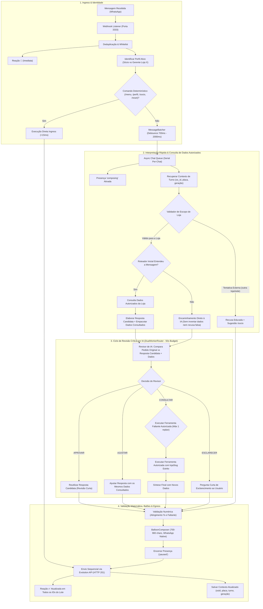

# Design Técnico: Hydra Conversacional por Perfil, Continuidade e IA Efetiva

**ID da Spec:** `manager-conversational-ai`  
**Data:** 30/09/2026  
**Status:** ESPECIFICAÇÃO DE DESIGN  

---

## 1. Arquitetura e Fluxo de Dados Ponta a Ponta



---

## 2. Interfaces TypeScript Reais (Estritas, Sem `any`)

### 2.1. Contrato de Perfil e Governança de Escopo

```typescript
export type PersonaType = 'socio' | 'gerente';

export interface UserSessionProfile {
  phone: string;
  persona: PersonaType;
  lojaSlug: string | null;         // Ex: 'MPJorgeBeretta' ou null se Sócio
  lojaNome: string | null;         // Ex: 'Jorge Beretta'
  defaultScope: 'network' | 'store';
  memoryGeneration: number;        // Incrementado para invalidar respostas órfãs
  dailyMemoryResetAt: string | null;
  updatedAt: string;
}

export interface ScopeValidationResult {
  isAllowed: boolean;
  targetLojaSlug: string | null;
  violationReason?: 'OUTSIDE_STORE_ATTEMPT' | 'UNAUTHORIZED_CROSS_STORE' | 'FORBIDDEN_NETWORK_SCOPE';
  refusalMessage?: string;
}
```

### 2.2. Ficha Técnica Completa de Ordem de Serviço

```typescript
export interface OSServiceItem {
  descricao: string;
  valor: number;
  mecanicoResponsavel: string | null;
}

export interface OSPartItem {
  descricao: string;
  quantidade: number;
  valorUnitario: number;
  valorTotal: number;
}

export interface OSChecklistStatus {
  entrada: {
    realizado: boolean;
    dataHora: string | null;
    observacoes: string | null;
  };
  mecanico: {
    realizado: boolean;
    dataHora: string | null;
    observacoes: string | null;
  };
}

export interface OSDetailComplete {
  osId: string;
  lojaSlug: string;
  lojaNome: string;
  placa: string | null;
  veiculo: string | null;
  cliente: string | null;
  isAberta: boolean;
  statusGrid: string;
  diasNoPatio: number;
  dataAbertura: string | null;
  dataPrometida: string | null;
  valorTotal: number;
  valorPago: number;
  valorRestante: number;
  temAlertaFinanceiro: boolean;   // valorRestante >= 2500 sem sinal suficiente
  servicos: OSServiceItem[];
  pecas: OSPartItem[];
  checklists: OSChecklistStatus;
}
```

### 2.3. Cálculo e Apuração Matemática de Metas

```typescript
export interface GoalAchievementCalculation {
  lojaSlug: string;
  lojaNome: string;
  periodoReferencia: string;       // Ex: '01/09/2026 a 30/09/2026'
  posicaoHora: string;             // Ex: '14h'
  faturamentoMes: number;          // Ex: 84613.61
  metaMes: number;                 // Ex: 124900.00
  percentualAtingimento: number;   // (faturamentoMes / metaMes) * 100 -> 67.75%
  valorFaltante: number;           // Math.max(0, metaMes - faturamentoMes) -> 40286.39
  superavit: number;               // Math.max(0, faturamentoMes - metaMes)
  volumeOS: number;
  ticketMedio: number;
  isMetaAlcancada: boolean;
}
```

export interface ManagerTurnTelemetry {
  correlationId: string;
  timestamp: string;
  phone: string;
  persona: PersonaType;
  lojaSlug: string | null;
  memoryGeneration: number;
  llmInvoked: boolean;
  workerChosen: 'primary' | 'secondary' | 'none';
  motor: 'AGY_PRIMARY' | 'AGY_SECONDARY' | 'FALLBACK_API';
  modelUsed: string;
  reviewDecision: 'APROVAR' | 'AJUSTAR' | 'CONSULTAR' | 'ESCLARECER' | null;
  replanCount: number;             // 0 ou 1 (teto anti-loop)
  duracaoTotalMs: number;
  duracaoLlmMs: number;
  duracaoDbMs: number;
  toolsCalled: string[];
  scopeViolationDetected: boolean;
  fallbackReason: string | null;
  errorCode: string | null;        // 'H-IA-01' | 'H-IA-02' | 'H-IA-03' | 'H-IA-04'
  tokensPrompt?: number;
  tokensCompletion?: number;
}
```

### 2.5. Contrato do Ciclo de Revisão Crítica da IA

```typescript
export type ReviewDecisionType = 'APROVAR' | 'AJUSTAR' | 'CONSULTAR' | 'ESCLARECER';

export interface ConsultedDataRecord {
  fonte: 'faturamento_diario_horario' | 'metas_horarias' | 'cmv_lojas' | 'ordens_servico' | 'nenhuma';
  periodo: string;                 // Ex: '30/09/2026' ou '01/09/2026 a 30/09/2026'
  lojaSlug: string;
  payload: Record<string, unknown>;
  timestamp: string;
}

export interface AIReviewRequest {
  mensagemOriginal: string;
  perfil: UserSessionProfile;
  contextoConversa: {
    osId?: string;
    placa?: string;
    lastIntent?: string;
    memoryGeneration: number;
  };
  respostaCandidata: string;
  dadosConsultados: ConsultedDataRecord[];
}

export interface AIReviewResult {
  decisao: ReviewDecisionType;
  justificativaCurta: string;
  respostaFinal?: string;          // Usada quando APROVAR ou AJUSTAR
  ferramentaSolicitada?: {         // Usada quando CONSULTAR
    nome: 'get_os_details' | 'get_cmv_loja' | 'get_vendas_hoje' | 'get_metas_mes';
    parametros: Record<string, string | number>;
  };
  perguntaEsclarecimento?: string; // Usada quando ESCLARECER
}
```

---

### 3. Módulos do Sistema e Divisão de Responsabilidades

### 3.1. Agente 1 — Roteador, Governança e Ciclo do Revisor de IA
- **Arquivos sob tutela:**
  - `src/hydra-sync/agent_dispatcher.ts`
  - `src/hydra-sync/semantic_prompt.ts`
  - `src/hydra-sync/dual_worker_router.ts`
  - `src/hydra-sync/manager_store_access.ts` (camada de validação de escopo)
- **Implementações Específicas:**
  1. No `agent_dispatcher.ts`:
     - Carregar `getUserProfile(db, phone)` **antes** de qualquer interpretação.
     - Se `persona === 'gerente'`, injetar a loja autorizada (`lojaSlug`) nas diretrizes de execução.
     - **Ciclo de Revisão Crítica por IA (AI Reviewer):**
       - O código tenta interpretar e consultar dados autorizados, gerando uma `respostaCandidata` e `dadosConsultados`.
       - Se o roteador inicial não entender a mensagem: encaminha diretamente à IA sem inventar uma resposta candidata e sem emitir recusa genérica falsa.
       - Antes do envio, a IA recebe: mensagem original, perfil/loja, contexto da conversa, resposta candidata e dados consultados (período e fonte).
       - A IA avalia e decide:
          * `APROVAR`: resposta atende ao pedido; revisão ultracurta, reutiliza a candidata.
          * `AJUSTAR`: dados consultados são suficientes, mas a formulação precisa de correção, tom ou melhor explicação. **Regra de Ouro:** `AJUSTAR` só pode usar dados já presentes em `dadosConsultados`. Proibido completar a resposta por suposição.
          * `CONSULTAR`: faltam dados ou houve erro de intenção. Em *“OS e CMV”*, se apenas o CMV foi consultado pelo fast-path, a decisão OBRIGATÓRIA é `CONSULTAR` para buscar as OSs. Em *“Detalhes da 1128”*, aciona `get_os_details` para obter a ficha técnica completa. Solicita ferramenta permitida no escopo da loja e conclui a resposta.
          * `ESCLARECER`: pergunta pontual apenas quando perfil, contexto e dados não resolverem uma ambiguidade real.
        - **Anti-Loop e Calibração dos Prazos com Evidências Reais:**
          * Timeout da chamada de revisão: **20.000 ms (20s)** (com base na medição real na VPS onde uma chamada de revisão consome ~16s).
          * Se `APROVAR` ou `AJUSTAR`: encerra em 1 chamada LLM (~5–16s).
          * Se `CONSULTAR`: ferramenta SQLite executa em <50ms. Nova chamada LLM para síntese só ocorre se o saldo restante do turno for `>= 15.000 ms`. Se o saldo for inferior a 15s, compõe a resposta diretamente via template factual determinístico para jamais ultrapassar o teto global de **50.000 ms**.
          * Falha de ambos os workers ou timeout encerra com código amigável `H-IA-02` (ou a resposta candidata se viável) sem espera indefinida nem resposta aleatória.
  2. No `semantic_prompt.ts`:
     - Formular o system prompt do Revisor Crítico Operacional, orientando a comparação rigorosa entre a pergunta e os dados disponíveis, sem permissão para executar SQL arbitrário nem extrapolar a loja do perfil.
  3. No `manager_store_access.ts`:
     - Validação estrita de escopo: qualquer ferramenta solicitada durante `CONSULTAR` é validada pelo código para garantir `lojaSlug === userProfile.lojaSlug`.
     - Recusa educada orientando `/socio` caso haja tentativa de consultar outras lojas.
  4. No `dual_worker_router.ts`:
     - Telemetria de turno gravada em banco: `reviewDecision`, `replanCount`, `workerChosen`, `latenciaMs`, `modelUsed`, e tokens consumidos quando reportados.

### 3.2. Agente 2 — Continuidade de Diálogo, Resposta Candidata e Ferramentas Autorizadas
- **Arquivos sob tutela:**
  - `src/hydra-sync/turn_context_repository.ts`
  - `src/hydra-sync/operational_adapter.ts`
  - `src/hydra-sync/db_repository.ts`
  - `src/hydra-sync/finance_snapshot_repository.ts`
- **Implementações Específicas:**
  1. No `operational_adapter.ts`:
     - Implementar `buildCandidateResponse(message, context, profile)`: realiza o fast-path de consulta, monta a candidata determinística e empacota `dadosConsultados` (`ConsultedDataRecord`: fonte, período, lojaSlug, payload).
     - Atender a decisões `CONSULTAR` do revisor: executar a ferramenta autorizada solicitada (`get_os_details`, `get_cmv_loja`, etc.) e retornar os dados complementares.
     - Suporte a consultas multi-intenção (*"OS e CMV"*): capacidade de compor dados de múltiplas fontes.
  2. No `db_repository.ts`:
     - Implementar `getOSDetailComplete(db, lojaSlug, osId)`: traz ficha completa da OS (situação, datas, itens/serviços, peças, valores pagos, saldo devedor e checklists de entrada/mecânico).
  3. No `turn_context_repository.ts`:
     - Preservar ativamente no `hydra_turn_contexts` os campos `os_id`, `placa`, `loja_slug` e `filters_json`.
     - Recuperar `os_id` ativo para resolver anáforas contextuais (*"quero os detalhes"*, *"e o checklist dela?"*), fornecendo contexto limpo ao revisor.
     - Ao alternar entre personas (Sócio -> Gerente), expurgar dados de rede do contexto em memória.

### 3.3. Agente 3 — Matemática, Balões e Test Harness de Evidências
- **Arquivos sob tutela:**
  - `src/hydra-sync/format_utils.ts`
  - `src/hydra-sync/balloon_composer.ts`
  - `src/hydra-sync/tests/test_manager_ai_continuity.ts`
- **Implementações Específicas:**
  1. Em `format_utils.ts` e `operational_adapter.ts`:
     - Função `calculateGoalMetrics(faturamento: number, meta: number): GoalAchievementCalculation`.
     - Cálculo exato: `atingimento = (faturamento / meta) * 100` e `faltante = Math.max(0, meta - faturamento)`.
     - Sanitização de texto: corrigir caracteres corrompidos em queries (`"Retidos há mais de 5 dias"`).
  2. Em `balloon_composer.ts`:
     - Ordem semântica dos balões: Resposta Direta -> Leitura dos Indicadores -> Detalhamento -> Rodapé com fonte e data/hora. Limite de 700 a 900 caracteres por balão.
  3. Em `tests/test_manager_ai_continuity.ts`:
     - Test Harness com a **Matriz dos 20 Cenários de Validação**, destacando as 6 evidências obrigatórias de revisão e continuidade:
       1. **Evidência 1 (Revisão APROVAR):** Candidata correta sobre faturamento aprovada por chamada real à IA (`decisao = 'APROVAR'`).
       2. **Evidência 2 (Revisão AJUSTAR):** Resposta incompleta (*"OS e CMV da minha loja"*) corrigida pela revisão para atender a ambas as partes.
       3. **Evidência 3 (Revisão CONSULTAR):** Interpretação insuficiente (*"Detalhes da 1128"* retornando só resumo) percebida pela revisão, disparando consulta autorizada `get_os_details` com entrega da ficha completa.
       4. **Evidência 4 (Continuidade Preservada):** Mensagem seguinte *"Quero os detalhes"* após selecionar a 1128 preserva o `osId` e mantém o contexto.
       5. **Evidência 5 (Zero Vazamento Cross-Store):** Consulta à outra loja (*"Faturamento da Kennedy"*) bloqueada no escopo com recusa educada e sugestão `/socio`, inclusive se tentada em `CONSULTAR`.
       6. **Evidência 6 (Falha Graciosa dos Workers):** Simulação de indisponibilidade primária e secundária resultando em encerramento com código `H-IA-02`, sem espera indefinida nem resposta aleatória.
       7. Identificação de loja por perfil (*"Qual minha loja?"*).
       8. Pergunta aberta da loja ativa (*"Como estamos?"* -> IA interpreta e contextualiza dados da loja).
       9. Tolerância a erro ortográfico (*"Consegue falar do fatuamento?"* -> entende faturamento).
       10. Continuação de período (*"E hoje?"* após faturamento mensal -> busca vendas de hoje).
       11. Cálculo correto de atingimento e faltante (*"Quanto falta pra meta?"* -> 67,75% e R$ 40.286,39).
       12. Qualificador local de conjunto (*"Todos os carros da minha loja"* -> conjunto local sem falso bloqueio).
       13. Desambiguação de OS (duas OSs possíveis sem seleção -> pedido curto de esclarecimento `ESCLARECER`).
       14. Consulta de área específica (*"CMV de óleo"* -> busca setor OLEO, não CMV total).
       15. Entrada por áudio equivalente a texto -> mesmo comportamento de perfil.
       16. Concorrência: complemento durante geração -> batcher descarta resposta obsoleta.
       17. Concorrência: troca de perfil durante geração -> cancelamento imediato in-flight.
       18. Failover: primário sem cota -> secundário atende com telemetria de swap.
       19. Dado ausente ou antigo -> explicação transparente sem inventar números.
       20. Isolamento Sócio -> Gerente -> não reaproveita dados de rede em cache.

---

## 4. Estratégia de Deploy e Hard Stop

1. As alterações nos worktrees dos subagentes são submetidas a teste local.
2. O Agente Principal revisa os diffs, realiza o merge em staging e executa o build gate `npx tsc --noEmit`.
3. Sincronização cuidadosa para `/opt/bots/` e `/home/operacional/hydra/`, mantendo `command_interceptor.js` e `balloon_composer.js` empacotados com `esbuild --bundle`.
4. Recarga controlada no PM2 (`pm2 reload hydra-bot`).
5. Validação com mensagens reais de WhatsApp enviadas para os números autorizados (`5511996242812` / `5511970671717`).
