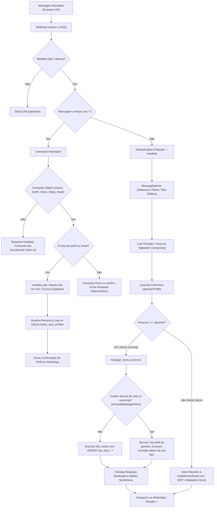

# Design Técnico: Isolamento Estrito de Escopo de Loja por Persona de Gerente

**ID da Spec:** `manager-store-scope`  
**Data:** 30/09/2026  
**Status:** ESPECIFICAÇÃO DE DESIGN  
**Target:** Node.js 22 LTS / TypeScript strict / SQLite WAL / Evolution API v2  

---

## 1. Fluxo de Execução e Circuito de Segurança

O diagrama abaixo ilustra o circuito de segurança aplicado no Ingress e no Dispatcher para garantir que nenhuma mensagem em modo gerente atinja a IA ou adaptadores gerais:



---

## 2. Contratos e Tipos TypeScript

### 2.1. Perfil de Usuário e Controle de Acesso (`UserProfile`)
Localizado em `src/hydra-sync/command_interceptor.ts`:
```typescript
export interface UserProfile {
  phone: string;
  persona: 'socio' | 'gerente';
  lojaSlug?: string;
  lojaNome?: string;
  defaultScope: 'rede' | 'loja';
  memoryGeneration: number;
  dailyMemoryResetAt?: string;
  updatedAt: string;
}

export interface StoreCommandMapping {
  command: string;
  lojaSlug: string;
  nome: string;
  description: string;
}
```

### 2.2. Resultado da Consulta do Gerente (`ManagerStoreResult`)
Localizado em `src/hydra-sync/manager_store_access.ts`:
```typescript
export interface ManagerStoreResult {
  replyText: string;
  toolsCalled: string[];
  allowed: boolean;
}
```

### 2.3. Registro de Aborto em Voo (`InFlightAbortRegistry`)
Permite invalidar e interromper execuções assíncronas concorrentes quando o usuário envia `/reset` ou troca de perfil:
```typescript
export interface InFlightJobInfo {
  phone: string;
  jobId: string;
  batchId?: string;
  startedAt: number;
  abortController: AbortController;
  isAborted: boolean;
}

export class InFlightAbortRegistry {
  private static instance: InFlightAbortRegistry;
  private activeJobs = new Map<string, InFlightJobInfo>();

  public static getInstance(): InFlightAbortRegistry;
  public register(phone: string, jobId: string, batchId?: string): AbortController;
  public abort(phone: string): { aborted: boolean; jobId?: string; batchId?: string };
  public isAborted(phone: string, jobId?: string): boolean;
  public clear(phone: string, jobId?: string): void;
  public hasInFlight(phone: string): boolean;
}
```

---

## 3. Modelo de Dados SQLite (`hydra_ops.db`)

Tabela persistente de perfis operacionais:
```sql
CREATE TABLE IF NOT EXISTS hydra_user_profiles (
  phone TEXT PRIMARY KEY,
  persona TEXT NOT NULL DEFAULT 'socio',
  loja_slug TEXT,
  loja_nome TEXT,
  default_scope TEXT NOT NULL DEFAULT 'rede',
  memory_generation INTEGER NOT NULL DEFAULT 1,
  daily_memory_reset_at TEXT,
  updated_at TEXT NOT NULL
);

CREATE INDEX IF NOT EXISTS idx_user_profiles_persona ON hydra_user_profiles(persona);
```

---

## 4. Regras de Detecção e Blindagem de Escopo

### 4.1. Verificação Léxica Externa (`isOutsideManagerStore`)
A função examina a mensagem do usuário buscando violações de fronteira de escopo:
1. **Termos proibidos de rede:**
   `\b(rede|lojas|unidades|filiais|todas|todos|ranking|geral|consolidado)\b`
2. **Apelidos de outras lojas:**
   Mapeamento das 10 lojas operacionais (`MPdompedro1`, `MPJabaquara`, `MPJorgeBeretta`, `MPkennedy`, `ReiDoOleoMaua`, `MPpiraporinha`, `MPplanalto`, `ReiDoModulo`, `MPrudge`, `MPSantoAndre`, `MPMaster`). Se qualquer apelido de loja diferente de `storeSlug` for encontrado, a função retorna `true` (fora de escopo).

### 4.2. Execução Determinística SQL de Loja (`executeManagerStoreQuery`)
Em modo gerente:
- **Intenções permitidas:** `financial_alerts`, `store_overview`, `store_cmv`, `store_areas`, `list_os`, `os_detail`, `aging_cars`.
- **Intenções recusadas (não-operacionais ou de rede):** `network_cmv`, `media_survey`, `checklist_audit`, `worst_store`, `ranking`.
- **Cláusulas SQL obrigatórias:**
  - `metas_diarias`: `SELECT ... FROM metas_diarias WHERE loja_slug = ? ORDER BY data_referencia DESC LIMIT 1`
  - `cmv_lojas`: `SELECT ... FROM cmv_lojas WHERE loja_slug = ? ORDER BY data_fim DESC LIMIT 1`
  - `faturamento_areas`: `SELECT ... FROM faturamento_areas WHERE loja_slug = ? AND UPPER(area) = UPPER(?)`
  - `ordens_servico`: `SELECT ... FROM ordens_servico WHERE loja_slug = ? AND (? IS NULL OR os_id = ?) ...`
- **Validação de Sub-consultas e Planos Estruturados:**
  Se a requisição contiver `subQueries` ou `answerRequirements`, todos os requisitos devem apontar estritamente para `storeSlug`. Se qualquer um apontar para outra loja ou omitir o filtro, a requisição é sumariamente rejeitada.

---

## 5. Acoplamento no Webhook e Cancelamento em Voo

No [webhook-listener.js](file:///home/operacional/hydra/webhook-listener.js):
1. **Antes de invocar comandos determinísticos:**
   Quando a mensagem iniciar por `/socio` ou `STORE_COMMANDS[cmd]` ou `/reset`:
   - Limpa a fila serial da conversa (`chatQueues.get(phone).queue = []`).
   - Notifica o `MessageBatcher` para marcar o lote ativo como obsoleto (`messageBatcher.markBatchObsolete(batchId)`).
   - Executa `InFlightAbortRegistry.getInstance().abort(phone)`.
   - Interrompe imediatamente o timer de presença `composing` (`activeChatQ.typing.stop()`).
   - Envia sinal explícito `paused` para a Evolution API.
2. **Entrega de Resposta de Comando:**
   - Respostas de comandos são enviadas sequencialmente via `sendSequentialReplies`.
   - Reação ✅ é enviada para confirmar a conclusão do comando.
   - Retorno HTTP 200 `{ status: "command_handled" }`, sem encaminhar para o batcher nem para o dispatcher de IA.

---

## 6. Tratamento de Comandos Desconhecidos

Se o usuário enviar `/dompeddro`, `/menuu` ou qualquer comando com prefixo `/` que não seja reconhecido:
1. `isDeterministicCommand(text)` identifica o prefixo `/`.
2. O interceptor avalia o comando e verifica que não existe no catálogo de comandos.
3. Retorna imediatamente:
   `> *Comando não reconhecido. Use /menu para ver os comandos disponíveis.*`
4. A mensagem é considerada tratada (`handled: true`), garantindo que erros de digitação não acionem o modelo de linguagem nem faturem tokens desnecessários.
